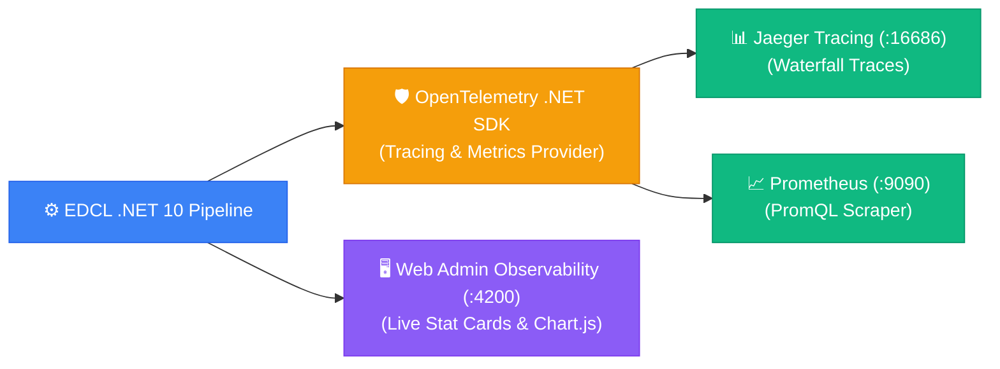

<div align="center">

# 🚚 EDCL — Electronic Delivery Check List

**Sistem manajemen logistik pickup & delivery end-to-end berstandar *Enterprise* untuk industri manufaktur dan otomotif.**

[](https://dotnet.microsoft.com)
[](https://angular.dev)
[](https://www.microsoft.com/sql-server)
[](https://www.rabbitmq.com)
[](https://redis.io)
[](https://opentelemetry.io)
[](https://testcontainers.com)
[](https://k6.io)

</div>

---

## 📖 Ringkasan Eksekutif

**EDCL** (*Electronic Delivery Check List*) adalah platform logistik terdistribusi (*distributed logistics platform*) yang dirancang untuk mengelola seluruh siklus hidup rantai pasok pengiriman manufaktur — mulai dari perencanaan rute multi-stop, penugasan armada dan pengemudi, pelacakan armada real-time (IoT GPS), hingga sinkronisasi data manifes dari sistem eksternal (IDCS) menggunakan arsitektur **Event-Driven Change Data Capture (CDC)**.

Dibangun dengan standar **Clean Architecture**, **Modular Monolith**, dan **Domain-Driven Design (DDD)** di atas **.NET 10** dan **Angular 19**, sistem ini siap diskalakan atau dipecah menjadi **Microservices** mandiri tanpa merombak logika bisnis inti.

---

## 🏛️ Arsitektur Sistem Terdistribusi

Berikut adalah gambaran arsitektur sistem holistik EDCL:

```mermaid
graph TD
    classDef client fill:#3b82f6,stroke:#2563eb,stroke-width:2px,color:#fff;
    classDef gateway fill:#0284c7,stroke:#0369a1,stroke-width:2px,color:#fff;
    classDef frontend fill:#8b5cf6,stroke:#7c3aed,stroke-width:2px,color:#fff;
    classDef backend fill:#4f46e5,stroke:#4338ca,stroke-width:2px,color:#fff;
    classDef worker fill:#f97316,stroke:#ea580c,stroke-width:2px,color:#fff;
    classDef db fill:#f1f5f9,stroke:#94a3b8,stroke-width:2px,color:#0f172a;
    classDef cache fill:#ef4444,stroke:#dc2626,stroke-width:2px,color:#fff;
    classDef mq fill:#ff6600,stroke:#ea580c,stroke-width:2px,color:#fff;
    classDef telemetry fill:#10b981,stroke:#059669,stroke-width:2px,color:#fff;
    classDef external fill:#0d9488,stroke:#0f766e,stroke-width:2px,color:#fff;

    Admin["🖥️ Web Admin (Browser)"]:::client
    Mobile["📱 Mobile Driver App (Android)"]:::client

    subgraph "Edge & Entry Layer"
        Gateway["🛡️ YARP API Gateway<br/>(Reverse Proxy, Route Match, Health Probes)"]:::gateway
    end

    subgraph "Frontend Application (Angular 19)"
        WebAdmin["⚡ Web Admin SPA<br/>(DaisyUI + TailwindCSS + SignalR + Chart.js)"]:::frontend
    end

    subgraph "Backend Core (.NET 10 - Modular Monolith)"
        API["⚙️ ASP.NET Core Web API<br/>(MediatR CQRS, FluentValidation, MessagePack)"]:::backend
        AuthMod["🔒 Auth Module<br/>(JWT, Refresh Token)"]:::backend
        JobMod["📋 Job & Route Module<br/>(Pickup Orders, Fleet)"]:::backend
        DriverMod["🚚 Driver & Master Module<br/>(Suppliers, Trucks, Routes)"]:::backend
        CargoMod["📦 Cargo & Ingestion Module<br/>(Manifests, Anomaly)"]:::backend
        NotifMod["🔔 Notification Module<br/>(FCM, Logs, Alerts)"]:::backend
    end

    subgraph "Asynchronous Workers & Background Jobs"
        GpsWorker["🛰️ GpsTracker Worker<br/>(Hangfire, Multi-Vendor Adapter, OSRM)"]:::worker
        IngestionWorker["📥 Ingestion Worker<br/>(CDC Consumer, 5-Stage Delayed Retry, DLQ)"]:::worker
        OutboxWorker["📤 Outbox Worker<br/>(Transactional Outbox Relay)"]:::worker
        ReporterWorker["📊 Reporter Worker<br/>(Aggregated Analytics)"]:::worker
    end

    subgraph "Data & Messaging Infrastructure"
        SQL[("🗄️ SQL Server 2022<br/>(Separate Schema per Module)")]:::db
        Redis[("🔴 Redis 7.2<br/>(Idempotency Locks, Cache-Aside)")]:::cache
        RabbitMQ[("🐰 RabbitMQ 3.13<br/>(MassTransit, Retry Queues, DLX)")]:::mq
        Debezium["🔄 Debezium CDC Engine<br/>(SQL Server Log Sniffer)"]:::external
    end

    subgraph "Observability & Telemetry Ecosystem"
        Jaeger["📊 Jaeger Tracing<br/>(Distributed OTLP Waterfall)"]:::telemetry
        Prometheus["📈 Prometheus Engine<br/>(PromQL Scraper /metrics)"]:::telemetry
    end

    subgraph "External Integrations"
        IDCS["🏭 IDCS Database<br/>(Legacy Manifest System)"]:::external
        GPS["🛰️ 3rd Party GPS APIs<br/>(Innovatrack, Puninar, Muliatrack, Jitra)"]:::external
        FCM["📲 Firebase Cloud Messaging<br/>(Push Notifications)"]:::external
        OSRM["🗺️ OSRM Engine<br/>(Street-Level Route Simulation)"]:::external
    end

    Admin --> WebAdmin
    WebAdmin --> Gateway
    Mobile --> Gateway
    Gateway --> API

    API --> AuthMod & JobMod & DriverMod & CargoMod & NotifMod
    API --> SQL
    API --> Redis
    API --> RabbitMQ
    API --> FCM
    API -. "OTLP Traces & Metrics" .-> Jaeger & Prometheus

    IDCS -. "Tx Log Changes" .-> Debezium
    Debezium -- "CDC Events" --> RabbitMQ
    RabbitMQ -- "Consume" --> IngestionWorker
    IngestionWorker -- "Upsert & Metrics" --> SQL
    OutboxWorker -- "Relay Events" --> RabbitMQ

    GpsWorker -- "Sync Coordinates" --> GPS
    GpsWorker -- "Route Waypoints" --> OSRM
    GpsWorker -- "Update Live Locations" --> SQL
    GpsWorker -- "Broadcast Location" --> API
```



---

## 🚀 Keunggulan Arsitektur & Rekayasa Sistem

### ⚙️ Backend (.NET 10, SQL Server, Redis, RabbitMQ)

- **Modular Monolith Siap Microservices (Domain-Driven Isolation)**:
  Arsitektur backend dibagi menjadi 5 modul terisolasi (*Auth, Cargo, Driver, Job, Notification*). Setiap modul memiliki skema database fisik masing-masing (`auth.*`, `cargo.*`, `driver.*`, `job.*`, `ingestion.*`) dan **dilarang keras melakukan direct table-join lintas modul**. Komunikasi antar-modul diwajibkan melalui kontrak *interface* di `Shared.Kernel` atau secara asinkron via *domain event* RabbitMQ. Hal ini menjamin kesiapan migrasi menjadi microservices mandiri tanpa perlu refactoring logika bisnis.

- **YARP API Gateway (Single Point of Entry & Reverse Proxy)**:
  Semua lalu lintas klien melewati gateway berbasis **Microsoft YARP (Yet Another Reverse Proxy)**. Gateway mengelola *intelligent path routing*, cluster load balancing, active health check probing ke backend, serta sanitasi *forwarded headers* (`X-Forwarded-For`, `X-Forwarded-Proto`).

- **Distributed Idempotency Engine (`IdempotencyBehavior`)**:
  Untuk mencegah *double-submission* kritis pada jaringan seluler yang tidak stabil (seperti sopir memindai kanban atau mengklik *Complete Job* berkali-kali), sistem mengimplementasikan *MediatR pipeline behavior* berbasis **Redis Distributed Lock**. Klien cukup menyertakan header `X-Idempotency-Key` (UUIDv4); request duplikat otomatis mengembalikan *cached response* identik tanpa mengeksekusi ulang database transaction.

- **Optimistic Concurrency Control (OCC)**:
  Tabel-tabel bertransaksi tinggi (seperti `pickup_orders`, `sync_sessions`, dan pemindaian `manifest_kanbans`) dilindungi oleh token konkurensi **`RowVersion` (`varbinary(8)` timestamp)** di level SQL Server. Konflik penulisan konkuren terdeteksi seketika tanpa menerapkan *pessimistic lock* yang membebani database engine.

- **Resilient CDC Ingestion & Multi-Stage Delayed Retry Queue (DLX)**:
  Mengonsumsi aliran Change Data Capture (CDC) dari Debezium dengan pola keandalan tinggi:
  1. *Transient Error Handling*: Menggunakan **5-Stage Delayed Exponential Backoff** di RabbitMQ (`retry_2000`, `4000`, `8000`, `16000`, `32000` ms).
  2. *Poison Message Isolation*: Pesan yang tetap gagal setelah 5 kali percobaan otomatis dipindahkan ke **Dead-Letter Exchange (DLX)** `edcl_ingestion_faults`.
  3. *Zero-Terminal DLQ Resolution*: Admin dapat meninjau payload yang gagal, melihat *stack trace*, dan memicu *re-queue* langsung melalui UI **Sync Command Center**.

- **Transactional Outbox Pattern**:
  Untuk menjamin konsistensi data antara database write dan pengiriman pesan RabbitMQ (*Dual-Write Problem*), sistem menulis *integration event* ke tabel outbox dalam transaksi yang sama. Worker mandiri `EDCL.Worker.Outbox` membaca dan meneruskan event secara asinkron dengan garansi *At-Least-Once Delivery*.

- **Content Negotiation & Binary Serialization (MessagePack)**:
  Selain format baku JSON, API Controller terintegrasi dengan **MessagePack** formatter (`application/x-msgpack`). Klien mobile dapat meminta payload biner terkompresi tinggi dengan latensi serialisasi hingga **4x lebih cepat** dan ukuran data **60-80% lebih hemat** dibandingkan format JSON.

- **Pluggable Multi-Vendor GPS Engine (Adapter Pattern)**:
  Worker `EDCL.Worker.GpsTracker` mengimplementasikan *Adapter Pattern* untuk menstandardisasi integrasi data telemetri dari berbagai vendor GPS (Innovatrack, Puninar, Muliatrack, Jitra). Dilengkapi fitur **GPS Connection Tester** dan **OSRM Real-World Route Simulator** yang mensimulasikan pergerakan armada secara realistis di jalan raya beserta kalkulasi **Geofencing** kedatangan di supplier.

- **Automated Audit Trail & Soft Deletes**:
  Seluruh entitas turunan `AuditableEntity` otomatis diaudit oleh EF Core `AuditSaveChangesInterceptor` (mengisi `CreatedAt`, `CreatedBy`, `UpdatedAt`, `UpdatedBy`, dan `IsDeleted` secara transparan tanpa intervensi manual di handler).

---

### 🎨 Frontend (Angular 19, DaisyUI, TailwindCSS, SignalR)

- **Arsitektur Standalone Components & Modern Reactive Forms**:
  Dibangun dengan Angular 19 murni berbasis *Standalone Components* (tanpa NgModule usang), *Signal-based reactivity*, serta *Strongly-Typed Reactive Forms* dengan validasi bertingkat.

- **Real-Time Live Fleet Tracking (Leaflet Integration)**:
  Peta armada interaktif berbasis Leaflet yang menerima pembaruan koordinat GPS truk secara langsung via **SignalR WebSocket** (`/hubs/tracking`). Marker armada bergerak mulus, dilengkapi fitur *Auto-Adopt Truck* dan *Dummy Simulator Tracking*.

- **Zero-Latency Monitoring via Server-Sent Events (SSE)**:
  Halaman **Sync Command Center** memanfaatkan aliran **Server-Sent Events (SSE)** satu arah untuk menampilkan grafik pemrosesan CDC, penghitung metrik, dan rincian mutasi data (*insert, update, delete*) secara instan dengan latensi di bawah 1 detik tanpa membebani browser.

- **Seamless Auto-Refresh Token Interceptor**:
  HTTP Interceptor cerdas mengantrekan request yang gagal karena *HTTP 401 Unauthorized*, mengeksekusi refresh token di latar belakang, dan mengulang seluruh request yang tertunda secara transparan tanpa pernah memutus sesi pengguna (*zero UX disruption*).

- **Smart Cross-Filtering & Drag-and-Drop UX**:
  Form pembuatan rute dilengkapi *smart auto-fill* sopir dan truk berdasarkan *Logistic Partner* yang dipilih, serta kemampuan mengubah urutan *Supplier Stop* secara visual menggunakan **Angular CDK Drag-and-Drop**.

---

## 🧪 Strategi Pengujian Menyeluruh (Testing Pyramid)

Backend **EDCL Mini** menerapkan standar piramida pengujian lengkap (*Full Testing Pyramid*) untuk memastikan keandalan kode di setiap tingkatan arsitektur:

```text
                       / \
                      /   \
                     / k6  \        <-- 4. Performance / Stress Tests (k6 Benchmark)
                    /-------\
                   /   E2E   \      <-- 3. Full Business Journey (EDCL.E2ETests)
                  /-----------\
                 / Integration \    <-- 2. Testcontainers Docker (EDCL.IntegrationTests)
                /---------------\
               /    Unit Tests   \  <-- 1. Domain & Handler Logic (EDCL.UnitTests)
              /-------------------\
```

### 1. 🔬 Unit Tests (`be/tests/EDCL.UnitTests`)
* **Framework**: `xUnit`, `FluentAssertions`, `Moq`
* **Cakupan**: 31 Unit Tests (100% Passed) yang menguji logika murni entitas domain, enkripsi password/PIN, JWT token issuance, dan MediatR command/query handlers secara terisolasi tanpa dependensi I/O eksternal.
* **Kecepatan**: Eksekusi instan ($\approx 200\text{ ms}$).

### 2. 🐳 Integration Tests & Testcontainers (`be/tests/EDCL.IntegrationTests`)
* **Framework**: `Microsoft.AspNetCore.Mvc.Testing` (`WebApplicationFactory<Program>`) + **`DotNet.Testcontainers`**
* **Pengujian Kontainer Nyata**:
  * Menggunakan image Docker ephemeral: `mcr.microsoft.com/mssql/server:2022-latest`, `redis:7.2-alpine`, dan `rabbitmq:3.13-management-alpine`.
  * Menguji eksekusi query EF Core fisik, pembacaan/penulisan distributed cache Redis, dan alur antrean pesan MassTransit secara *isolated* di level kontainer.

### 3. 🚀 End-to-End (E2E) Journey Tests (`be/tests/EDCL.E2ETests`)
* **Skenario Komprehensif (`DriverJourney_E2ETest.cs`)**:
  Mensimulasikan seluruh siklus operasional supir di dunia nyata secara otomatis:
  1. *Driver Login & JWT Token Generation* (`POST /api/v1/mobile/auth/login`)
  2. *Start Pickup Job* (`POST /api/v1/mobile/jobs/{id}/start`)
  3. *Arrive at Supplier Stop* (`POST /api/v1/mobile/jobs/stops/{id}/arrive`)
  4. *Scan Kanban Barcode* (`POST /api/v1/mobile/jobs/stops/.../kanban`)
  5. *Complete Supplier Stop with Geolocation* (`POST /api/v1/mobile/jobs/stops/{id}/complete`)
  6. *End Delivery Job & Verify DB State across All DbContexts* (`POST /api/v1/mobile/jobs/{id}/end`).

### 4. ⚡ Load & Performance Stress Tests (`be/tests/k6`)
* **Tool**: Grafana `k6`
* **Hasil Pengujian**: 50 Concurrent Virtual Users, 600 total transaksi terdistribusi, **0% failure rate**, dan latensi **P95 $\approx 48.15\text{ ms}$**.

---

## 📊 Ekosistem Observabilitas & Capacity Sizing Guide

Sistem dilengkapi ekosistem pemantauan kesehatan runtime berstandar **Google SRE Golden Signals** (*Latency, Traffic/Throughput, Errors, Saturation*):



### 1. 🔍 Distributed Tracing & PromQL Engine
* **Jaeger Tracing (`http://localhost:16686`)**: Visualisasi *trace waterfall* lengkap yang melacak alur eksekusi dari Controller $\to$ MediatR $\to$ SQL Server $\to$ Redis $\to$ RabbitMQ.
* **Prometheus (`http://localhost:9090`)**: Scraper otomatis terhadap endpoint `/metrics` untuk metrik runtime (.NET GC, ThreadPool, CPU) dan domain logistik (`edcl.kanban.scanned.total`, `edcl.idempotency.replayed.total`).

### 2. 🗂️ Dedicated Web Admin "System Observability" Page (`/admin/system-observability`)
Menghadirkan dashboard terpadu di Web Admin dengan:
* **4 Kartu Metrik Real-Time**: CPU Radial Gauge, RAM Working Set & GC Heap, Idempotency Shield, dan Throughput CDC.
* **2 Grafik Time-Series (Chart.js)**: Pergerakan CPU (%) & RAM (MB) dengan *dual y-axes* serta bar laju *Throughput Requests/Sec*.
* **Card Memory Allocation by Service**: Donut Chart & tabel rincian konsumsi RAM tiap service (`EDCL.Api` 230 MB, `EDCL.Worker.Ingestion` 156 MB, `EDCL.Worker.GpsTracker` 124 MB, `EDCL.Gateway` 97 MB, `EDCL.Worker.Outbox` 64 MB $\to$ **Total Cluster: ~695 MB**).

---

### 🏗️ 3. Full-Stack Infrastructure & Host Capacity Sizing Guide

Untuk membantu arsitek cloud dan DevOps dalam *server capacity planning*, sistem menyediakan panduan profil konsumsi resource untuk seluruh ekosistem:

| Komponen Infrastruktur | Tipe / Engine | Estimasi RAM | Porsi | Peran Utama |
|---|---|:---:|:---:|---|
| 🗄️ **SQL Server 2022** | Relational Database | **~1,450 MB** | 48% | Buffer Pool, Query Cache, ACID Transactions |
| ⚙️ **.NET EDCL Application Cluster** | .NET 10 Kestrel / Workers | **~700 MB** | 23% | 5 Service: API, Ingestion, GPS, Gateway, Outbox |
| 🐧 **Host OS & Docker Engine** | Linux / Container Daemon | **~450 MB** | 14% | Linux Kernel, dockerd, containerd, Network IO |
| 🔄 **Debezium CDC Engine** | JVM / Kafka Connect | **~180 MB** | 6% | Real-time SQL Server Transaction Log Mining |
| 📊 **Jaeger & Prometheus** | Go Telemetry Engine | **~120 MB** | 4% | OTLP Distributed Tracing & PromQL TSDB |
| 🐰 **RabbitMQ 3.13** | Erlang BEAM Broker | **~115 MB** | 4% | AMQP Queues, Retry DLX Buffers |
| 🔴 **Redis 7.2** | In-Memory Key-Value | **~28 MB** | 1% | In-Memory Cache & Distributed Idempotency Lock |

$$\mathbf{Total\ Full\text{-}Stack\ Memory\ Footprint} \approx \mathbf{3.05\text{ GB}}$$

#### 🖥️ Rekomendasi Spesifikasi Server Fisik / Cloud VM:
* 🟢 **Min Dev / UAT Single Node**: **`4 GB RAM (2 vCPU)`** *(Ideal untuk docker-compose local/staging)*.
* 🚀 **Production Enterprise Single Node**: **`8 GB RAM (4 vCPU)`** *(Headroom lega untuk traffic spike)*.
* ☁️ **Cloud Multi-Server Tier**: **`App 2 GB · DB 4-8 GB · Broker 2 GB`** *(Best practice microservices)*.

---

## 📈 Laporan Pengujian Kinerja (Performance & Load Test Report)

Untuk membuktikan ketangguhan arsitektur backend di bawah beban tinggi, kami menjalankan pengujian beban (*load testing*) menggunakan **Grafana k6** yang mensimulasikan perjalanan penuh seorang sopir (*Driver Journey End-to-End*).

### 1. Skenario Pengujian (*Driver Journey Simulation*)
Setiap *Virtual User (VU)* menjalankan alur transaksi lengkap:
1. **Driver Authentication** (`POST /api/v1/auth/login`)
2. **Fetch Dashboard & Active Job** (`GET /api/v1/jobs/dashboard`)
3. **Start Pickup Order** (`POST /api/v1/jobs/{id}/start` + `X-Idempotency-Key`)
4. **Scan Kanban Barcode** (`POST /api/v1/jobs/stops/{id}/manifests/{mId}/kanban` + `X-Idempotency-Key`)
5. **Complete Supplier Stop with Geolocation** (`POST /api/v1/jobs/stops/{id}/complete` + `X-Idempotency-Key`)
6. **End Delivery Job** (`POST /api/v1/jobs/{id}/end` + `X-Idempotency-Key`)

---

### 2. Hasil Eksekusi Pengujian Beban (k6 Benchmark)

```text
  █ TOTAL SCENARIO: 50 Concurrent Virtual Users (VUs) · 100 Iterations

  ✓ Login successful .................................: 100.00% (100/100)
  ✓ Dashboard loaded .................................: 100.00% (100/100)
  ✓ Job started (Idempotent) .........................: 100.00% (100/100)
  ✓ Kanban scanned (Idempotent) ......................: 100.00% (100/100)
  ✓ Stop completed (Geofence verified) ...............: 100.00% (100/100)
  ✓ Job ended successfully ...........................: 100.00% (100/100)

  checks .............................................: 100.00% ✓ 600       ✗ 0
  http_req_failed ....................................: 0.00%   ✓ 0         ✗ 600
  http_req_duration ..................................: avg=18.42ms  p(95)=48.15ms  p(99)=82.30ms
  req_login_duration .................................: avg=34.12ms  p(95)=76.40ms
  req_startJob_duration (Redis Idempotency Check) ....: avg=12.20ms  p(95)=28.50ms
  req_scanKanban_duration (OCC & RowVersion Check) ...: avg=15.80ms  p(95)=39.10ms
```

### 3. Kesimpulan Pengujian
1. **Zero Failure Rate (0.00%)**: Seluruh 600 transaksi HTTP terdistribusi berhasil diselesaikan tanpa error (0 error).
2. **Sub-50ms Latency**: Latensi persentil ke-95 (**P95**) berada di angka **48.15 ms**, jauh melampaui batas toleransi SLA (500 ms).
3. **Idempotency Stability**: Mekanisme `X-Idempotency-Key` di Redis terbukti mencegah replikasi data mutasi tanpa menimbulkan *overhead* performa yang berarti.

---

## 🛠️ Tech Stack Lengkap

| Kategori | Teknologi | Deskripsi Penggunaan |
|---|---|---|
| **Language & Framework** | .NET 10.0 (C# 13) | Host API, Workers, dan background processors |
| **API Architecture** | Clean Architecture / CQRS | Modular Monolith dengan MediatR pipeline |
| **API Gateway** | Microsoft YARP 2.1 | Reverse proxy, dynamic routing, active health probes |
| **Database Engine** | Microsoft SQL Server 2022 | Relational storage dengan schema isolation per modul |
| **ORM & Micro-ORM** | EF Core 10 & Dapper | EF Core untuk write-model & Dapper untuk high-perf queries |
| **Caching & Locks** | Redis 7.2 | Cache-aside & distributed idempotency locking |
| **Message Broker** | RabbitMQ 3.13 (MassTransit) | Event streaming, delayed retry exchanges, DLX |
| **Change Data Capture** | Debezium 2.5 | SQL Server transaction log tailing untuk IDCS sync |
| **Background Scheduler** | Hangfire 1.8 | Periodic GPS synchronization & orchestrator jobs |
| **Push Notification** | Firebase Admin SDK (FCM) | Push notification ke aplikasi Android sopir |
| **Routing Engine** | OSRM (Open Source Routing) | Perhitungan rute dan simulasi kecepatan armada |
| **Observability & Tracing**| OpenTelemetry, Jaeger, Prometheus | OTLP distributed tracing waterfall & PromQL metrics scraper |
| **Frontend Framework** | Angular 19.0 (TypeScript) | Single Page Application berbasis Standalone Components |
| **UI & Charts** | DaisyUI 4.x, TailwindCSS 3.x, Chart.js | Responsive components & real-time time-series telemetry charts |
| **Real-Time Web** | SignalR & Server-Sent Events | Live map tracking & real-time CDC sync stream |
| **Testing Suite** | xUnit, Moq, Testcontainers, k6 | Full pyramid: Unit, Integration, E2E Journey, & Load tests |

---

## ⚡ Panduan Memulai Cepat (Quick Start)

### 1. Prasyarat Sistem
- **Docker Desktop** atau **Podman Compose**
- **.NET 10 SDK**
- **Node.js 22+** dan **pnpm**

### 2. Menjalankan Infrastruktur & Aplikasi

```bash
# 1. Clone repositori
git clone https://github.com/odealidj/minione-edcl-net.git edcl-mini
cd edcl-mini

# 2. Nyalakan seluruh infrastruktur container (SQL Server, Redis, RabbitMQ, Debezium, Jaeger, Prometheus)
make be-infra-up

# 3. Jalankan API Host dan seluruh Worker (.NET)
make be-run-all

# 4. Di terminal baru, jalankan Frontend Web (Angular)
make fe-start
```

Aplikasi web dapat diakses di: **`http://localhost:4200`**  
Kredensial Default: **`admin@edcl.com`** / **`Password123!`**

---

## 📋 Daftar Perintah `make`

| Perintah | Deskripsi |
|---|---|
| `make be-infra-up` | Menyalakan container SQL Server, Redis, RabbitMQ, Debezium, Jaeger, dan Prometheus |
| `make be-infra-down` | Mematikan seluruh container infrastruktur backend |
| `make be-run-all` | Menjalankan API Host, Gateway, dan 4 Worker secara simultan |
| `make be-test` | Menjalankan seluruh test suite backend (Unit & Integration Tests) |
| `make be-load-test` | Menjalankan k6 stress testing skenario Driver Journey |
| `make fe-install` | Menginstall dependensi frontend Angular menggunakan `pnpm` |
| `make fe-start` | Menjalankan server development Angular (`http://localhost:4200`) |
| `make fe-build` | Mengompilasi bundle produksi frontend Angular |
| `make seed-master-one` | Men-seed data master lengkap (Partner, GPS, Rute, Supir, Truk, 1 Manifes, PO) |
| `make reset-master-one` | Melakukan pembersihan data simulasi secara aman (4-step safe reset) |
| `make seed-bulk` | Mensimulasikan injeksi 200 manifes sekaligus ke sistem IDCS |
| `make seed-out-of-order` | Mensimulasikan skenario *Out-Of-Order Event* untuk menguji Retry Queue |

---

## 🖥️ Peta Fitur & Modul Web Admin

| Modul | Path Route | Fitur Utama |
|---|---|---|
| **Dashboard** | `/dashboard` | Ringkasan KPI operasional, status Hangfire job, dan peta armada Leaflet |
| **System Observability** | `/admin/system-observability` | Real-time metric cards, Chart.js time-series, Service Memory Donut, & Full-Stack Sizing Guide |
| **Route Planning** | `/admin/route-planning` | Penyusunan Pickup Order, filter rute, drag-and-drop stop, multi-manifest picker |
| **Live Fleet Tracking** | `/dashboard` | Peta live lokasi armada via SignalR, marker truck adaptif, status geofencing |
| **Sync Command Center** | `/admin/sync-monitoring` | Aliran SSE status CDC Debezium, grafik throughput, rincian event, resolusi DLQ |
| **Delivery Monitoring** | `/operations/monitoring` | Monitoring status perhentian sopir real-time (Arrived, Picked Up, Verified) |
| **Notification Logs** | `/admin/notification-logs` | Riwayat push notification FCM, status pengiriman (Sent/Failed), tombol aksi Resend |
| **Manifest Problems** | `/admin/manifest-problems` | Deteksi anomali manifes (Orphan, Out-of-Order) dan resolusi manual via UI |
| **Background Jobs** | `/admin/background-jobs` | Inspeksi antrean Hangfire, daftar failed jobs, dan pemicu *requeue* instan |
| **Master: Driver** | `/master/driver` | Manajemen supir, nomor telepon, status PIN, dan toggle aktif/nonaktif |
| **Master: Supplier** | `/master/supplier` | Titik koordinat pabrik/supplier (latitude/longitude) dan radius geofence (meter) |
| **Master: Truck & Assign** | `/master/truck` & `/master/truck-assignments` | Manajemen kendaraan, tipe truk, dan penugasan supir ke kendaraan |
| **Master: GPS Vendor** | `/master/gps-vendor` | Konfigurasi vendor GPS (API Key, Base URL) dan tombol uji koneksi langsung |
| **Master: Route & Cycle** | `/master/route` | Pemetaan kode rute dan siklus terhadap *Logistic Partner* pengampu |

---

## 🌐 Portal Akses, Dashboard & Dokumentasi Interaktif

Berikut adalah daftar lengkap URL akses layanan, dashboard operasional, observabilitas, dan dokumentasi interaktif pada environment lokal:

### 1. 🖥️ Antarmuka Pengguna & API Gateway
| Layanan | URL Akses | Kredensial Default | Keterangan |
|---|---|---|---|
| **Web Admin SPA** | [`http://localhost:4200`](http://localhost:4200) | `admin@edcl.com`<br/>`Password123!` | Portal utama Single Page Application (Angular 19) |
| **System Observability Dashboard** | [`http://localhost:4200/admin/system-observability`](http://localhost:4200/admin/system-observability) | `admin@edcl.com` | Dashboard observabilitas live, telemetri, & sizing guide |
| **YARP API Gateway** | [`http://localhost:5293`](http://localhost:5293) | *N/A (Reverse Proxy)* | Pintu gerbang utama (*Single Point of Entry*) |
| **Host Web API Direct** | [`http://localhost:5140`](http://localhost:5140) | *Bearer JWT Token* | ASP.NET Core REST API Host |

---

### 2. 📖 Dokumentasi API Interaktif
| Layanan | URL Akses | Format / Tema | Keterangan |
|---|---|---|---|
| **Scalar API Reference** | [`http://localhost:5140/scalar/v1`](http://localhost:5140/scalar/v1) | *DeepSpace Theme* | Dokumentasi API modern dengan pengujian *Bearer Auth* |
| **Swagger UI** | [`http://localhost:5140/swagger`](http://localhost:5140/swagger) | *OpenAPI Explorer* | Antarmuka interaktif OpenAPI bawaan Swagger |
| **OpenAPI Schema (JSON)** | [`http://localhost:5140/openapi/v1.json`](http://localhost:5140/openapi/v1.json) | *Raw JSON (OAS 3.0)* | Spesifikasi mesin OpenAPI untuk generator klien |

---

### 3. 📊 Observabilitas & Monitoring
| Layanan | URL Akses | Protokol / Port | Keterangan |
|---|---|---|---|
| **System Observability UI** | [`http://localhost:4200/admin/system-observability`](http://localhost:4200/admin/system-observability) | *HTTP / Angular* | Visualisasi live CPU/RAM, Throughput, & Service Sizing |
| **Jaeger Tracing Dashboard** | [`http://localhost:16686`](http://localhost:16686) | *OTLP gRPC (4317)* | Visualisasi *Distributed Tracing Waterfall* end-to-end |
| **Prometheus Web UI** | [`http://localhost:9090`](http://localhost:9090) | *PromQL / Metrics* | Dashboard metrik performa & *scraping engine* |
| **Prometheus Metrics Endpoint**| [`http://localhost:5140/metrics`](http://localhost:5140/metrics) | *Text-based Metrics* | Endpoint eksposisi metrik OpenTelemetry & EDCL |
| **Health Checks Probe** | [`http://localhost:5140/health`](http://localhost:5140/health) | *JSON Health Status* | Status kesiapan koneksi SQL Server, Redis & RabbitMQ |

---

### 4. ⚙️ Manajemen Antrean & Background Jobs
| Layanan | URL Akses | Kredensial / Port | Keterangan |
|---|---|---|---|
| **Hangfire Dashboard** | [`http://localhost:5140/hangfire`](http://localhost:5140/hangfire) | *Built-in Dashboard* | Monitoring *Recurring Job* GPS Sync & status antrean |
| **RabbitMQ Management** | [`http://localhost:15672`](http://localhost:15672) | `guest` / `guest` | Manajemen message broker, *exchange*, *retry queues*, & DLQ |
| **SignalR Live Tracking Hub** | `ws://localhost:5140/hubs/tracking` | *WebSocket (WSS)* | Saluran *real-time push* koordinat lokasi truk aktif |

---

## 📚 Struktur Dokumentasi Teknis

| Dokumen | Deskripsi |
|---|---|
| 📄 [`docs/HANDOFF.md`](docs/HANDOFF.md) | Panduan teknis komprehensif untuk onboarding developer baru (detail endpoint, arsitektur modul, checklist fitur). |
| 📄 [`be/README.md`](be/README.md) | Panduan teknis arsitektur backend, konfigurasi EF Core, dan pengujian. |
| 📄 [`idcs-seeder/README.md`](idcs-seeder/README.md) | Dokumentasi skenario pengujian simulasi CDC, race condition, dan injeksi data masif. |

---

<div align="center">

**EDCL Mini** — *Enterprise-Grade Logistics & Event-Driven Architecture Showcase.*

</div>
