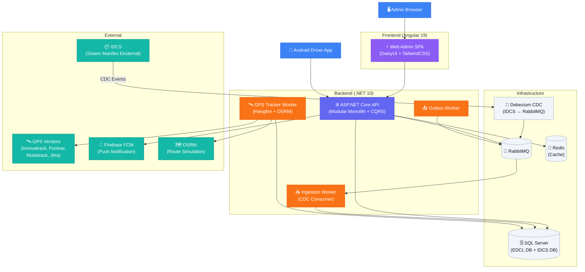
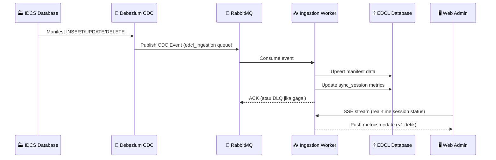

<div align="center">

# 🚚 EDCL — Express Delivery Cargo Logistic

**Sistem manajemen logistik pickup & delivery end-to-end untuk industri manufaktur/otomotif.**

[](https://dotnet.microsoft.com)
[](https://angular.dev)
[](https://www.microsoft.com/sql-server)
[](https://www.rabbitmq.com)
[](https://redis.io)
[](https://docker.com)

</div>

---

## 📖 Deskripsi Proyek

**EDCL** (*Express Delivery Cargo Logistic*) adalah platform logistik komprehensif yang mengelola seluruh siklus hidup pengiriman manufaktur — mulai dari perencanaan rute pickup, penugasan driver, pelacakan GPS real-time, hingga sinkronisasi data manifest dari sistem eksternal (IDCS) via **Change Data Capture**.

Sistem ini dibangun untuk mensimulasikan skenario nyata di industri otomotif, di mana puluhan sopir truk perlu dikoordinasikan secara real-time antara pabrik, supplier, dan gudang.

---

## 🏛️ Arsitektur Sistem



---

## 🚀 Keunggulan Sistem

### ⚙️ Backend & Arsitektur

- **Modular Monolith siap migrasi Microservices**: Setiap fitur (*Auth, Cargo, Driver, Job, Notification*) dipisahkan ke dalam modul independen dengan skema database terpisah (`auth.*`, `job.*`, `driver.*`, `ingestion.*`). Modul hanya boleh berkomunikasi lewat *interface* kontrak di `Shared.Kernel` atau via *event* RabbitMQ — **nol tight coupling antar modul**. Ini berarti setiap modul bisa diangkat menjadi *microservice* kapan saja tanpa perubahan logika bisnis.

- **CQRS + MediatR**: Semua operasi ditulis sebagai *Command* (mutasi) atau *Query* (baca) yang dieksekusi via MediatR pipeline. Ini memisahkan *read model* dari *write model* secara bersih, membuat kode mudah di-test dan mudah dikembangkan secara paralel.

- **Change Data Capture (CDC) via Debezium**: Sistem tidak polling database secara manual. Debezium memonitor *transaction log* SQL Server IDCS (sistem manifest eksternal) dan otomatis mempublikasikan setiap perubahan data ke RabbitMQ. `EDCL.Worker.Ingestion` kemudian mengkonsumsi event ini untuk menyinkronkan data ke EDCL — arsitektur **eventual consistency** yang scalable.

- **Transactional Outbox Pattern**: Setiap event domain yang dipublish ke RabbitMQ dijamin terkirim meski server crash sekalipun, menggunakan pola *Outbox* yang diproses oleh `EDCL.Worker.Outbox`.

- **Dead Letter Queue (DLQ) dengan resolusi UI**: Pesan CDC yang gagal diproses (contoh: manifest tiba sebelum parent-nya) masuk ke DLQ. Admin bisa melihat, men-diagnosa, dan me-*requeue* pesan tersebut langsung dari UI **Sync Command Center** — tanpa perlu akses terminal.

- **GPS Real-Time Multi-Vendor**: `EDCL.Worker.GpsTracker` mengimplementasikan pola **Adapter** untuk mengintegrasikan 4 vendor GPS berbeda (Innovatrack, Puninar, Muliatrack, Jitra) di balik satu interface yang seragam. Menambah vendor GPS baru hanya perlu membuat 1 file adapter baru.

- **GPS Route Simulation**: Untuk development & testing, sistem dilengkapi *simulator* yang menggerakkan truk virtual sepanjang rute nyata menggunakan **OSRM** (Open Source Routing Machine). Driver virtual bergerak sesuai kecepatan dan jarak jalan asli.

- **Geofencing Otomatis**: Ketika posisi GPS truk masuk dalam radius supplier, sistem secara otomatis mendeteksi kedatangan dan memperbarui status pengiriman.

- **FCM Push Notification**: Penugasan driver, pembatalan, dan update status terkirim sebagai push notification ke Android app driver via Firebase Cloud Messaging. Admin bisa memantau status pengiriman notif (Sent/Failed) dan melakukan *resend* dari UI.

- **Hangfire Background Jobs**: Job GPS sync berjalan terjadwal setiap menit via Hangfire. Admin dapat memantau antrian job, melihat job yang gagal beserta error message-nya, dan men-trigger *requeue* — semua dari halaman web.

### 🎨 Frontend Web Admin

- **Real-Time Live Fleet Tracking**: Peta interaktif (Leaflet) menampilkan posisi seluruh truk aktif secara real-time. Posisi diperbarui otomatis tanpa perlu refresh halaman.

- **Server-Sent Events (SSE) untuk Sync Monitoring**: Halaman **Sync Command Center** menerima update status ingestion secara real-time via SSE stream — latensi update kurang dari 1 detik sejak data masuk ke database.

- **Auto-Refresh Token (Seamless UX)**: Ketika access token expired, sistem secara transparan me-refresh token di background dan mengulang request yang gagal. User tidak pernah di-force logout atau kehilangan pekerjaan yang sedang dilakukan.

- **Smart Driver & Truck Auto-Fill**: Saat admin memilih Route/Logistic Partner di form Pickup Order, sistem secara otomatis memfilter dan mengisi dropdown Driver dan Truck yang hanya relevan dengan logistic partner tersebut — mengurangi kesalahan input.

- **Drag & Drop Stop Sequencing**: Urutan perhentian (stop) dalam route plan dapat diurutkan ulang dengan drag & drop interaktif menggunakan Angular CDK.

- **Dashboard Terintegrasi**: Satu halaman dashboard menampilkan ringkasan operasional (PO aktif, driver on-progress, manifest hari ini), status Hangfire background jobs, dan peta live fleet tracking secara bersamaan.

### 🔄 Integrasi Sistem Eksternal (IDCS)

- **Zero-Polling CDC Architecture**: EDCL tidak pernah query langsung ke database IDCS. Semua sinkronisasi data manifest terjadi secara event-driven via Debezium CDC — sistem siap menangani volume besar perubahan data tanpa beban polling.

- **IDCS Direct View**: Admin dapat melihat status pengiriman langsung dari perspektif IDCS (sistem eksternal) via halaman khusus, memudahkan troubleshooting ketika terjadi discrepancy data.

- **Manifest Anomaly Detection**: Worker ingestion mendeteksi dan mencatat semua anomali (manifest orphan, duplikat, urutan tidak berurutan) ke tabel terpisah. Admin bisa me-resolve anomali tersebut dari halaman **Manifest Problems**.

---

## 📦 Struktur Project

```
edcl-mini/
├── be/                          # Backend (.NET 10)
│   ├── src/
│   │   ├── Host/                # ASP.NET Core API Host
│   │   ├── Gateway/             # API Gateway (YARP)
│   │   ├── Modules/
│   │   │   ├── Auth/            # Autentikasi, User, Driver
│   │   │   ├── Cargo/           # Manifest, Kanban, Anomaly
│   │   │   ├── Driver/          # Supplier, Truck, GPS Vendor, Route
│   │   │   ├── Job/             # Pickup Order, Dashboard, Fleet
│   │   │   └── Notification/    # FCM Push, Notification Logs
│   │   ├── Workers/
│   │   │   └── EDCL.Worker.GpsTracker/  # GPS tracking & simulation
│   │   └── Shared/              # Kernel, Infrastructure, Contracts
│   ├── workers/
│   │   ├── EDCL.Worker.Ingestion/  # CDC consumer (IDCS → EDCL)
│   │   ├── EDCL.Worker.Outbox/     # Transactional outbox
│   │   └── EDCL.Worker.Reporter/   # Laporan & agregasi
│   └── tests/                   # Unit, Integration, E2E, k6 Load Tests
│
├── fe/web/                      # Frontend (Angular 19)
│   └── src/app/
│       ├── features/
│       │   ├── admin/           # Route Planning, Fleet, Sync, Notif
│       │   ├── master/          # Driver, Supplier, Truck, GPS, Route
│       │   ├── dashboard/       # Dashboard + Live Map
│       │   └── operations/      # Delivery Monitoring
│       ├── core/
│       │   ├── services/        # API services, Auth, SignalR, SSE
│       │   └── models/          # TypeScript interfaces
│       └── layout/              # Sidebar, Header, Main Layout
│
├── idcs-seeder/                 # CLI Tool — Seed & simulasi data IDCS
├── docs/                        # Dokumentasi teknis (HANDOFF.md, dll)
└── Makefile                     # Unified entry point semua perintah
```

---

## 🛠️ Tech Stack Lengkap

| Layer | Teknologi |
|-------|-----------|
| **Backend API** | .NET 10 · ASP.NET Core · MediatR (CQRS) · EF Core · Dapper |
| **Architecture** | Modular Monolith · Clean/Hexagonal Architecture per modul |
| **Database** | SQL Server 2022 (skema terpisah per modul) |
| **Message Broker** | RabbitMQ · MassTransit |
| **Cache** | Redis |
| **CDC / Streaming** | Debezium (Kafka Connect on SQL Server) |
| **Background Jobs** | Hangfire (embedded in GPS worker) |
| **GPS Routing** | OSRM (Open Source Routing Machine) |
| **Push Notification** | Firebase Cloud Messaging (FCM) |
| **Frontend** | Angular 19 · Standalone Components · TypeScript |
| **UI Framework** | DaisyUI · TailwindCSS · Angular CDK |
| **Maps** | Leaflet.js |
| **Real-Time** | Server-Sent Events (SSE) · SignalR |
| **Mobile** | Android (Kotlin) |
| **Containerization** | Docker · Docker Compose |
| **Testing** | xUnit · Moq · k6 (load testing) · Cypress (E2E) |
| **API Gateway** | YARP (Yet Another Reverse Proxy) |

---

## ⚡ Memulai Cepat

### Prerequisites

- Docker & Docker Compose (atau Podman)
- .NET 10 SDK
- Node.js 22+ & pnpm

### Jalankan Sistem

```bash
# 1. Clone project
git clone https://github.com/odealidj/minione-edcl-net.git edcl-mini
cd edcl-mini

# 2. Nyalakan infrastructure (SQL Server, Redis, RabbitMQ, Debezium)
make be-infra-up

# 3. Jalankan Backend API + semua Worker
make be-run-all

# 4. Jalankan Frontend
make fe-start
# → http://localhost:4200
```

### Login Admin

```
URL      : http://localhost:4200
Email    : admin@edcl.com
Password : Password123!
```

### Seed Data Simulasi (Opsional)

```bash
# Seed master data + 1 manifest untuk demo end-to-end
make seed-master-one

# Reset semua data simulasi (safe reset)
make reset-master-one
```

---

## 📋 Perintah Make

### Root Project
| Perintah | Deskripsi |
|----------|-----------|
| `make be-infra-up` | Nyalakan SQL Server, Redis, RabbitMQ, Debezium |
| `make be-run-all` | Jalankan API + semua Worker (local .NET) |
| `make fe-start` | Jalankan Angular dev server |
| `make be-test` | Jalankan backend test suite |

### IDCS Seeder (Data Simulasi)
| Perintah | Deskripsi |
|----------|-----------|
| `make seed-master-one` | Seed 1 set lengkap: Logistic Partner, GPS Vendor, Supplier, Driver, Truck, Route, Manifest, Pickup Order |
| `make reset-master-one` | Reset semua data simulasi dengan aman (urutan 4 langkah dengan CDC flush) |
| `make seed-manifest` | Insert 1 manifest baru ke IDCS |
| `make seed-bulk` | Insert 200 manifest sekaligus ke IDCS |
| `make seed-out-of-order` | Simulasi skenario manifest tiba sebelum parent |
| `make seed-race-condition` | Simulasi race condition pada ingestion |

---

## 🖥️ Halaman-Halaman Utama

| Halaman | Path | Fitur |
|---------|------|-------|
| Dashboard | `/dashboard` | Ringkasan operasional + Live Fleet Map |
| Route Planning | `/admin/route-planning` | CRUD Pickup Order, drag & drop stop |
| Delivery Monitoring | `/operations/monitoring` | Monitor status delivery per driver |
| Sync Command Center | `/admin/sync-monitoring` | CDC session status + DLQ resolution |
| Live Fleet Tracking | `/dashboard` | Peta real-time posisi seluruh truk |
| Notification Logs | `/admin/notification-logs` | FCM log + resend |
| Manifest Problems | `/admin/manifest-problems` | Anomaly CDC + resolve |
| Background Jobs | `/admin/background-jobs` | Hangfire monitor + requeue |
| IDCS Deliveries | `/admin/idcs-deliveries` | View langsung ke sistem IDCS |
| Master: Driver | `/master/driver` | CRUD Driver + status toggle |
| Master: Supplier | `/master/supplier` | CRUD Supplier + geofence radius |
| Master: Truck | `/master/truck` | CRUD Truck + assignment |
| Master: GPS Vendor | `/master/gps-vendor` | CRUD GPS Vendor + test koneksi |
| Master: Route | `/master/route` | CRUD Route/Cycle + LP filter |
| Master: Logistic Partner | `/master/logisticPartner` | CRUD LP + assign GPS vendor |
| User Management | `/admin/users` | Role management |

---

## 📡 API Overview

Semua endpoint tersedia di `http://localhost:5140` dengan prefix:
- **`/api/v1/web/`** — Endpoint untuk web admin
- **`/api/v1/mobile/`** — Endpoint untuk Android driver app  
- **`/api/v1/auth/`** — Autentikasi

Contoh endpoint utama:
```http
# Admin
GET  /api/v1/web/admin/pickup-orders          # List route planning
GET  /api/v1/web/admin/dashboard/live-fleets  # Posisi GPS semua truk
GET  /api/v1/web/admin/notifications/logs     # Notification logs

# Master Data
GET  /api/v1/web/master/suppliers             # List supplier
GET  /api/v1/web/master/gps-vendors           # List GPS vendor
GET  /api/v1/web/master/routes                # List route/cycle

# Mobile Driver
GET  /api/v1/mobile/jobs/{id}                 # Detail job driver
POST /api/v1/mobile/jobs/{id}/start           # Mulai job
POST /api/v1/mobile/jobs/{id}/stops/{s}/complete # Selesai pickup
```

Format response seragam:
```json
{
  "trace_id": "...",
  "status": "success",
  "code": 200,
  "data": { ... },
  "pagination": { "page": 1, "page_size": 10, "total_items": 100 }
}
```

---

## 📚 Dokumentasi

| Dokumen | Deskripsi |
|---------|-----------|
| [`docs/HANDOFF.md`](docs/HANDOFF.md) | Panduan lengkap untuk developer/agent baru: arsitektur, semua endpoint, semua halaman frontend, status fitur, dan next steps |
| [`be/README.md`](be/README.md) | Detail arsitektur backend, struktur folder, dan testing |
| [`idcs-seeder/README.md`](idcs-seeder/README.md) | Panduan penggunaan IDCS seeder & semua skenario simulasi |

---

## 🧩 Diagram Alur Data — CDC Ingestion



---

## 🤝 Kontribusi & Lisensi

Project ini adalah showcase portofolio pribadi. Bebas diinspeksi untuk keperluan pembelajaran.

---

<div align="center">

Dibangun dengan ☕ dan semangat membangun sistem yang *production-ready*.

</div>
