# API Sequence Diagrams

Sequence diagram endpoint utama sistem **EDCL Mini** dikelompokkan berdasarkan modul.

---

## 1. Module Auth

### 1.1. Driver Login & PIN Authentication (Mobile Driver)
**Endpoints:** `POST /api/v1/mobile/auth/drivers/login` & `POST /api/v1/mobile/auth/drivers/change-pin`

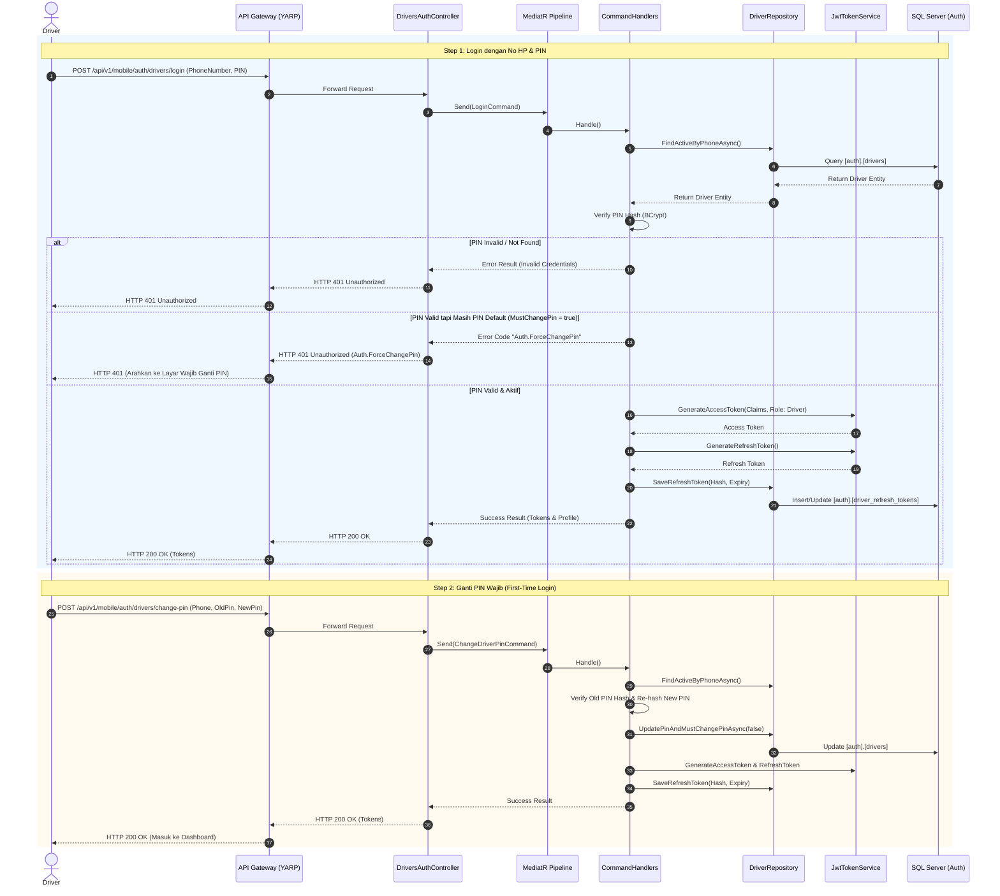

### 1.2. AppUser Login (Web Admin)
**Endpoint:** `POST /api/v1/web/auth/users/login`

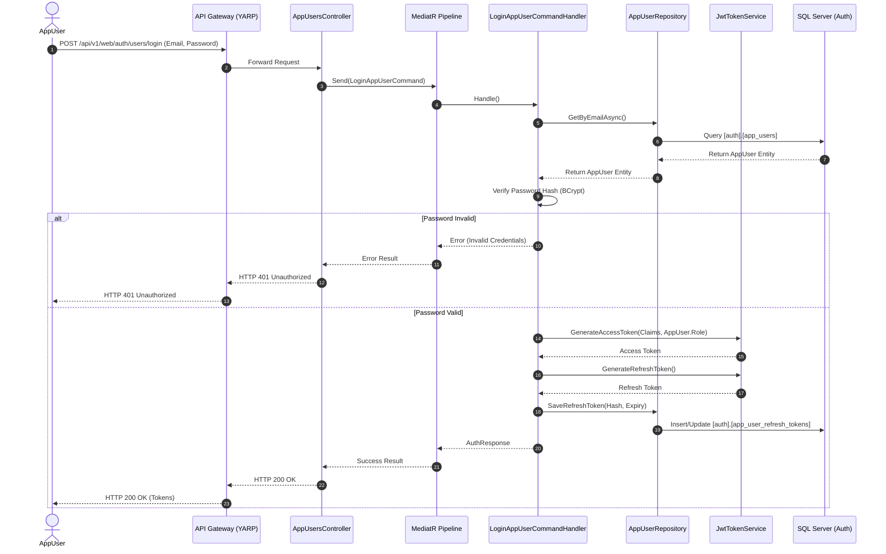

### 1.3. Refresh Token
**Endpoints:** `POST /api/v1/web/auth/users/refresh-token` & `POST /api/v1/mobile/auth/drivers/refresh-token`

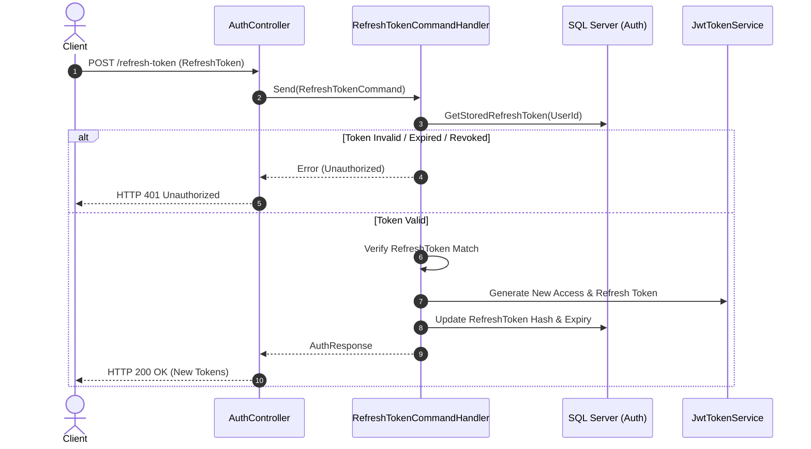

---

## 2. Module Job

### 2.1. Start Job
**Endpoint:** `POST /api/v1/mobile/jobs/{id}/start`

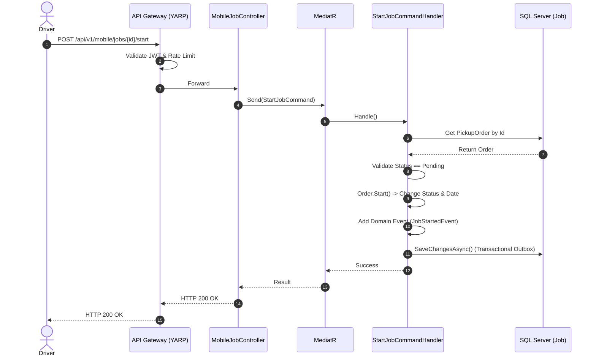

### 2.2. Scan Kanban
**Endpoint:** `POST /api/v1/mobile/jobs/stops/{stopId}/manifests/{manifestId}/kanban`

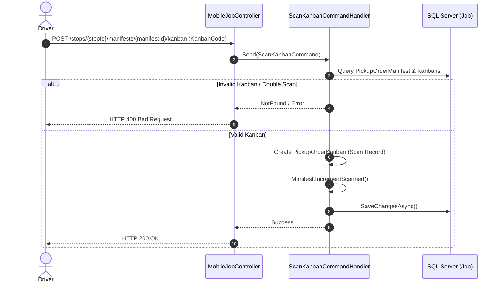

### 2.3. Complete Stop
**Endpoint:** `POST /api/v1/mobile/jobs/stops/{stopId}/complete`

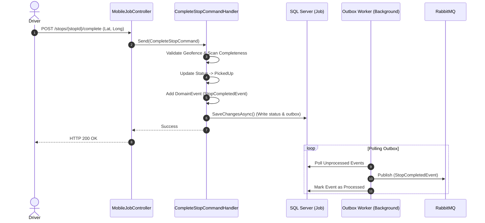

---

## 3. Module Cargo

### 3.1. Query Manifest Detail (Parts Breakdown)
**Endpoint:** `GET /api/v1/mobile/cargo/manifests/{manifestNo}/detail`

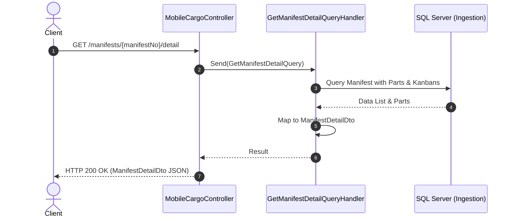

## 4. Module Notification

### 4.1. Event-Driven Notification Push
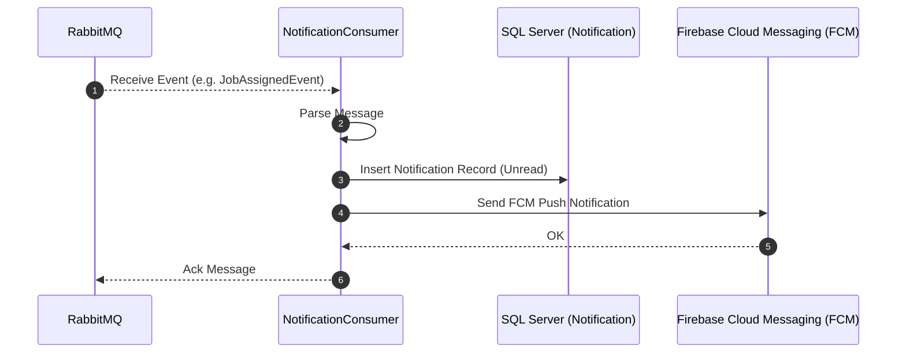

---

## 5. Module GPS Tracking (`EDCLGPSAPI`) & Real-Time Streaming

### 5.1. Ingesti Koordinat GPS Tracking & Streaming Peta Real-Time (End-to-End)
**Alur:** Polling Vendor $\to$ Sink ke PostgreSQL $\to$ Publish ke RabbitMQ $\to$ Ingesti ke Redis $\to$ Broadcast SignalR Web Admin.

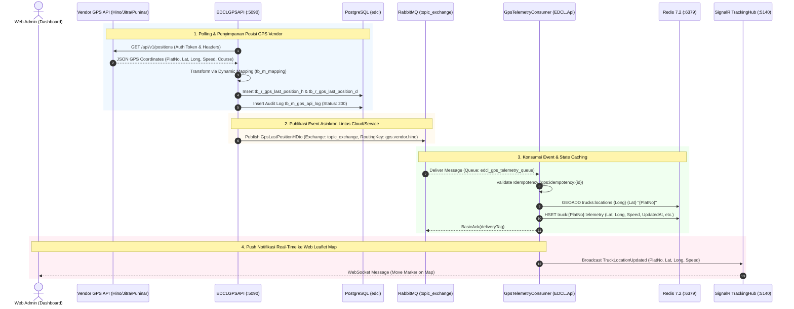

### 5.2. Historical Route Replay Query via YARP Gateway
**Endpoint:** `GET /api/v1/gps/deliveries/{id}/history` / `/api/v1/gps/deliveries/{id}/positions`

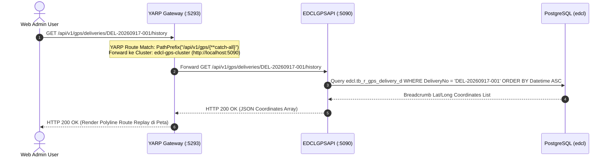

### 5.3. Vendor Dynamic Authentication & Token Rotation
**Endpoint:** `POST /api/v1/gps/auth/refresh`

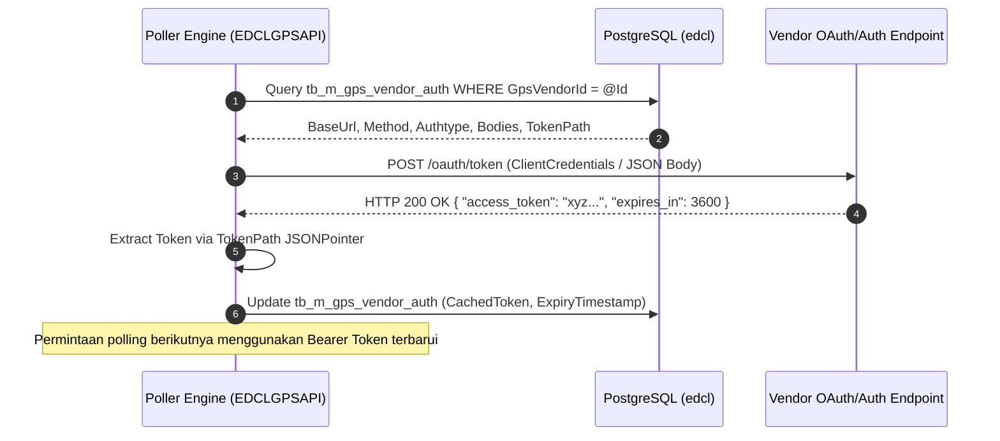

