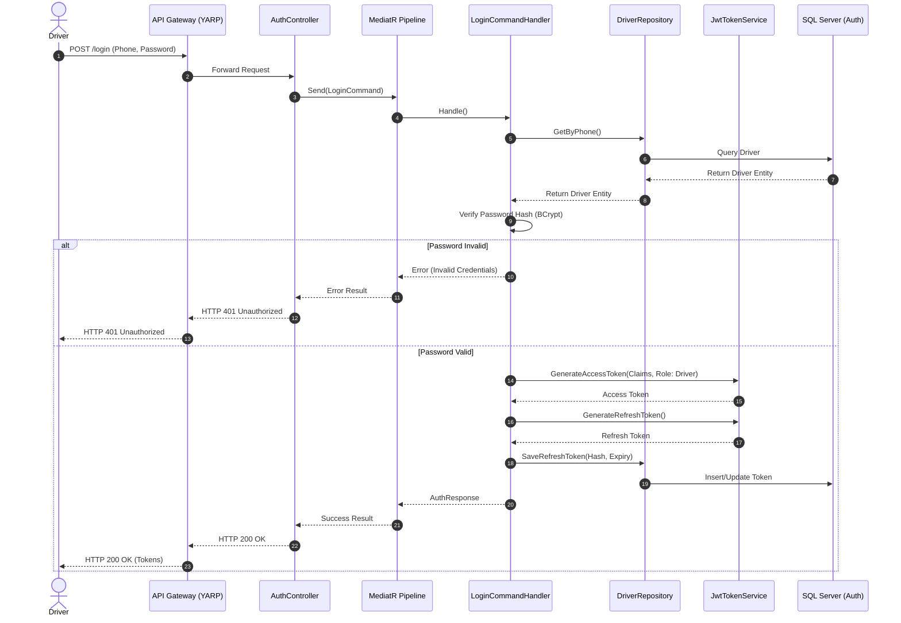
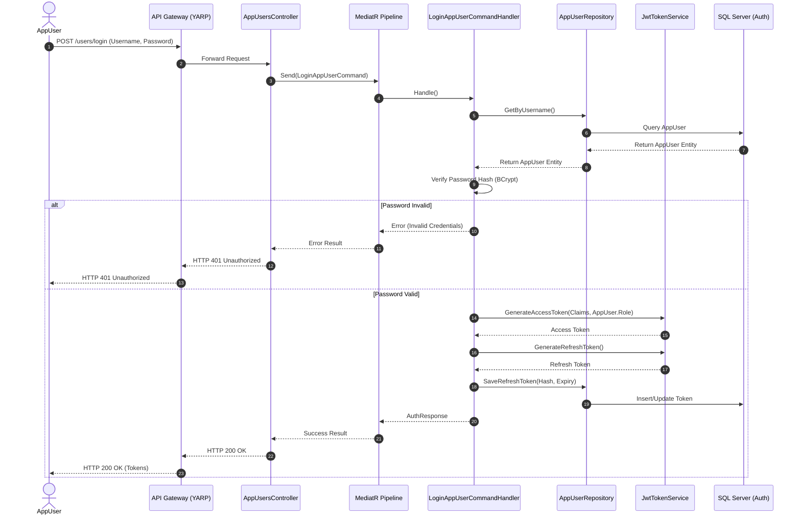
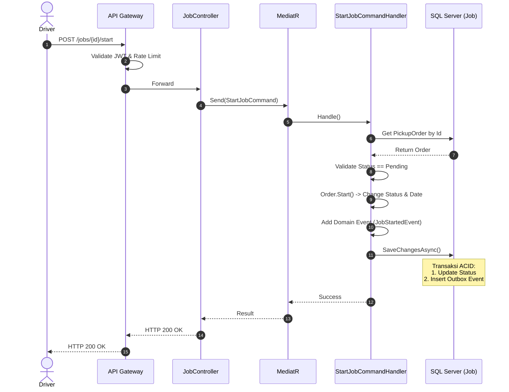
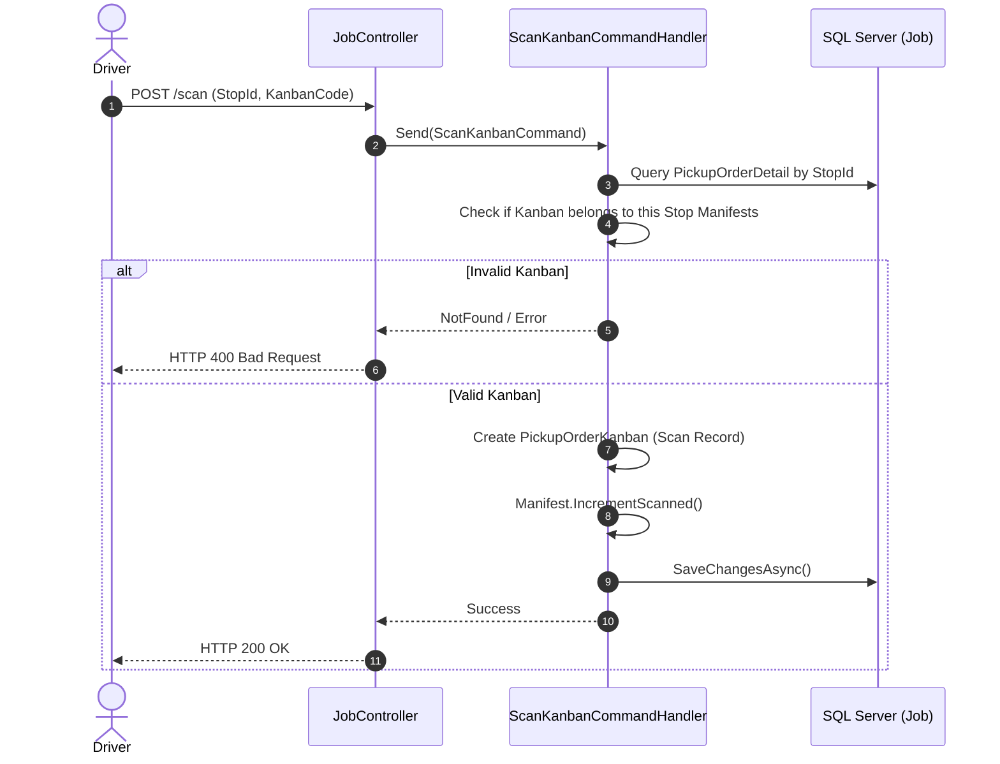
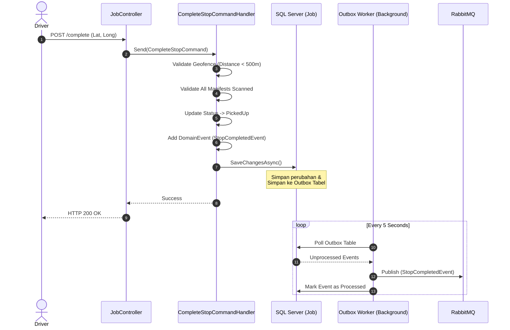
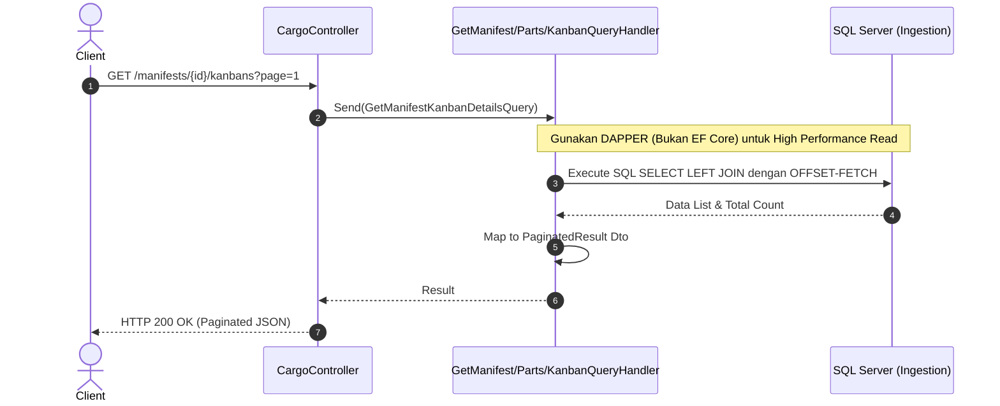
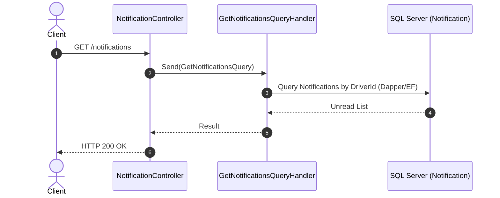
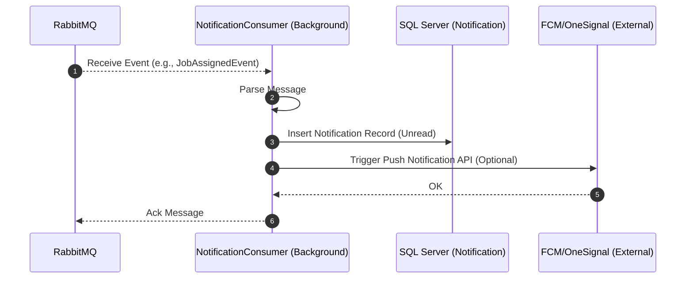

# API Sequence Diagrams

Dokumen ini memuat *Sequence Diagram* untuk seluruh endpoint yang ada di **EDCL Mini**. Diagram ini dirancang untuk memberikan pemahaman teknis mengenai alur request dari *Client* (Mobile/Web), melewati *API Gateway*, masuk ke *Modular Monolith (EDCL.Api)*, hingga dieksekusi oleh *Database* dan *Message Broker* (Outbox Pattern).

Agar mudah dipahami, dokumentasi ini dikelompokkan berdasarkan **Module**.

---

## Daftar Isi
1. [Module Auth (Authentication & Authorization)](#1-module-auth)
2. [Module Job (Core Operational)](#2-module-job)
3. [Module Cargo (Master Data Ingestion)](#3-module-cargo)
4. [Module Notification (Pusat Pemberitahuan)](#4-module-notification)

---

## 1. Module Auth
Module ini bertanggung jawab atas pembuatan token JWT, registrasi pengguna, dan manajemen sesi.

### 1.1. Driver Login
**Endpoint:** `POST /api/v1/auth/login`

**Penjelasan:**
- Driver login menggunakan Nomor HP dan Password. Sistem memverifikasi kredensial menggunakan BCrypt.
- Jika sukses, sistem meng-generate *Access Token* (umur pendek, misal 15 menit) dan *Refresh Token* (umur panjang, misal 30 hari).
- Refresh Token di-hash dan disimpan di database untuk mencegah pencurian token, sehingga bisa di-*revoke* (cabut akses) kapan saja.

### 1.2. AppUser Login (Web Admin)
**Endpoint:** `POST /api/v1/auth/users/login`

**Penjelasan:**
- Login untuk pengguna Web Admin (AppUser) menggunakan *Username* dan Password. 
- Alur intinya identik dengan login Driver, namun diarahkan ke `AppUsersController` dan tabel `app_users` untuk menjaga separasi entitas. Role code (misal: `ADMIN`) akan di-inject ke dalam JWT Claims.

### 1.3. Refresh Token
**Endpoint:** `POST /api/v1/auth/refresh`

---

## 2. Module Job
Module ini adalah pusat operasional di mana Driver menerima pekerjaan, mengeksekusi rute, men-scan barang, dan menyelesaikan tugas. Semua operasi tulis (Write) di modul ini menggunakan **Outbox Pattern**.

### 2.1. Start Job (Memulai Pekerjaan)
**Endpoint:** `POST /api/v1/jobs/{id}/start`

### 2.2. Scan Kanban
**Endpoint:** `POST /api/v1/jobs/stops/{stopId}/scan`

**Penjelasan:**
- Scan divalidasi apakah barcode Kanban tersebut terdaftar dalam kumpulan Manifest di Stop (Supplier) tersebut.
- Jika cocok, sistem mencatat waktu *scan* dan meng-update *counter* validasi Manifest.

### 2.3. Complete Stop (Selesai Pickup di Supplier)
**Endpoint:** `POST /api/v1/jobs/stops/{stopId}/complete`

**Penjelasan:**
- Endpoint ini menggabungkan **Validasi Bisnis (Geofence & Validasi Scan)** dengan arsitektur **Outbox Pattern**.
- Respons diberikan seketika ke Driver agar aplikasi cepat.
- Event `StopCompletedEvent` dilempar ke RabbitMQ di latar belakang (asinkron), yang nantinya bisa ditangkap oleh Modul Notifikasi atau Reporting.

---

## 3. Module Cargo
Module Cargo melayani pembacaan *Master Data* yang cepat (Query) untuk kebutuhan operasional. Write biasanya dilakukan via sinkronisasi *Legacy System* (Ingestion Worker).

### 3.1. Get Manifests by Stop ID / Parts / Kanbans
**Endpoint:** `GET /api/v1/manifests/...`

**Penjelasan:**
- Operasi `GET` (Queries) di aplikasi ini menggunakan pustaka **Dapper** langsung memanggil syntax SQL murni.
- Ini menghilangkan *overhead* dari *Entity Framework Core Tracking*, memastikan operasi baca sangat cepat untuk mendukung pagination di Web Admin.

---

## 4. Module Notification
Modul ini bertugas menyajikan list notifikasi ke aplikasi klien (lonceng notifikasi).

### 4.1. Get Notifications & Mark as Read
**Endpoint:** `GET /api/v1/notifications` | `POST /api/v1/notifications/{id}/read`

### 4.2. Penerimaan Event Asinkron (Event-Driven)
*(Proses yang berjalan di latar belakang tanpa HTTP Request)*

**Penjelasan:**
- Modul Notifikasi adalah *Consumer* utama dari sistem event-driven. Saat ada pekerjaan baru di-assign (dari Job Module) dan dimasukkan ke RabbitMQ via Outbox, Worker Notifikasi akan menangkapnya, mencatat ke database, dan men-trigger *Push Notification* ke HP Driver.

---

## 💡 Best Practices yang Diterapkan:
1. **API Gateway First**: Semua request wajib melewati Gateway untuk validasi JWT terpusat dan *Rate Limiting* guna mencegah serangan DDoS.
2. **CQRS Strict Separation**: Command (Write) mengubah state via EF Core, sementara Query (Read) via Dapper.
3. **Outbox Pattern**: Transaksi *database* lokal (*SQL Commit*) dan publikasi *event* (*Message Broker Publish*) tidak akan pernah *out-of-sync*.
4. **Idempotency**: Request modifikasi (POST/PUT) wajib menyertakan kunci Idempotency untuk menghindari eksekusi ganda jika *Client* retry akibat *timeout* jaringan.
