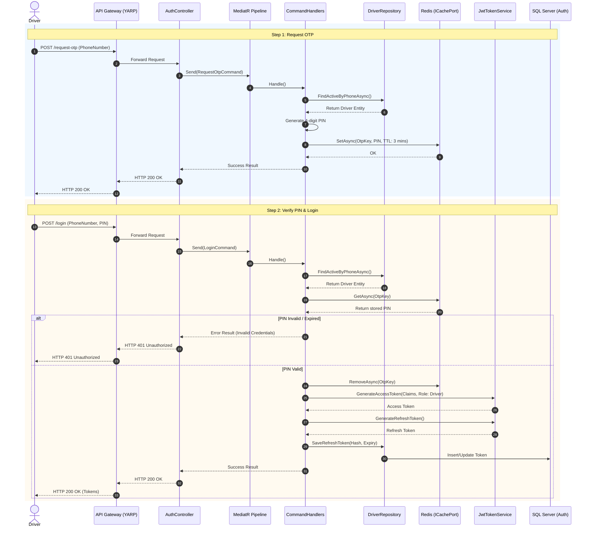
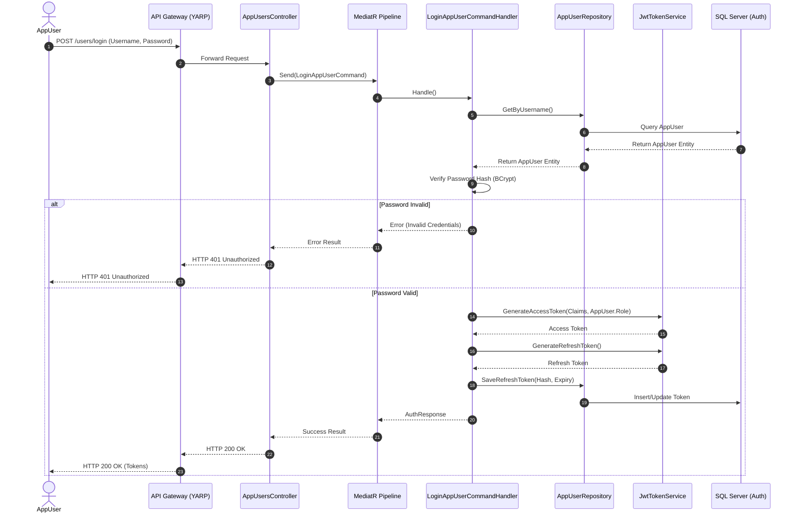
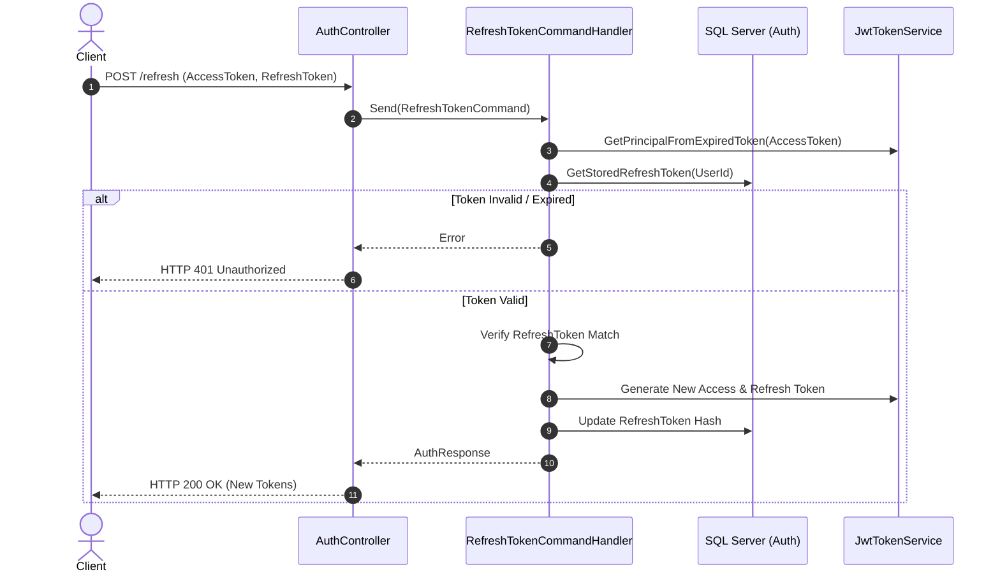
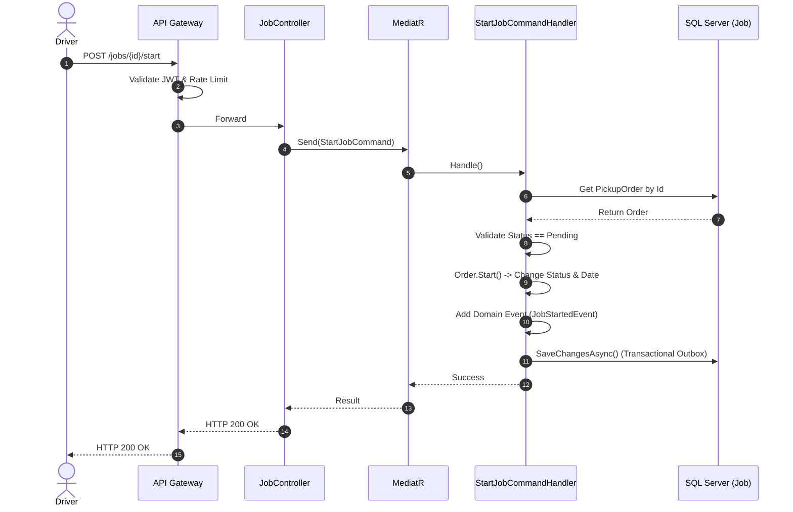
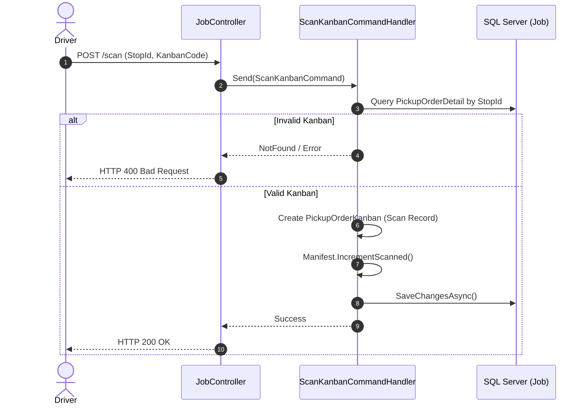
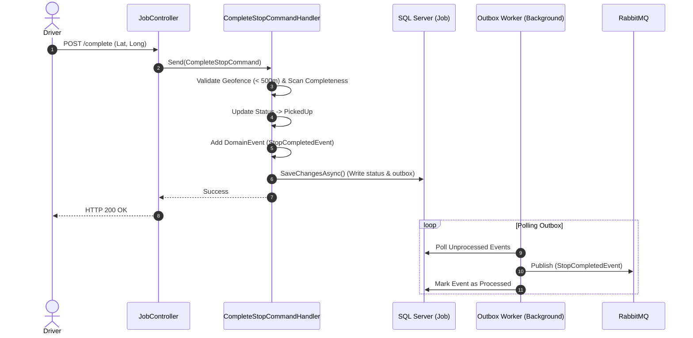
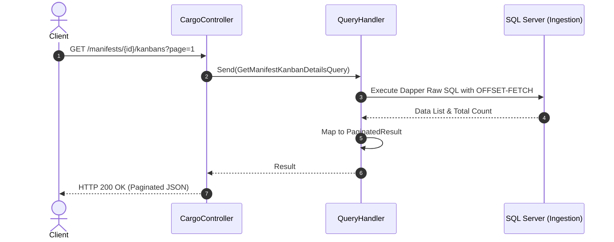
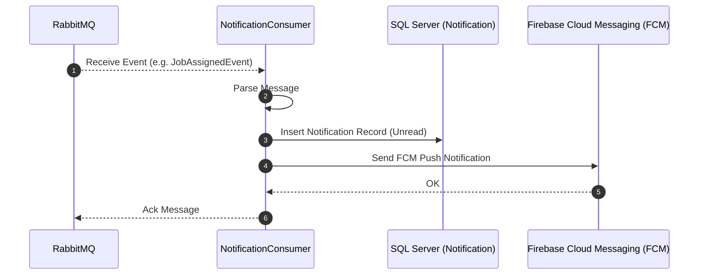

# API Sequence Diagrams

Sequence diagram endpoint utama sistem **EDCL Mini** dikelompokkan berdasarkan modul.

---

## 1. Module Auth

### 1.1. Driver Login (2-Step OTP Verification)
**Endpoints:** `POST /api/v1/auth/request-otp` & `POST /api/v1/auth/login`

### 1.2. AppUser Login (Web Admin)
**Endpoint:** `POST /api/v1/auth/users/login`

### 1.3. Refresh Token
**Endpoint:** `POST /api/v1/auth/refresh`

---

## 2. Module Job

### 2.1. Start Job
**Endpoint:** `POST /api/v1/jobs/{id}/start`

### 2.2. Scan Kanban
**Endpoint:** `POST /api/v1/jobs/stops/{stopId}/scan`

### 2.3. Complete Stop
**Endpoint:** `POST /api/v1/jobs/stops/{stopId}/complete`

---

## 3. Module Cargo

### 3.1. Query Manifests / Parts / Kanbans
**Endpoint:** `GET /api/v1/manifests/...`

---

## 4. Module Notification

### 4.1. Event-Driven Notification Push

