# Architecture Overview (EDCL Microservices Ecosystem)

Arsitektur sistem **EDCL** dirancang sebagai ekosistem **.NET Distributed Microservices** kelas *enterprise* berbasis **Hexagonal Architecture (Ports & Adapters)**, **CQRS**, **Event-Driven Architecture**, dan **Polyglot Persistence**.

Sistem ini merefleksikan studi kasus nyata logistik manufaktur otomotif **Toyota (TMMIN Milk-Run Logistics)** yang mengadopsi pola **Hybrid Cloud Integration** (AWS Cloud Ingress $\leftrightarrow$ On-Premises Plant Core).

---

## 1. Topologi Sistem & Diagram Arsitektur

```mermaid
graph TD
    classDef client fill:#3b82f6,stroke:#2563eb,stroke-width:2px,color:#fff;
    classDef gateway fill:#0284c7,stroke:#0369a1,stroke-width:2px,color:#fff;
    classDef core fill:#4f46e5,stroke:#4338ca,stroke-width:2px,color:#fff;
    classDef gps fill:#059669,stroke:#047857,stroke-width:2px,color:#fff;
    classDef worker fill:#f97316,stroke:#ea580c,stroke-width:2px,color:#fff;
    classDef db fill:#f1f5f9,stroke:#94a3b8,stroke-width:2px,color:#0f172a;
    classDef cache fill:#ef4444,stroke:#dc2626,stroke-width:2px,color:#fff;
    classDef mq fill:#ff6600,stroke:#ea580c,stroke-width:2px,color:#fff;
    classDef obs fill:#8b5cf6,stroke:#7c3aed,stroke-width:2px,color:#fff;
    classDef external fill:#0d9488,stroke:#0f766e,stroke-width:2px,color:#fff;

    DriverClient(["📱 Mobile Client (Driver)"]):::client
    WebClient(["💻 Web Client (Admin/Dispatcher)"]):::client

    Gateway["🚪 API Gateway (YARP :5293)<br/>─────────────────<br/>Reverse Proxy & Dynamic Path Routing<br/>Health Probes & Forwarded Headers"]:::gateway

    subgraph CoreSvc ["1. Logistics Core Service (EDCL.Api :5140)"]
        direction TB
        AuthMod["🔒 Auth Module (JWT, Roles)"]:::core
        JobMod["📋 Job Module (Pickup Orders, Stops)"]:::core
        CargoMod["📦 Cargo Module (Manifest, Kanban)"]:::core
        NotifMod["🔔 Notification Module (FCM, Alerts)"]:::core
        DriverMod["🚚 Driver & Master Module (Fleet, Routes)"]:::core
        GpsConsumer["🛰️ GpsTelemetryConsumer<br/>(RabbitMQ Topic Consumer)"]:::core
    end

    subgraph GpsTrackingSvc ["2. GPS Tracking Service (EDCLGPSAPI :5090)"]
        direction TB
        VendorIngress["📡 Vendor Ingestion Worker<br/>(Hino, Jitra, Puninar Poll/Webhook)"]:::gps
        GeofenceEngine["📍 Geofence & Delivery Progress Engine"]:::gps
        GpsPublisher["🐰 GpsPublisherService<br/>(topic_exchange Publisher)"]:::gps
    end

    subgraph Workers ["3. Ingestion & Outbox Engine"]
        direction TB
        IngestionWorker["📥 Worker.Ingestion<br/>(5-Stage Delayed Backoff DLQ)"]:::worker
        OutboxRelay["📤 Worker.Outbox<br/>(Transactional Outbox Publisher)"]:::worker
        ReporterWorker["📊 Worker.Reporter<br/>(Dapper IDCS Write-Back)"]:::worker
    end

    subgraph Persistence ["4. Polyglot Persistence & Data Stores"]
        SQLServer[("🗄️ SQL Server 2022 (:1444)<br/>Core Logistics DB<br/>Schemas: auth, job, cargo, etc.")]:::db
        PostgresGPS[("🐘 PostgreSQL 16 (:5436)<br/>AE031_EDCL_GPS_DB<br/>Raw Coordinates & Vendor Logs")]:::db
        Redis[("🔴 Redis 7.2 (:6379)<br/>Geospatial Index (GEOADD)<br/>Idempotency Distributed Locks")]:::cache
        RabbitMQ{{"🐰 RabbitMQ 3.13 (:5672)<br/>Exchanges: topic_exchange, dlx<br/>Priority & Dead Letter Queues"}}:::mq
    end

    subgraph ObservabilitySuite ["5. Observability & Monitoring"]
        Jaeger["📊 Jaeger Tracing (:16686)"]:::obs
        Prometheus["📈 Prometheus (:9090)"]:::obs
        SeqUI["📋 Seq Logs (:5341 / :9091)"]:::obs
    end

    subgraph ExternalSystems ["6. External Ecosystem"]
        IDCS[("🏭 IDCS Legacy Database<br/>SQL Server (Port 1466)")]:::external
        GpsVendors["🛰️ 3rd Party GPS Trackers<br/>(Hino Connect, Jitra, Puninar)"]:::external
        FCM["📲 Firebase Cloud Messaging"]:::external
    end

    DriverClient -->|HTTP/REST| Gateway
    WebClient -->|HTTP/REST / SignalR| Gateway

    Gateway -->|/api/v1/jobs/*, /api/v1/manifests/*| CoreSvc
    Gateway -->|/api/v1/gps/*| GpsTrackingSvc

    CoreSvc -->|ACID Transactions| SQLServer
    CoreSvc -->|Live GEO / Idempotency| Redis
    CoreSvc -->|Publish Domain Events| RabbitMQ
    CoreSvc -->|Push Alerts| FCM
    CoreSvc -.->|OTLP Traces| Jaeger & Prometheus

    GpsVendors -->|Poll / Webhook| VendorIngress
    VendorIngress -->|Store History| PostgresGPS
    VendorIngress -->|Forward Coordinates| GpsPublisher
    GpsPublisher -->|Publish GpsLastPositionHDto| RabbitMQ
    GpsTrackingSvc -.->|Serilog Sink| SeqUI

    RabbitMQ -->|Consume gps.vendor.*| GpsConsumer
    GpsConsumer -->|GEOADD trucks:locations| Redis
    GpsConsumer -->|SignalR Broadcast| WebClient
```

---

## 2. Prinsip & Pola Desain Kunci

- **Hybrid Cloud Architecture (Toyota Case Study)**:
  - **AWS Cloud Ingress (`EDCLGPSAPI`)**: Berjalan di **AWS ECS Fargate**, **AWS RDS PostgreSQL (`AE031_EDCL_GPS_DB`)**, dan **Amazon MQ (AMQPS:5671 TLS)** untuk menangani ribuan koordinat GPS vendor publik tanpa mengekspos jaringan internal pabrik.
  - **On-Premises Factory Core (`EDCL Core`)**: Berjalan di server *on-premises* pabrik manufaktur dengan **SQL Server 2022 Enterprise** untuk kepatuhan tata kelola data korporat dan latensi rendah ke sistem IDCS.
  - **Local Development Parity**: Seluruh topologi *hybrid* disimulasikan 1-to-1 di workstation menggunakan **Unified Podman Compose** (`podman-compose up -d`).

- **Polyglot Persistence (Database-per-Service & Right Tool for the Job)**:
  1. **SQL Server 2022** (Port 1444): Database relasional transaksional ACID tinggi untuk Manifes, 1 Juta Kanban, Job Dispatch, dan Stop Lifecycle.
  2. **PostgreSQL 16** (Port 5436): Database khusus GPS tracking untuk menyimpan riwayat mentah koordinat GPS (*raw breadcrumbs*), audit log API vendor, dan konfigurasi endpoint dinamis dalam format JSONB.
  3. **Redis 7.2** (Port 6379): In-memory data store dengan struktur **Geospatial Index** (`GEOADD trucks:locations <lon> <lat> <plat_no>`), hash status armada, dan lock idempotency (`X-Idempotency-Key`).

- **API Gateway (Microsoft YARP)**:
  Single entry point pada port `5293` dengan reverse proxy dynamic path routing:
  - Rute logistik (`/api/v1/jobs/*`, `/api/v1/manifests/*`, `/api/v1/auth/*`) $\to$ dialirkan ke **Logistics Core Svc** (Port `5140`).
  - Rute GPS (`/api/v1/gps/*`) $\to$ dialirkan ke **GPS Tracking Svc** (Port `5090`).
  - Health check probes otomatis (`/health` dan `/hc`) untuk mengisolasi kegagalan service.

- **Event-Driven GPS Tracking Stream**:
  - `EDCLGPSAPI` mem-publish payload event `GpsLastPositionHDto` ke RabbitMQ `topic_exchange` dengan routing key `gps.vendor.{vendorId}`.
  - `EDCL.Api` mengonsumsi event via `GpsTelemetryConsumer` pada queue `edcl_gps_telemetry_queue`.
  - Koordinat live langsung diindeks ke Redis Geospatial dan di-broadcast ke SignalR `TrackingHub`.
  - **Database SQL Server terbebas 100% dari 1.7 juta baris koordinat GPS mentah per hari!**

- **CQRS & MediatR Pipeline**: Pemisahan Command (Write Model) dan Query (Read Model). Didukung pipeline behavior untuk validasi, logging, dan idempotency locking.

- **Observability**:
  - **Jaeger** (`:16686`): Distributed OTLP tracing waterfall.
  - **Prometheus** (`:9090`): Metrik kinerja & PromQL scraper.
  - **Seq** (`:5341` & `:9091`): Centralized structured logging untuk log GPS vendor.

---

## 3. Alur Transaksi End-to-End (`Complete Stop`)

1. **Client Request**: Driver mengirim `POST /api/v1/mobile/jobs/stops/{stopId}/complete` via YARP Gateway (`:5293`) dengan header JWT dan `X-Idempotency-Key`.
2. **Idempotency Check**: Middleware memvalidasi key di Redis. Jika duplikat, kembalikan cached response seketika.
3. **Command Handling (CQRS)**: `CompleteStopCommand` diproses oleh handler modul `Job`.
4. **Transactional Outbox (Unit of Work)**: Status stop diperbarui ke `COMPLETED`, dan `StopCompletedEvent` disimpan ke tabel Outbox dalam transaksi database yang sama (ACID).
5. **Fast Response**: API mengembalikan respons `200 OK` ke klien mobile.
6. **Async Relay (Worker Outbox)**: `Worker.Outbox` membaca event dari tabel Outbox dan mem-publish-nya ke RabbitMQ.
7. **Async Reaction**: Modul `Notification` dan `Worker.Reporter` mengonsumsi event untuk memicu push notification FCM dan memperbarui laporan ke IDCS.
