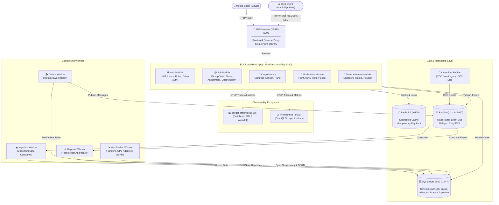

# Architecture Overview (EDCL Mini)

Arsitektur sistem **EDCL Mini** berbasis **Modular Monolith**, **Hexagonal Architecture (Ports & Adapters)**, dan **CQRS**, siap dimigrasikan ke **Microservices**.

---

## 1. Topologi Sistem & Diagram Arsitektur

---

## 2. Prinsip & Pola Desain Kunci

- **API Gateway (Microsoft YARP)**: Single entry point pada port `5293`. Menangani reverse proxy, path routing, sanitasi header (`X-Forwarded-*`), dan load balancing internal.
- **Domain Isolation & Modular Monolith**: 5 modul terpisah (`Auth`, `Job`, `Cargo`, `Driver`, `Notification`) tanpa foreign key lintas skema fisik database (`auth.*`, `job.*`, `cargo.*`, dll.). Komunikasi lintas modul melalui interface contract di `Shared.Kernel` atau asynchronous events via RabbitMQ.
- **CQRS & MediatR Pipeline**: Pemisahan Command (Write Model) dan Query (Read Model). Didukung pipeline behavior untuk validasi, logging, dan idempotency locking.
- **Infrastruktur Terdistribusi**:
  - **SQL Server 2022**: Skema terisolasi per modul dengan Optimistic Concurrency Control (`RowVersion`).
  - **Redis 7.2**: Distributed cache dan lock idempotency (`X-Idempotency-Key`).
  - **RabbitMQ 3.13 (MassTransit)**: Message broker dengan 5-Stage Delayed Retry Queue dan Dead-Letter Exchange (DLX).
  - **Debezium 2.5 CDC**: Log tailing SQL Server IDCS untuk streaming perubahan data transaksi manifes.
- **Asynchronous Workers**:
  1. `Worker.Ingestion`: Konsumsi dan pemrosesan stream CDC Debezium.
  2. `Worker.Outbox`: Menjamin *At-Least-Once Delivery* melalui Transactional Outbox Pattern.
  3. `Worker.Reporter`: Agregasi data laporan read-model.
  4. `Worker.GpsTracker`: Sinkronisasi telemetri GPS multi-vendor dan geofencing via Hangfire.
- **Observability**: OpenTelemetry OTLP tracing ke Jaeger (`:16686`) dan scraping metrik Prometheus (`:9090`).

---

## 3. Alur Transaksi End-to-End (`Complete Stop`)

1. **Client Request**: Driver mengirim `POST /api/v1/jobs/stops/{id}/complete` via YARP Gateway (`:5293`) dengan header JWT dan `X-Idempotency-Key`.
2. **Idempotency Check**: Middleware memvalidasi key di Redis. Jika duplikat, kembalikan cached response seketika.
3. **Command Handling (CQRS)**: `CompleteStopCommand` diproses oleh handler modul `Job`.
4. **Transactional Outbox (Unit of Work)**: Status stop diperbarui ke `COMPLETED`, dan `StopCompletedEvent` disimpan ke tabel Outbox dalam transaksi database yang sama (ACID).
5. **Fast Response**: API mengembalikan respons `200 OK` ke klien mobile.
6. **Async Relay (Worker Outbox)**: `Worker.Outbox` membaca event dari tabel Outbox dan mem-publish-nya ke RabbitMQ.
7. **Async Reaction**: Modul `Notification` dan `Worker.Reporter` mengonsumsi event untuk memicu push notification FCM dan memperbarui laporan.
