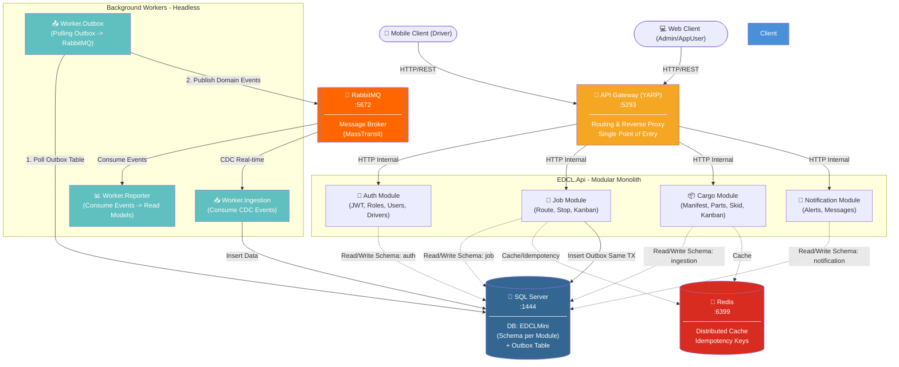

# Architecture Overview (EDCL Mini)

Dokumen ini menjelaskan arsitektur tingkat tinggi dari **EDCL Mini** (Electronic Delivery Check List). Sistem ini dibangun menggunakan arsitektur **Modular Monolith** dengan pola **Hexagonal Architecture** dan **CQRS** (Command Query Responsibility Segregation). 

Pendekatan ini dipilih agar sistem mudah di-maintenance, memiliki batasan (*boundaries*) yang tegas antar domain, namun tetap siap (*ready*) jika di masa depan perlu dipecah menjadi **Microservices**.

## 1. Topologi Sistem & Diagram Arsitektur

Berikut adalah gambaran besar bagaimana komponen-komponen dalam EDCL Mini berinteraksi satu sama lain:

---

## 2. Komponen Utama

### A. API Gateway (YARP)
Bertindak sebagai **Single Point of Entry**. Klien (Mobile App) tidak bisa menebak atau mengakses langsung ke *backend* API. Semua *request* akan divalidasi *routing*-nya di level Gateway sebelum diteruskan ke *internal API*. Hal ini juga memudahkan *load balancing* dan migrasi *microservices* (hanya perlu mengubah konfigurasi rute di Gateway tanpa mengubah klien).

### B. EDCL.Api (Modular Monolith)
Aplikasi inti yang membungkus beberapa modul independen (`Auth`, `Job`, `Cargo`, `Notification`).
- **Strict Boundaries**: Modul tidak boleh me-*reference* modul lain secara langsung. Komunikasi silang (*cross-domain*) dilakukan secara elegan melalui interface/port di *Shared Kernel* (contoh: `IDriverPort`, `ISupplierPort`). Di fase monolith, ini dieksekusi secara *in-memory* via *Dependency Injection*. Saat migrasi ke *microservices*, port tersebut cukup di-inject dengan *HTTP/gRPC Client* tanpa mengubah *business logic* dari modul pemanggil.
- **CQRS**: Menggunakan `MediatR` untuk memisahkan *Command* (operasi tulis/ubah data) dan *Query* (operasi baca data). Hal ini mempercepat performa *read* dan mengamankan *write*.
- **Database Schema per Module (Microservices Ready)**: Meski secara fisik menggunakan 1 Database (`EDCLMini`), setiap modul memiliki skema (*schema*) SQL Server yang terpisah (contoh: `auth`, `job`, `ingestion`, `notification`). Yang paling krusial, **tidak ada Foreign Key constraint antar skema** (misal: Modul Job hanya menyimpan `long DriverId` bukan navigasi objek relasional ke skema Auth). Hal ini membuat migrasi ke *microservices* semudah mengekspor skema ke database fisik terpisah.

### C. Infrastruktur Pendukung
- **SQL Server**: Relational Database Management System utama.
- **Redis**: Digunakan untuk *Distributed Caching* (mempercepat pengambilan data statis) dan menyimpan status *Idempotency Key* (mencegah *request* duplikat jika aplikasi klien kehilangan koneksi jaringan).
- **RabbitMQ**: *Message Broker* andalan kita untuk komunikasi *Asynchronous* antar layanan, menggunakan pustaka `MassTransit`.

### D. Background Workers
Pemisahan beban kerja berat agar tidak memblokir antarmuka API klien.
1. **Worker.Ingestion**: Ujung tombak integrasi data dari sistem *Legacy* (IDCS). Tidak lagi menggunakan *polling* periodik yang membebani database sumber, melainkan mendengarkan aliran data *real-time* via **Change Data Capture (Debezium CDC)** dari RabbitMQ dan menyimpannya ke database internal kita secara aman.
2. **Worker.Outbox**: Menjamin **Eventual Consistency**. Membaca tabel `Outbox` secara *polling*, lalu melempar kejadian (*Domain Events*) tersebut ke RabbitMQ.
3. **Worker.Reporter**: Pendengar setia RabbitMQ. Ia mengolah *events* yang dilempar oleh Outbox (misal: "Paket Terkirim") untuk membangun data laporan (*Read Models*) atau mengirimkan notifikasi.

---

## 3. Narasi Alur Eksekusi (Contoh Kasus: Complete Stop)

Untuk memahami bagaimana arsitektur ini bekerja dari perspektif *request* klien hingga *database* dan *message broker*, berikut adalah urutan eksekusinya:

### Skenario: Driver menyelesaikan rute pemberhentian (Complete Stop)

1. **Inisiasi Klien (Mobile):** Driver menekan tombol "Selesai" di aplikasi. Aplikasi klien mengirim HTTP POST `/api/v1/jobs/stops/1/complete` yang dilengkapi *JWT Token* dan `X-Idempotency-Key` ke API Gateway (Port `5293`).
2. **Routing (Gateway):** Gateway menerima *request* tersebut dan meneruskannya ke `EDCL.Api` (Port internal `8080`).
3. **Validasi Idempotency & Auth:** Pipeline `EDCL.Api` mengecek JWT dan mengecek `X-Idempotency-Key` di **Redis**. Jika *request* ini duplikat (misal user memencet tombol 2 kali secara cepat), API langsung membalas sukses tanpa mengeksekusi ulang kode di bawahnya.
4. **Command Execution (CQRS):** Request dipetakan menjadi `CompleteStopCommand` lalu ditangkap oleh *Handler* di Modul `Job`.
5. **Database Transaction (Unit of Work):** 
   - *Handler* mengubah status `Stop` menjadi `Completed` di memori.
   - *Handler* membuat `StopCompletedEvent` dan menambahkannya ke entitas.
   - Entity Framework menyimpannya ke SQL Server (Schema `job`). Bersamaan dengan itu (dalam 1 Transaksi Database yang sama), *Domain Event* tadi di-serialize menjadi JSON dan dimasukkan ke dalam tabel **Outbox**.
   - Ini memastikan prinsip ACID: Jika perubahan status gagal, *Event* tidak akan masuk Outbox.
6. **Respons Sinkron (Instan):** Setelah *commit* ke DB selesai, `EDCL.Api` segera mengembalikan HTTP `200 OK` ke klien. (Proses API selesai sangat cepat, tidak menunggu notifikasi/sistem lain).
7. **Relay Asinkron (Worker Outbox):** Di *background*, `Worker.Outbox` yang melakukan *polling* ke SQL Server menyadari ada pesan baru di tabel Outbox. Worker ini mengambil pesan tersebut dan mem-*publish*-nya ke **RabbitMQ**. Jika berhasil ter-*publish*, pesannya ditandai sebagai *Processed* di database.
8. **Reaksi Lanjutan (Worker Reporter / Notif):** Pesan di RabbitMQ didengarkan oleh `Worker.Reporter` atau Modul `Notification`. Mereka secara asinkron (tanpa mengganggu *driver*) memproses pesan tersebut untuk membuat rekap laporan *delay* atau men-*trigger* Push Notification ke sistem pusat.
