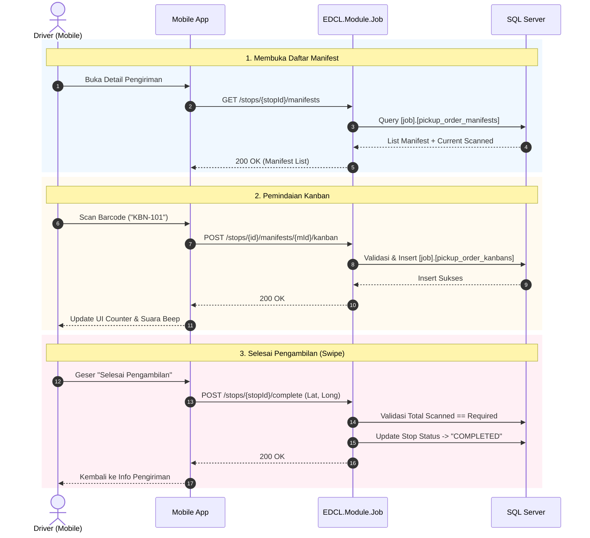

# Dokumen Teknis: Detail Pengiriman (Kanban Scanning System)

Spesifikasi alur pemindaian barcode Kanban pada perhentian supplier (*Pickup Stop*).

---

## 1. Spesifikasi Endpoint

| Endpoint | HTTP Method | Deskripsi |
|---|---|---|
| `/api/v1/mobile/driver/jobs/stops/{stopId}/manifests` | `GET` | Mengambil daftar manifes dan progres pemindaian kanban per manifes. |
| `/api/v1/mobile/driver/jobs/stops/{stopId}/manifests/{manifestId}/kanban` | `POST` | Merekam barcode kanban yang dipindai (`KanbanCode`). |
| `/api/v1/mobile/driver/jobs/stops/{stopId}/complete` | `POST` | Mengunci perhentian setelah seluruh kanban terverifikasi. |

---

## 2. Sequence Diagram

---

## 3. Best Practices
- **Camera Debouncing**: Jeda 1-2 detik setelah pemindaian barcode untuk mencegah duplicate scan.
- **Swipe-to-Complete**: Menggunakan gestur geser (*swipe*) untuk mencegah trigger selesai yang tidak disengaja.
- **Backend Strict Validation**: Menolak pemindaian kanban yang melebihi kuota manifes dengan `400 Bad Request`.
