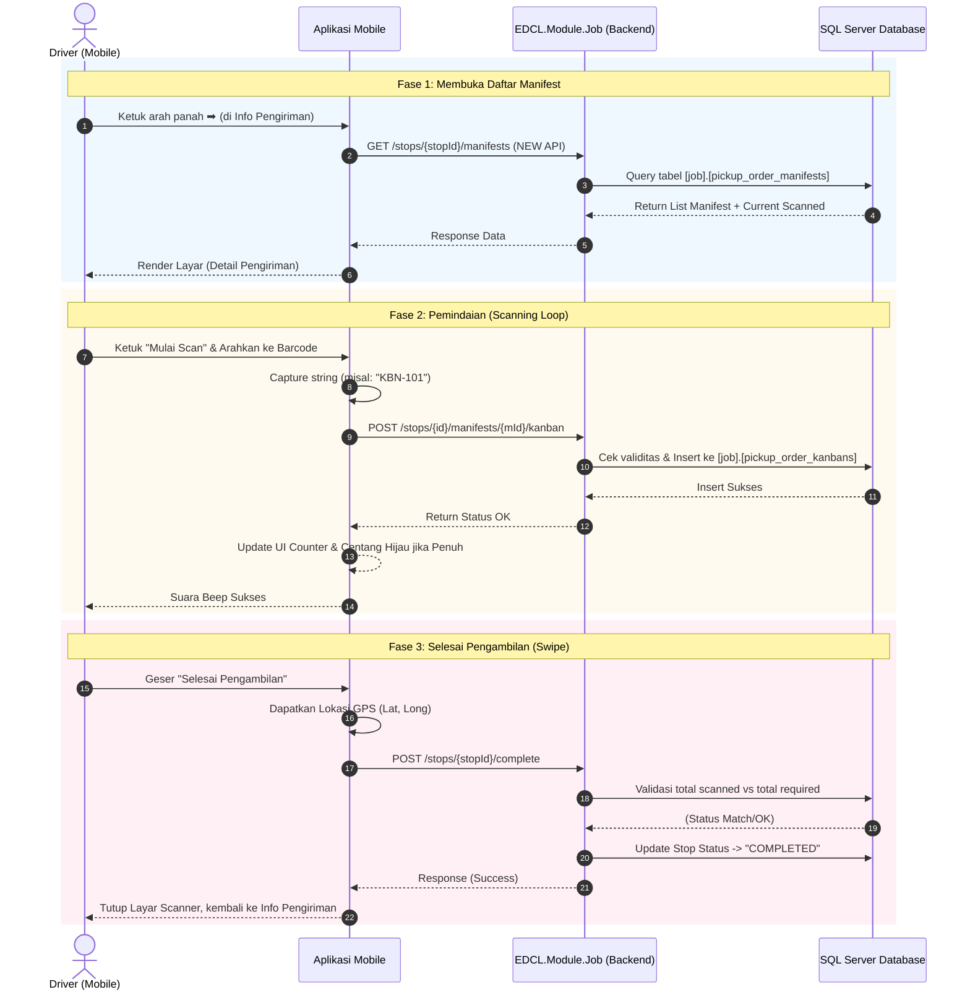

# Dokumen Teknis: Detail Pengiriman (Kanban Scanning System)

Dokumen ini memaparkan spesifikasi teknis dan interaksi arsitektural yang terjadi pada layar **Detail Pengiriman** atau *Kanban Scanner*.

## 1. Spesifikasi Teknis (Endpoint Requirement)

Karena pada tahap sebelumnya aplikasi Mobile hanya menerima agregasi total Kanban, layar Detail Pengiriman memerlukan **Endpoint Baru** untuk menarik rincian baris demi baris per Manifest.

### A. Endpoint Baru: Get Manifests by Stop
- **URL:** `GET /api/v1/jobs/stops/{stopId}/manifests`
- **Tujuan:** Menampilkan tabel rincian manifest (Manifest No, Type, Total SKID, Dock Code, No of Kanban, Status).
- **Behavior:** Backend harus menghitung `scannedKanban` secara *real-time* dengan membandingkan jumlah `PickupOrderKanban` yang berelasi dengan `PickupOrderManifest` tersebut. Jika `scannedKanban == totalKanban`, status di UI akan menjadi hijau (Complete).

### B. Endpoint Pemindaian (Sudah Ada)
- **URL:** `POST /api/v1/jobs/stops/{stopId}/manifests/{manifestId}/kanban`
- **Tujuan:** Menerima *string* barcode (`KanbanCode`) dari kamera.
- **Behavior:** Backend memvalidasi eksistensi manifest, kemudian melakukan *Insert* ke tabel `PickupOrderKanban` dengan *timestamp* saat ini (`ScannedAt = DateTime.UtcNow`).

### C. Endpoint Penguncian / Selesai (Sudah Ada)
- **URL:** `POST /api/v1/jobs/stops/{stopId}/complete`
- **Tujuan:** Dieksekusi dari *slider* "Geser Selesai Pengambilan".
- **Behavior:** Backend memvalidasi apakah jumlah `scannedKanban` di semua manifest milik *Stop* tersebut sudah menyentuh angka `totalKanban`.

## 2. Diagram Sekuensial (Scanner Flow)

## 3. Best Practices Implementasi Pemindaian

1. **Optimistic UI Updates (Resiliensi UX)**
   - Karena *scanning* terjadi dengan cepat (Driver dapat menembak 5 barcode dalam 3 detik), memanggil *endpoint* secara sinkron (menunggu *loading spin* per *scan*) akan menghambat pergerakan operasional.
   - **Rekomendasi:** Mobile app dapat mengantre (*queue*) payload *scan* di latar belakang dan merender UI secara optimis (langsung memperbarui *counter* lokal). Jika panggilan HTTP *Failed*, *counter* ditarik kembali (*rollback*) dan memunculkan *toast error*.

2. **Slider/Swipe untuk Aksi Destruktif**
   - Penggunaan tombol "Geser Selesai Pengambilan" (Swipe to Complete) merupakan *best practice* dalam aplikasi *Supply Chain* untuk mencegah ketidaksengajaan mengetuk (*accidental tap*) yang dapat mengakibatkan rute terkunci sebelum barang sungguhan naik ke truk.

3. **Debouncing Camera Scan**
   - Aplikasi klien (Mobile) harus mengimplementasikan *debouncing* atau jeda singkat (sekitar 1-2 detik) pada pembacaan kamera setelah satu barcode berhasil terbaca. Hal ini mencegah pengiriman 10 request API sekaligus untuk satu *barcode* yang sama karena tangan Driver belum beranjak.
   
4. **Validasi Strict Manifest di Backend**
   - API `POST .../kanban` tidak boleh hanya sekadar memasukkan data (*insert blind*). Ia wajib mengecek ulang tabel database apakah `ScannedKanban` sudah melebihi batas `TotalKanban`. Jika lebih, API harus menolak dengan HTTP 400 (Bad Request).
