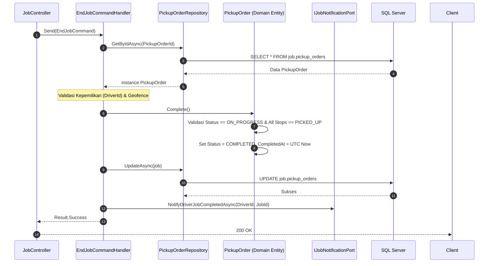

# Arsitektur Sistem: Penyelesaian Pekerjaan (End Job)

Spesifikasi teknis dan alur eksekusi penyelesaian pekerjaan (*End Job*) pada modul `Job`.

---

## 1. Spesifikasi Endpoint API

- **URL**: `POST /api/v1/mobile/driver/jobs/{PickupOrderId}/end`
- **Auth**: `Bearer JWT Token` (Driver)
- **Headers**: `X-Idempotency-Key` (UUIDv4)
- **Payload**:
  ```json
  {
    "latitude": -6.312151,
    "longitude": 107.135422
  }
  ```

---

## 2. Aturan Bisnis & Validasi (Domain Model)

1. **Ownership**: `job.DriverId` wajib cocok dengan klaim JWT pemanggil.
2. **State Transition**: `job.Status` harus dalam status `ON_PROGRESS`.
3. **Stop Completion**: Seluruh `PickupOrderDetail` (Supplier Stops) harus sudah berstatus `PICKED_UP`.
4. **Geofence Audit**: Koordinat GPS server-side dicatat untuk audit lokasi penyelesaian tugas di plant.
5. **State Mutation**: `status` $\to$ `COMPLETED`, `completed_at` $\to$ `DateTime.UtcNow`.
6. **Integration Event**: Memicu `JobCompletedIntegrationEvent` melalui outbox/notification port.

---

## 3. Sequence Diagram


