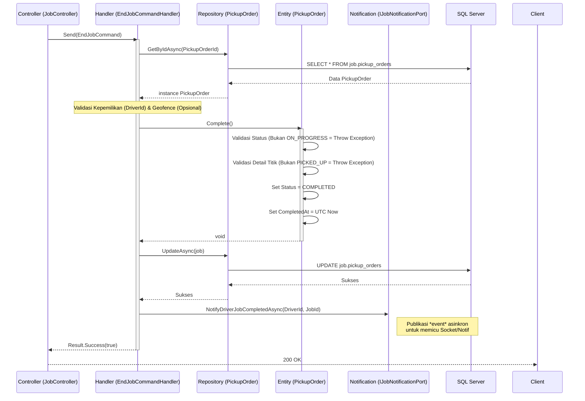

# Arsitektur Sistem: Penyelesaian Pekerjaan (End Job)

Dokumen ini menguraikan arsitektur dan pola teknis implementasi penyelesaian tugas pengiriman operasional (End Job) dalam arsitektur modul `Job`.

## 1. Spesifikasi Endpoint API

Aplikasi klien (Mobile) berinteraksi dengan API sentral untuk mengubah *state* (*Domain Entity*) dari pekerjaan saat ini.

- **URL:** `POST /api/v1/jobs/{PickupOrderId}/end`
- **Method:** `POST`
- **Otorisasi:** `Bearer Token` (ID Driver harus sama dengan pemilik *Job*).
- **Format Payload:** JSON
- **Body Request:**
  ```json
  {
    "latitude": -6.312151,
    "longitude": 107.135422
  }
  ```

## 2. Pemrosesan Logika Bisnis (CQRS)

Penyelesaian *job* ditangani oleh *Command* `EndJobCommand` dan dieksekusi melalui Handler `EndJobCommandHandler.cs` menggunakan *library* MediatR.

### a. Validasi Kepemilikan & Integritas (*Validation*)
1. Sistem mencari identitas pekerjaan melalui `PickupOrderId`. Jika tidak ada, kembalikan galat `404 Not Found`.
2. Sistem mencocokkan `job.DriverId` dengan ID pemanggil (Driver) pada *token*. Jika berbeda, kembalikan galat `401 Unauthorized`.
3. Sistem memanggil modul domain `job.Complete()`, yang mana di dalamnya akan diperiksa ulang:
   - Jika status pekerjaan saat ini bukanlah `ON_PROGRESS`, sistem akan melempar *InvalidOperationException*.
   - Jika masih ada titik (Supplier) yang statusnya bukan `PICKED_UP`, sistem juga akan melempar *InvalidOperationException*.

### b. Logika Geofencing Server-Side (Opsional/Ekstensi)
Meskipun aplikasi Mobile memicu "END JOB" berdasarkan pembacaan Geofence lokal mereka, Backend API tetap menyediakan parameter `Latitude` dan `Longitude` sebagai pilar keamanan. Hal ini memungkinkan Backend untuk menghitung validasi jarak (`CalculateDistance()`) untuk memastikan bahwa aplikasi Mobile tidak diretas (lokasi palsu) dan Driver sungguh berada di kawasan TMMIN.

### c. Pembaruan State Database
- Jika lolos validasi, Backend mengeksekusi *UpdateAsync* ke repositori SQL.
- Kolom yang terdampak pada tabel `job.pickup_orders`:
  - `status` berubah dari `ON_PROGRESS` menjadi `COMPLETED`.
  - `completed_at` di-set menjadi waktu UTC server saat eksekusi.

## 3. Sistem Notifikasi Asynchronous (Event Driven)

Setelah operasi ke *Database* selesai dengan aman (*transaction committed*), sistem tidak langsung memberi balikan kosong. API memanfaatkan port abstraksi `IJobNotificationPort` untuk memicu notifikasi.
- **Port:** `notificationPort.NotifyDriverJobCompletedAsync(...)`
- **Tujuan Arsitektur:** Ini memungkinkan modul internal logistik atau Administrator memantau secara *real-time* via soket atau sinyal R apabila sebuah armada (*Driver*) telah kembali dan menyelesaikan tugas penjemputannya di pabrik pusat.

## 4. Keuntungan Desain (Clean Architecture)
- **Isolasi Logika (Rich Domain Model):** Metode *mutator* `Complete()` terenkapsulasi murni pada kelas `PickupOrder` tanpa kebocoran aturan ke kontroler.
- **Geofence Fallback:** Ketersediaan koordinat GPS yang terekam pada server berfungsi sebagai jaring pengaman, alat audit untuk mengetahui lokasi persis saat tugas dianggap rampung secara sistem.

## 5. Sequence Diagram: Arsitektur Backend

Berikut adalah visualisasi teknis spesifik mengenai alur eksekusi di sisi *Backend* ketika permintaan "END JOB" diterima:


