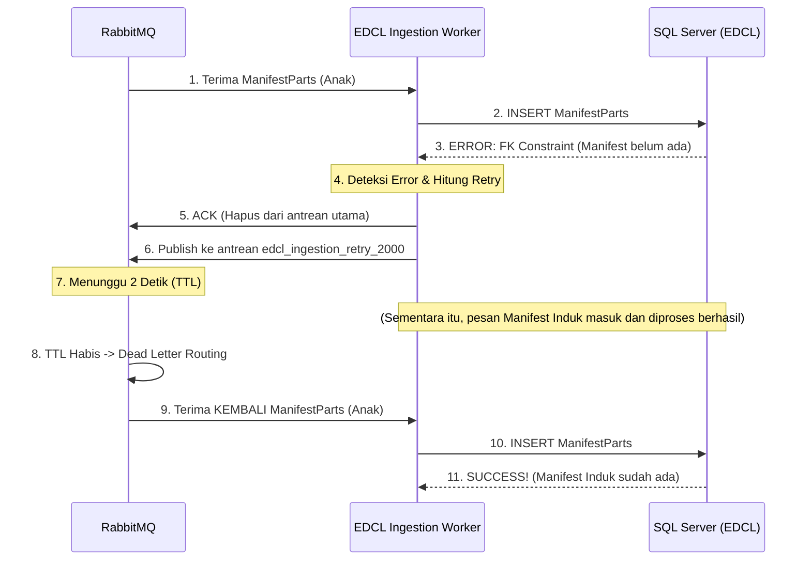

# Architecture: Event-Driven with Exponential Backoff & Dead Letter Exchange (DLX)

## 1. Executive Summary
Sistem EDCL menggunakan pola arsitektur **Change Data Capture (CDC)** via Debezium dan RabbitMQ untuk menyinkronkan data secara *real-time* dari sistem IDCS. 

Tantangan utama dalam arsitektur ini adalah **Data Ordering & Race Conditions**. Dalam sistem terdistribusi asinkron, tidak ada jaminan bahwa pesan "Induk" (misalnya `Manifests`) akan diproses sebelum pesan "Anak" (misalnya `ManifestParts`). 

Dokumen ini menjelaskan bagaimana sistem EDCL menyelesaikan masalah ini menggunakan pola **Delayed Retry dengan Exponential Backoff dan Dead Letter Exchange (DLX)**, sebuah praktik standar industri (*best practice*) untuk menjaga konsistensi relasional tanpa mengorbankan skalabilitas.

---

## 2. Definisi Masalah (The Problem)

### 2.1. Foreign Key Constraint Violation
Misalkan di IDCS, sebuah proses secara berurutan:
1. Menyimpan data Induk `Manifests` (ID: 101).
2. Menyimpan data Anak `ManifestParts` (dengan FK ManifestId: 101).

Debezium menangkap kedua *event* ini dan melemparnya ke RabbitMQ. Namun, karena jaringan, latensi, atau adanya pemrosesan paralel oleh beberapa *Worker*, bisa jadi pesan **Anak tiba lebih dulu di antrean pemrosesan**.

Ketika `EDCL.Worker.Ingestion` mencoba melakukan `INSERT` data Anak ke SQL Server:
```sql
-- GAGAL! Manifest dengan Id 101 belum ada di database EDCL.
INSERT INTO edcl.ingestion.manifest_parts (ManifestId, ...) VALUES (101, ...);
```
SQL Server akan melempar `SqlException` (*Foreign Key Constraint Violation*). 

### 2.2. Bahaya Pendekatan Naif
- Jika pesan **Dibuang (Ack & Ignore):** Terjadi kebocoran data (*Data Loss*).
- Jika pesan **Ditolak (Nack & Requeue):** Pesan akan langsung dikembalikan ke puncak antrean. Worker akan membaca pesan yang sama, gagal lagi, dan memblokir pesan-pesan lain di belakangnya (*Poison Pill* yang menyebabkan *Infinite Loop*).

---

## 3. Solusi: Exponential Backoff & DLX

Solusi elegan yang diimplementasikan di `Worker.cs` adalah memindahkan pesan yang gagal ke sebuah "Ruang Tunggu" sementara.

### 3.1. Komponen Utama

1. **Main Queue (`edcl_ingestion`)** 
   Antrean utama tempat *Worker* membaca data masuk.
2. **Retry Delay Queues (`edcl_ingestion_retry_{delayMs}`)** 
   Antrean sementara (Ruang Tunggu) yang TIDAK memiliki *Consumer/Worker*. Antrean ini memanfaatkan dua properti RabbitMQ:
   - `x-message-ttl` (Time-to-Live): Waktu (dalam milidetik) pesan bertahan di antrean ini sebelum dianggap "mati".
   - `x-dead-letter-routing-key` & `x-dead-letter-exchange`: Perintah bagi RabbitMQ, *"Jika pesan mati (waktu habis), kirim pesan ini kembali ke `edcl_ingestion`."*
3. **Dead Letter Queue / DLQ (`edcl_ingestion_faults`)** 
   Kuburan akhir untuk pesan-pesan yang terus-menerus gagal meskipun sudah ditunda berkali-kali.

### 3.2. Alur Proses (Sequence)



---

## 4. Implementasi Teknis (Code Breakdown)

### 4.1. Error Catching
Ketika terjadi kegagalan saat proses SQL `ExecuteAsync`, *worker* akan masuk ke blok `catch`. Disinilah jumlah percobaan (*attempt*) dihitung.

```csharp
catch (Exception ex)
{
    // Cek apakah ini percobaan ke 1, 2, 3, dst
    if (attempt >= maxRetries) {
        // ... Masuk ke DLQ
    } else {
        // ... Lakukan Exponential Backoff
    }
}
```

### 4.2. Perhitungan Exponential Backoff
Agar sistem tidak memborbardir database, waktu tunggu akan semakin lambat setiap kali pesan gagal. Ini disebut *Exponential Backoff*.

```csharp
// attempt 1 = 2000 ms (2 detik)
// attempt 2 = 4000 ms (4 detik)
// attempt 3 = 8000 ms (8 detik)
var delayMs = (int)Math.Pow(2, attempt) * 1000;
var retryQueueName = $"edcl_ingestion_retry_{delayMs}";
```

### 4.3. Pembuatan Ruang Tunggu & Routing (DLX)
Kode di bawah ini secara otomatis membuat antrean (jika belum ada) dan mengatur ke mana pesan akan "terlempar" jika *timer* habis.

```csharp
var queueArgs = new Dictionary<string, object?>
{
    { "x-dead-letter-exchange", "" }, 
    { "x-dead-letter-routing-key", "edcl_ingestion" }, // Lempar kembali ke antrean utama
    { "x-message-ttl", delayMs } // Nyalakan timer!
};

await channel.QueueDeclareAsync(
    retryQueueName, true, false, false, queueArgs, cancellationToken: stoppingToken
);
```

### 4.4. Menjaga Status (Header Injection)
Pesan *retry* yang dilempar harus tahu bahwa ia sudah gagal berapa kali. Oleh karena itu, *worker* menyuntikkan header `x-retry-count` ke dalam metadata RabbitMQ.

```csharp
headers["x-retry-count"] = attempt + 1; // Naikkan counter

var retryProps = new RabbitMQ.Client.BasicProperties { Headers = headers, ... };
await channel.BasicPublishAsync(..., routingKey: retryQueueName, basicProperties: retryProps, ...);
```

### 4.5. Fatal Error (DLQ)
Jika percobaan mencapai `maxRetries` (misalnya 5 kali = total waktu menunda ~62 detik), pesan tidak akan di-*retry* lagi. Pesan dibungkus dalam JSON baru berisi *ErrorMessage* dan *StackTrace*, kemudian dilempar ke `edcl_ingestion_faults`.

---

## 5. Kesimpulan
Pola **Exponential Backoff dengan RabbitMQ DLX** pada sistem ini memberikan jaminan 3 tingkat:
1. **Zero Data Loss:** Pesan tidak akan pernah hilang.
2. **Relational Consistency:** Masalah urutan CDC (Anak datang sebelum Induk) dapat ditangani secara otomatis.
3. **High Throughput:** Pesan yang gagal tidak memblokir antrean bagi pesan-pesan lain yang sah (*Non-blocking retry*).

Arsitektur ini menghilangkan kebutuhan *polling* manual dan meniadakan keharusan mengubah kode sistem warisan (IDCS), menjadikannya solusi *ingestion* kelas *Enterprise*.
