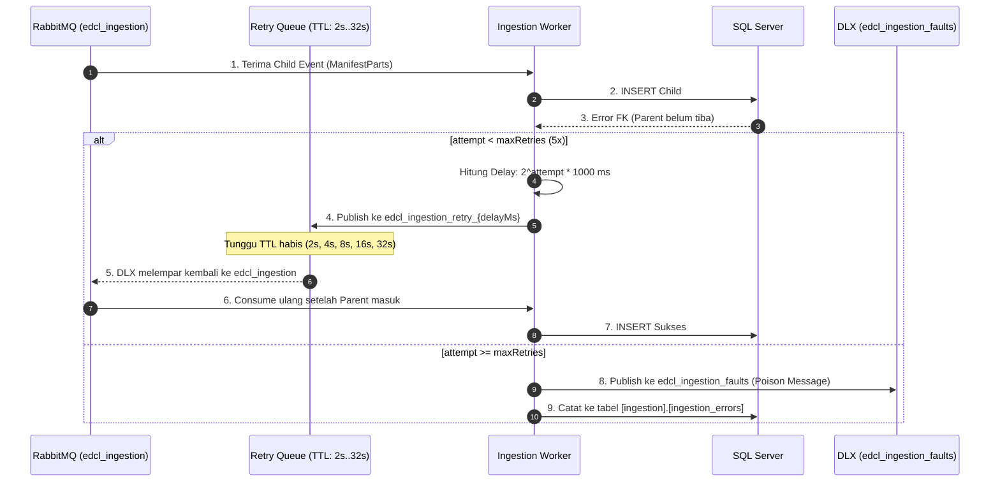

# Architecture: Event-Driven with Exponential Backoff & Dead Letter Exchange (DLX)

Pola mitigasi *out-of-order events* dan *transient errors* pada alur Change Data Capture (CDC) Debezium $\to$ RabbitMQ $\to$ SQL Server.

---

## 1. Topologi Antrean Retry & DLX

---

## 2. Struktur Antrean RabbitMQ

| Antrean | Tipe / Konfigurasi | Fungsi |
|---|---|---|
| `edcl_ingestion` | Main Consumer Queue | Antrean utama yang dikonsumsi oleh `EDCL.Worker.Ingestion`. |
| `edcl_ingestion_retry_2000` | TTL 2s, DLX `edcl_ingestion` | Ruang tunggu retry stage 1 (2 detik). |
| `edcl_ingestion_retry_4000` | TTL 4s, DLX `edcl_ingestion` | Ruang tunggu retry stage 2 (4 detik). |
| `edcl_ingestion_retry_8000` | TTL 8s, DLX `edcl_ingestion` | Ruang tunggu retry stage 3 (8 detik). |
| `edcl_ingestion_retry_16000` | TTL 16s, DLX `edcl_ingestion` | Ruang tunggu retry stage 4 (16 detik). |
| `edcl_ingestion_retry_32000` | TTL 32s, DLX `edcl_ingestion` | Ruang tunggu retry stage 5 (32 detik). |
| `edcl_ingestion_faults` | Dead Letter Queue (DLQ) | Penyimpanan pesan gagal permanen untuk inspeksi dan manual re-queue via Sync Command Center UI. |

---

## 3. Keunggulan Arsitektur
- **Zero Data Loss**: Pesan out-of-order tidak dibuang, melainkan ditunda secara non-blocking.
- **Head-of-Line Blocking Prevention**: Antrean utama tetap memproses pesan valid lainnya tanpa terhambat poison pill.
- **Automatic Recovery**: Hubungan relasional Foreign Key terpulihkan otomatis saat pesan induk selesai diproses.
