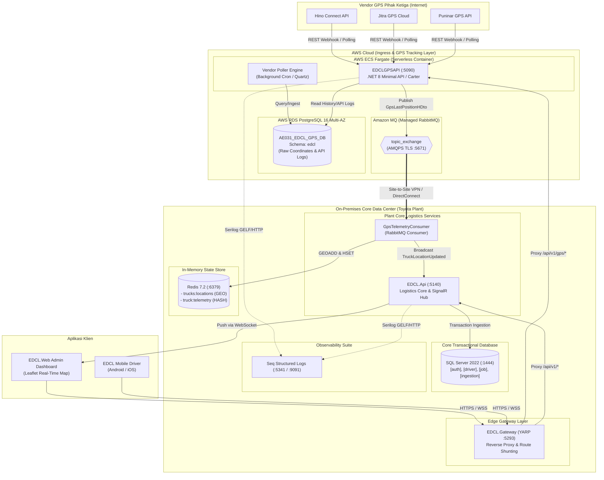

# Dokumen Teknis: Sistem GPS Tracking Armada (`EDCLGPSAPI`)

Dokumen ini memaparkan spesifikasi teknis arsitektur, integrasi sistem, skema persistensi data, dan kontrak komunikasi *event-driven* untuk subsistem **GPS Tracking Armada** (**`EDCLGPSAPI`**) yang terintegrasi di dalam ekosistem **EDCL Mini**.

---

## 1. Ikhtisar & Peran Arsitektural

Dalam rantai pasok manufaktur otomotif (*Toyota Production System / Just-In-Time Logistics*), pemantauan armada truk pengangkut komponen dari ratusan supplier menuju pabrik perakitan (*Plant*) memerlukan akurasi koordinat dan estimasi waktu kedatangan (*ETA*) dengan latensi sangat rendah.

Namun, data GPS tracking memiliki karakteristik lalu lintas data yang unik:
- **Write-Heavy & High Frequency**: Ratusan armada mengirimkan koordinat latitude/longitude setiap 1 menit (menghasilkan akumulasi data telemetri dalam volume masif).
- **Heterogeneous Vendor Payloads**: Mitra logistik (*Hikari Logistics, Puninar, Hino Connect, Jitra*) menggunakan perangkat keras pelacak dan format API JSON/XML yang berbeda-beda.
- **Payload Dinamis & Schema Flexibility**: Memerlukan dukungan penyimpanan tipe data dokumen/JSONB untuk fleksibilitas integrasi vendor baru tanpa mengubah DDL inti secara berulang.

Untuk mencegah beban konkurensi koordinat GPS ini mengganggu transaksi relasional inti logistik (Manifes, 1 Juta Kanban, Penugasan Driver) di database utama SQL Server, EDCL mengadopsi **arsitektur terdistribusi poliglut** (*polyglot persistence microservice*) melalui layanan independen **`EDCLGPSAPI`**.

---

## 2. Arsitektur Hybrid Cloud (Kasus Nyata Produksi Toyota)

Secara operasional pada skala industri (skenario produksi Toyota Astra Motor / TMMIN), sistem menerapkan topologi **Hybrid Cloud**:



### Karakteristik Pemisahan Tanggung Jawab:
1. **AWS ECS Fargate**: Menjalankan *workload* `EDCLGPSAPI` yang berhadapan langsung dengan jaringan publik (Internet) untuk menerima data atau melakukan polling ke API vendor GPS secara elastis tanpa membuka *port incoming* ke server *on-premises* pabrik.
2. **AWS RDS PostgreSQL**: Menyerap ribuan koordinat GPS mentah (*breadcrumbs*) per menit dengan dukungan tipe data `JSONB` untuk payload vendor dan audit log panggilan API.
3. **Amazon MQ (AMQPS TLS)**: Bertindak sebagai jembatan asinkron berkeamanan tinggi yang mengalirkan event GPS dari AWS Cloud ke jaringan lokal pabrik (*On-Premises*) melalui enkripsi TLS/VPN.
4. **On-Premises Plant Core**: Menjalankan `EDCL.Api`, `EDCL.Gateway`, dan database **SQL Server 2022** yang memegang kedaulatan data transaksi manufaktur, serta **Redis 7.2** untuk *state* koordinat armada *real-time*.
5. **Local Podman Parity**: Seluruh topologi di atas diabstraksikan secara 100% identik di lingkungan lokal pengembang melalui satu file [`be/docker-compose.yml`](file:///home/aliube/Workspace/Project-Personal/Net/gemini/edcl-mini/be/docker-compose.yml) berbasis Podman.

---

## 3. Komponen Layanan & Port Mapping

| Komponen | Runtime / Teknologi | Port Host | Deskripsi Tanggung Jawab |
|---|---|---|---|
| **`EDCLGPSAPI`** | .NET 8, Carter, MediatR, Npgsql | `:5090` | Layanan mikro GPS tracking, vendor auth, dynamic mapping, GPS polling engine. |
| **`EDCL.Api`** | .NET 10, ASP.NET Core, SignalR | `:5140` | Layanan inti logistik, *host* untuk `GpsTelemetryConsumer` dan `TrackingHub`. |
| **`EDCL.Gateway`** | .NET 10, YARP Reverse Proxy | `:5293` | Gerbang tunggal API, merutekan lalu lintas GPS tracking ke port 5090 dan logistik ke port 5140. |
| **`AE031_EDCL_GPS_DB`** | PostgreSQL 16 Alpine | `:5436` | Database GPS tracking, riwayat koordinat GPS, konfigurasi vendor dan audit log. |
| **`SQL Server 2022`** | Microsoft SQL Server Express | `:1444` | Database inti transaksi manifes, 1 juta Kanban, perhentian rute (*Stops*), dan akun driver. |
| **`Redis`** | Redis 7.2 Alpine | `:6379` | Cache in-memory berkecepatan tinggi, indeks geospasial (`GEOADD`), dan distributed lock. |
| **`RabbitMQ`** | RabbitMQ 3.13 Management | `:5672` (AMQP)<br/>`:15672` (UI) | Message broker asinkron, exchange `topic_exchange` untuk routing stream koordinat GPS. |
| **`Seq`** | Datalust Seq Standalone | `:5341` (Ingest)<br/>`:9091` (UI) | Server visualisasi dan query terpusat untuk log terstruktur (*structured logging*). |

---

## 4. Skema Database PostgreSQL (`AE031_EDCL_GPS_DB`)

Seluruh relasi GPS tracking berada di dalam skema `edcl` dan diinisialisasi melalui skrip [`be/sql/init-edclgps-db.sql`](file:///home/aliube/Workspace/Project-Personal/Net/gemini/edcl-mini/be/sql/init-edclgps-db.sql):

### 4.1. Tabel Master Konfigurasi
1. **`tb_m_gps_vendor`**:
   - `Id` (UUID PK), `VendorName` (VARCHAR), `Timezone` (VARCHAR), `RequiredAuth` (BOOLEAN), `AuthType` (VARCHAR: `NoAuth`, `Bearer`, `Basic`, `OAuth2`), `ProcessingStrategy` (VARCHAR: `Individual`, `Batch`).
2. **`tb_m_gps_vendor_endpoint`**:
   - `Id` (UUID PK), `GpsVendorId` (UUID FK), `BaseUrl` (VARCHAR), `Method` (VARCHAR), `Headers` (JSONB), `Params` (JSONB), `VarParams` (JSONB).
3. **`tb_m_gps_vendor_auth`**:
   - `Id` (UUID PK), `GpsVendorId` (UUID FK), `BaseUrl` (VARCHAR), `Method` (VARCHAR), `Authtype` (VARCHAR), `TokenPath` (VARCHAR), `Bodies` (JSONB).
4. **`tb_m_mapping`**:
   - `Id` (SERIAL PK), `GpsVendorId` (UUID FK), `ResponseField` (VARCHAR), `MappedField` (VARCHAR).
   - Memungkinkan pembacaan format dinamis dari vendor tanpa refactoring kode C#.
5. **`tb_m_gps_vendor_lpcd`**:
   - `Id` (UUID PK), `GpsVendorId` (UUID FK), `Lpcd` (VARCHAR) — kode unit truk di vendor GPS.
6. **`tb_m_system`**:
   - `SysCat` (PK), `SysSubCat` (PK), `SysCd` (PK), `SysValue` (VARCHAR), `Remarks` (VARCHAR).
   - Menyimpan parameter runtime seperti interval polling (`30` detik) dan threshold geofence (`100m` supplier, `150m` plant).
7. **`tb_m_gps_api_log`**:
   - `Id` (UUID PK), `FunctionName` (VARCHAR), `Status` (VARCHAR), `ErrorMessage` (TEXT), `Parameter` (TEXT), `CreatedAt` (TIMESTAMPTZ).

### 4.2. Tabel Transaksi GPS Tracking
1. **`tb_r_delivery_progress`**:
   - `Id` (UUID PK), `DeliveryNo` (VARCHAR), `PlatNo` (VARCHAR), `NoKtp` (VARCHAR), `VendorName` (VARCHAR), `Lpcd` (VARCHAR).
2. **`tb_r_gps_delivery_h` & `tb_r_gps_delivery_d`**:
   - Header dan Detail rekam jejak koordinat GPS selama penugasan delivery berjalan:
     - `PlatNo` (VARCHAR), `DeviceId` (VARCHAR), `Datetime` (TIMESTAMP), `X` (NUMERIC 19,16 - Longitude), `Y` (NUMERIC 19,16 - Latitude), `Speed` (NUMERIC 5), `Course` (NUMERIC 5), `StreetName` (VARCHAR).
3. **`tb_r_gps_delivery`**:
   - Tabel konsolidasi terpadu untuk query riwayat perjalanan delivery (*Route Replay*).
4. **`tb_r_gps_last_position_h` & `tb_r_gps_last_position_d`**:
   - Menyimpan koordinat teraktual armada dari eksekusi polling terakhir.

---

## 5. Kontrak Event Asinkron & Aliran Pesan (RabbitMQ)

Layanan `EDCLGPSAPI` menerbitkan event koordinat ke RabbitMQ menggunakan skema `GpsLastPositionHDto`.

### 5.1. Topologi Exchange & Queue
- **Exchange**: `topic_exchange`
  - Tipe: `topic`
  - Durabilitas: `Durable`
- **Routing Key**: `gps.vendor.<vendor_code>` (contoh: `gps.vendor.hino`, `gps.vendor.jitra`, `gps.vendor.puninar`)
- **Queue Konsumen**: `edcl_gps_telemetry_queue`
  - Durabilitas: `Durable`
  - Binding Pattern: `gps.vendor.*` (Menangkap semua stream dari seluruh vendor GPS)

### 5.2. Format JSON Payload Event (`GpsLastPositionHDto`)

```json
{
  "id": "f47ac10b-58cc-4372-a567-0e02b2c3d479",
  "gpsVendorId": "a1b2c3d4-e5f6-7a8b-9c0d-1e2f3a4b5c6d",
  "gpsVendorName": "HINO-CONNECT",
  "lastPositions": [
    {
      "id": "e7b8c9d0-1e2f-3a4b-5c6d-7e8f90123456",
      "gpsLastPositionHId": "f47ac10b-58cc-4372-a567-0e02b2c3d479",
      "lpcd": "TMM01",
      "platNo": "B 9123 TMM",
      "deviceId": "HINO-OBD-0921",
      "datetime": "2026-09-17T08:15:30Z",
      "x": 107.1378,
      "y": -6.3685,
      "speed": 45.0,
      "course": 92.0,
      "streetName": "Jl. Industri Cikarang Barat No. 12"
    }
  ]
}
```

---

## 6. Konsumsi Koordinat GPS & State Caching di `EDCL.Api`

Host backend `EDCL.Api` menjalankan komponen latar belakang **`GpsTelemetryConsumer`** yang terdaftar sebagai *Hosted Service*:

```csharp
// Cuplikan Alur Pemrosesan di GpsTelemetryConsumer.cs
public async Task ProcessTelemetryAsync(GpsLastPositionHDto payload)
{
    foreach (var pos in payload.LastPositions)
    {
        // 1. Guard Idempotensi dengan Redis TTL
        var idempotencyKey = $"gps:idempotency:{pos.Id}";
        if (!await _redisDb.StringSetAsync(idempotencyKey, "1", TimeSpan.FromHours(24), When.NotExists))
            continue;

        // 2. Simpan koordinat ke Indeks Geospasial Redis
        await _redisDb.GeoAddAsync("trucks:locations", (double)pos.X, (double)pos.Y, pos.PlatNo);

        // 3. Simpan atribut koordinat & status lengkap ke Redis Hash
        var hashEntries = new HashEntry[]
        {
            new("latitude", pos.Y.ToString()),
            new("longitude", pos.X.ToString()),
            new("speed", pos.Speed.ToString()),
            new("course", pos.Course.ToString()),
            new("streetName", pos.StreetName ?? string.Empty),
            new("vendor", payload.GpsVendorName),
            new("updatedAt", pos.Datetime.ToString("O"))
        };
        await _redisDb.HashSetAsync($"truck:{pos.PlatNo}:telemetry", hashEntries);

        // 4. Siarkan perubahan ke seluruh klien Web Admin via SignalR Hub
        await _hubContext.Clients.All.SendAsync("TruckLocationUpdated", new
        {
            PlatNo = pos.PlatNo,
            Latitude = pos.Y,
            Longitude = pos.X,
            Speed = pos.Speed,
            Course = pos.Course,
            UpdatedAt = pos.Datetime
        });
    }
}
```

---

## 7. Reverse Proxy & Shunting di `EDCL.Gateway` (YARP)

Gateway YARP (`EDCL.Gateway`) yang berjalan pada port `5293` dikonfigurasi untuk memotong seluruh permintaan GPS tracking dan mengarahkannya ke `EDCLGPSAPI` (:5090) secara transparan:

```json
{
  "ReverseProxy": {
    "Routes": {
      "gps-route": {
        "ClusterId": "edcl-gps-cluster",
        "Match": {
          "Path": "/api/v1/gps/{**catch-all}"
        }
      },
      "core-api-route": {
        "ClusterId": "edcl-core-cluster",
        "Match": {
          "Path": "/api/v1/{**catch-all}"
        }
      }
    },
    "Clusters": {
      "edcl-gps-cluster": {
        "Destinations": {
          "destination1": {
            "Address": "http://localhost:5090"
          }
        }
      },
      "edcl-core-cluster": {
        "Destinations": {
          "destination1": {
            "Address": "http://localhost:5140"
          }
        }
      }
    }
  }
}
```

---

## 8. Panduan Verifikasi & Health Check

Untuk memvalidasi bahwa seluruh subsistem GPS tracking berfungsi optimal:

1. **Pemeriksaan Status Kontainer Podman**:
   ```bash
   podman ps --format "table {{.Names}}\t{{.Status}}\t{{.Ports}}"
   ```
   Pastikan kelima kontainer (`edcl_sqlserver`, `edcl_postgres_gps`, `edcl_rabbitmq`, `edcl_redis`, `edcl_seq`) berada dalam status `Up`.

2. **Pengujian Reverse Proxy Gateway**:
   ```bash
   curl -I http://localhost:5293/api/v1/gps/vendors
   # Harus mengembalikan HTTP 200 OK dari EDCLGPSAPI (:5090)
   ```

3. **Verifikasi Koordinat Geospasial di Redis**:
   ```bash
   podman exec -it edcl_redis redis-cli GEOPOS trucks:locations "B 9123 TMM"
   podman exec -it edcl_redis redis-cli HGETALL "truck:B 9123 TMM:telemetry"
   ```

4. **Inspeksi Log Terstruktur di Seq**:
   Buka browser ke `http://localhost:9091` dan gunakan query:
   ```sql
   @Message like "%[GpsTelemetryConsumer]%"
   ```
