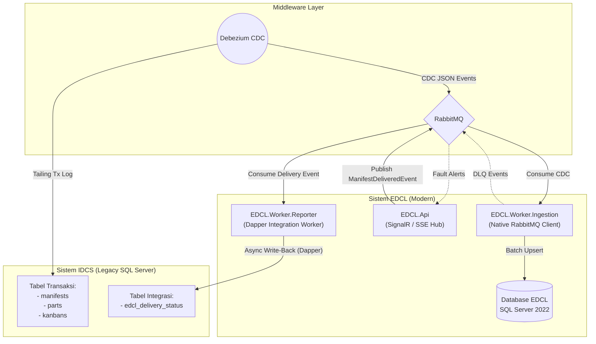

# Arsitektur Integrasi IDCS ↔ EDCL

Spesifikasi integrasi data dua arah antara sistem legacy **IDCS** dan **EDCL** berbasis **Change Data Capture (CDC)** dan **Event-Driven Write-Back**.

---

## 1. Diagram Integrasi

---

## 2. Alur Integrasi Dua Arah

### A. Ingestion (IDCS $\to$ EDCL)
1. **Log Sniffing**: Debezium membaca mutasi data (`INSERT`, `UPDATE`, `DELETE`) dari SQL Server Transaction Log IDCS secara pasif tanpa SELECT polling.
2. **Buffering**: Event dikonversi menjadi format JSON dan dikirim ke queue RabbitMQ `edcl_ingestion`.
3. **Ingestion Worker**: `EDCL.Worker.Ingestion` memproses payload dan melakukan upsert ke skema `ingestion.*` di database EDCL.
4. **Resiliency**: Skenario out-of-order ditangani melalui 5-stage delayed retry queues (TTL 2s..32s). Galat fatal dialirkan ke DLQ dan dipantau via SSE di Web Admin.

### B. Write-Back (EDCL $\to$ IDCS)
1. **Trigger**: Saat driver menyelesaikan pengiriman, `EDCL.Api` menerbitkan `ManifestDeliveredIntegrationEvent` ke RabbitMQ.
2. **Worker Reporter**: `EDCL.Worker.Reporter` mengonsumsi event dan menulis status penyelesaian ke tabel `edcl_delivery_status` di IDCS menggunakan Dapper.
3. **Fault Isolation**: Jika database IDCS tidak dapat diakses, event tetap aman mengantre di RabbitMQ (*guaranteed eventual consistency*).

---

## 3. Topologi Lingkungan

| Lingkungan | IDCS Target | Koneksi Database IDCS |
|---|---|---|
| **Local Development** | Kontainer Docker `idcs_sqlserver` (`port 1466`) via `make idcs-up` | `Server=host.docker.internal,1466;Database=IDCS;...` |
| **Staging / Production** | Server database korporat eksternal | `Server=idcs-db.corp.internal,1433;Database=IDCS;...` (via Env Variable / Secrets) |
