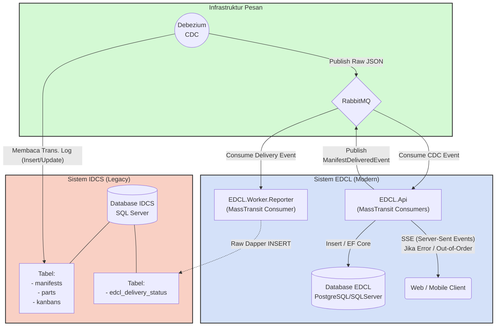

# Arsitektur Integrasi IDCS ↔ EDCL

Dokumen ini menjelaskan alur pergerakan data dari **Sistem Legacy (IDCS)** ke **Sistem Baru (EDCL)**, serta bagaimana EDCL melaporkan kembali (Write-Back) status pengiriman ke IDCS secara *asynchronous* dan *real-time* tanpa membebani performa database.

---

## 🏗 Diagram Arsitektur

Berikut adalah diagram alur data keseluruhan (menggunakan pendekatan *Event-Driven Architecture* & *Change Data Capture*):

---

## 📖 Narasi Alur Integrasi

Integrasi ini dibagi menjadi dua fase utama: **Fase Ingestion** (Masuk ke EDCL) dan **Fase Write-Back** (Kembali ke IDCS).

### A. Fase Ingestion (IDCS ➔ EDCL)

**Tantangan:** Data manifest beserta komponen-komponen anakannya (Parts, Kanbans, Skids) harus disinkronkan ke EDCL secara terus-menerus (real-time) tanpa membuat database IDCS kewalahan akibat proses *polling* (seperti yang terjadi pada Talend di masa lalu).

**Solusi:**
1. **Change Data Capture (CDC):** Kita menggunakan **Debezium** yang menempel langsung pada *Transaction Logs* (SQL Server Agent) di database IDCS. Setiap kali ada query `INSERT`, `UPDATE`, atau `DELETE` pada tabel Manifest/Parts di IDCS, Debezium langsung mengetahuinya secara pasif (tanpa perlu melempar query `SELECT`).
2. **Message Broker (RabbitMQ):** Debezium mengubah perubahan data tersebut menjadi format *Raw JSON* dan melemparkannya ke antrean **RabbitMQ**. RabbitMQ bertindak sebagai "Peredam Kejut" (*Shock Absorber*). Jika EDCL sedang mati atau *overload*, data tidak akan hilang; ia akan antre dengan aman di RabbitMQ.
3. **MassTransit Consumer (EDCL):** API EDCL menggunakan MassTransit (dengan konfigurasi `UseRawJsonSerializer`) untuk membaca pesan JSON tersebut. MassTransit akan mengubah JSON mentah menjadi objek C# (DTO).
4. **Penanganan Out-Of-Order (Retry & SSE):** Terkadang data *Part* datang lebih cepat daripada *Manifest* (induknya belum ada di EDCL). Saat hal ini terjadi:
   - EF Core akan melempar error *Foreign Key Constraint*.
   - MassTransit akan melakukan **Exponential Backoff Retry** (Mencoba ulang setelah 1 detik, lalu 5 detik, dst.).
   - Jika setelah di-*retry* beberapa kali tetap gagal, pesan dikirim ke `IngestionFaultConsumer` yang selanjutnya menembakkan sinyal **Server-Sent Events (SSE)** ke tampilan Web Client untuk memberi tahu admin secara *real-time*.

---

### B. Fase Write-Back (EDCL ➔ IDCS)

**Tantangan:** Setelah barang berhasil diproses dan dikirimkan oleh EDCL, status penyelesaian tersebut harus dilaporkan kembali ke IDCS. Kita **tidak diizinkan** melakukan `UPDATE` langsung ke tabel asli IDCS karena berisiko merusak integritas *legacy system*.

**Solusi:**
1. **Tabel Serah-Terima (Integration Table):** Dibuat satu tabel khusus di database IDCS bernama `edcl_delivery_status`. Tabel ini sepenuhnya "dimiliki" oleh EDCL untuk menaruh laporan *Delivery*.
2. **Event Driven:** Saat sebuah pengiriman dinyatakan selesai di EDCL (misal melalui klik tombol "Delivered" oleh supir di aplikasi), API EDCL **tidak langsung** melakukan *query* ke database IDCS. API EDCL hanya akan menerbitkan pesan internal: `ManifestDeliveredIntegrationEvent` ke RabbitMQ.
3. **Dedicated Reporter Worker:** Sebuah *Microservice* kecil bernama **`EDCL.Worker.Reporter`** akan menangkap pesan integrasi tersebut.
4. **Eksekusi Dapper:** Worker inilah yang menyimpan *Secondary Connection String* menuju database IDCS. Worker ini akan melempar raw SQL (`INSERT INTO edcl_delivery_status`) menggunakan Dapper (karena sangat cepat dan ringan).
5. **Keamanan & Isolasi:** Jika server IDCS sedang *down* saat penulisan balik, EDCL tidak akan *error*. Pesan `ManifestDeliveredIntegrationEvent` akan tetap mengantre di RabbitMQ sampai server IDCS hidup kembali dan `Worker.Reporter` berhasil menuliskan datanya.
