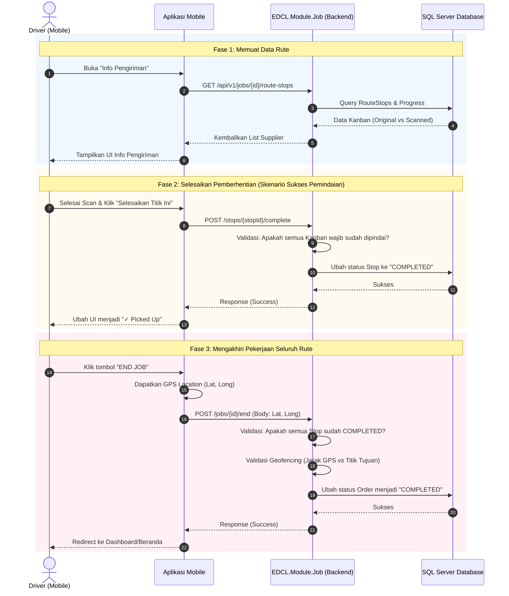

# Dokumen Teknis: Sistem Info Pengiriman (Route Execution)

Dokumen ini menguraikan arsitektur sistem dan alur teknis interaksi antara antarmuka (Mobile) dengan API (Backend) saat Driver mengeksekusi *Pickup Order*.

## 1. Arsitektur Teknis
Dalam mengelola rute operasional, aplikasi EDCL Mini menggunakan pola **State-Machine** pada `PickupOrder` dan `RouteStop` untuk memastikan validitas urutan dan eksekusi.

### Endpoint Utama yang Terlibat
- `GET /api/v1/jobs/{id}/route-stops` : Mengembalikan daftar lengkap perhentian rute dengan rincian *Kanban* yang belum/sudah dipindai.
- `POST /api/v1/jobs/stops/{stopId}/complete` : Mengubah status suatu pemberhentian menjadi *COMPLETED* (Picked Up).
- `POST /api/v1/jobs/{id}/end` : Mengakhiri keseluruhan tugas. Membutuhkan titik koordinat lat/long pengemudi.

## 2. Diagram Sekuensial (Sequence Diagram)

Diagram berikut menjelaskan siklus interaksi klien Mobile dan Backend saat berada di layar **Info Pengiriman**:

## 3. Best Practices yang Diterapkan

1. **State Validation (Pencegahan Inkonsistensi)**
   - API `POST /end` harus menolak (*reject*) *request* jika masih ada `RouteStop` di bawah naungan *Order* tersebut yang masih berstatus `PENDING`. Driver tidak boleh mengakhiri rute jika ada supplier yang terlewat.
   
2. **Offline Resilience (Ketahanan Jaringan)**
   - Layar *Info Pengiriman* di aplikasi seluler disarankan menerapkan *Local Caching* (misalnya menggunakan SQLite lokal atau IndexedDB jika menggunakan PWA/Web-view) pada data `GET /route-stops`. Jika Driver kehilangan sinyal internet saat di pelosok kawasan industri, aplikasi tetap dapat menampilkan daftar urutan pabrik berdasarkan *cache* terakhir.
   
3. **Geofence Validation (Keamanan Data)**
   - Payload dari `POST /end` menyertakan `latitude` dan `longitude`. Backend EDCL Mini wajib melakukan penghitungan jarak (menggunakan formula *Haversine*) antara koordinat tersebut dengan koordinat gudang pusat/tujuan. Jika terlalu jauh, transaksi berhak dibatalkan untuk menghindari kecurangan sopir yang menyelesaikan tugas dari rumah.
   
4. **Idempotensi Pemanggilan**
   - Meskipun tombol *END JOB* ditekan berulang kali karena sinyal lelet, desain API memastikan bahwa pengubahan status dari *IN_PROGRESS* ke *COMPLETED* hanya tereksekusi sekali (menghasilkan *Status 200 OK* atau *Conflict 409* pada panggilan duplikat, tanpa mengacaukan *state* mesin).
