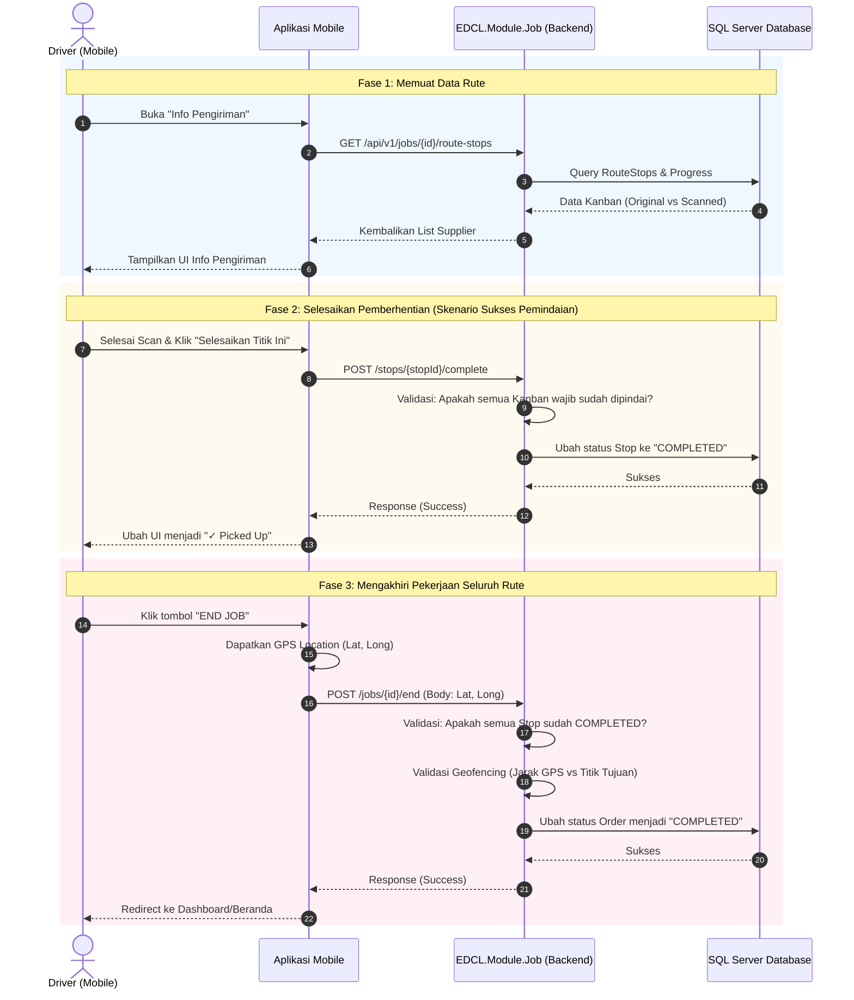

# Dokumen Teknis: Sistem Info Pengiriman (Route Execution)

Spesifikasi teknis interaksi antarmuka mobile dan backend saat driver mengeksekusi rute perhentian (*Route Stops*).

---

## 1. Spesifikasi Endpoint

| Endpoint | Method | Deskripsi |
|---|---|---|
| `GET /api/v1/mobile/driver/jobs/{id}/route-stops` | `GET` | Daftar perhentian rute dan progres pemindaian kanban. |
| `POST /api/v1/mobile/driver/jobs/stops/{stopId}/complete` | `POST` | Menyelesaikan perhentian (*Picked Up*). |
| `POST /api/v1/mobile/driver/jobs/{id}/end` | `POST` | Mengakhiri seluruh tugas pengiriman dengan koordinat GPS. |

---

## 2. Sequence Diagram

---

## 3. Aturan Bisnis & Validasi
- **State Validation**: `POST /end` ditolak jika masih ada stop yang belum berstatus `COMPLETED`.
- **Geofence Audit**: Memvalidasi radius lokasi penyelesaian terhadap plant tujuan.
- **Idempotency**: Mencegah mutasi ganda pada retries jaringan seluler.
