# Logical Data Model (EDCL Mini)

Dokumen ini mendeskripsikan model data logis dari aplikasi **EDCL Mini**. Model ini dikelompokkan berdasarkan **Domain Module** aktual yang ada di codebase — sebuah *Modular Monolith* dengan 5 modul utama, masing-masing memiliki database schema-nya sendiri.

> [!NOTE]
> Versi dokumen ini diperbarui berdasarkan analisis mendalam terhadap kode sumber aktual (entitas, konfigurasi EF Core, dan domain ports) per **Juli 2026**.

---

## 1. Peta Domain & Database Schema

Setiap modul memiliki **SQL Schema** tersendiri untuk memisahkan batas domain secara fisik di database:

| Module | Schema DB | Tanggung Jawab |
|---|---|---|
| `Auth` | `[auth]` | Identitas Driver (Mobile App) & AppUser (Web), token autentikasi |
| `Driver` | `[driver]` | Master Data: Logistic Partner, Truck, Supplier, Truck-Driver Assignments |
| `Cargo` | *(dapper/raw SQL)* | Ingestion Manifest dari IDCS (CDC via Debezium) |
| `Job` | `[job]` | Pickup Order — rencana & realisasi pengiriman di lapangan |
| `Notification` | `[notification]` | Kotak masuk notifikasi Driver |

---

## 2. Entity-Relationship Diagram (ERD) Lengkap

Diagram ini menggambarkan semua entitas yang ada, relasi antar-entitas, serta garis batas antar-domain (cross-module communication melalui `IDomainPorts`).

```mermaid
erDiagram
    %% ======================================================
    %% [auth] SCHEMA — Auth Module
    %% ======================================================

    ROLE ||--o{ APP_USER : "dimiliki oleh"
    ROLE {
        bigint id PK
        string code UK
        string name
        string description
        boolean is_active
        datetime created_at
        string created_by
    }

    APP_USER {
        bigint id PK
        string name
        string email UK
        string password_hash
        bigint role_id FK
        boolean is_active
        datetime created_at
        string created_by
        datetime deleted_at
        boolean is_deleted
        bytes row_version
    }

    APP_USER ||--o{ APP_USER_REFRESH_TOKEN : "memiliki"
    APP_USER_REFRESH_TOKEN {
        bigint id PK
        bigint app_user_id FK
        string token
        string device_info
        datetime expires_at
        boolean is_revoked
        datetime revoked_at
        string replaced_by_token
    }

    DRIVER ||--o{ DRIVER_PHONE_HISTORY : "mencatat histori"
    DRIVER ||--o{ DRIVER_REFRESH_TOKEN : "memiliki"
    DRIVER {
        bigint id PK
        bigint logistic_partner_id "logical ref cross-domain"
        string name
        string nik UK
        string phone_number UK
        string pin_hash
        boolean must_change_pin
        string fcm_token
        string photo_url
        boolean is_active
        datetime created_at
        string created_by
        datetime deleted_at
        boolean is_deleted
        bytes row_version
        string trace_id
    }

    DRIVER_PHONE_HISTORY {
        bigint id PK
        bigint driver_id FK
        string old_phone_number
        string new_phone_number
        datetime changed_at
    }

    DRIVER_REFRESH_TOKEN {
        bigint id PK
        bigint driver_id FK
        string token
        string device_info
        datetime expires_at
        boolean is_revoked
        datetime revoked_at
        string replaced_by_token
    }

    %% ======================================================
    %% [driver] SCHEMA — Driver Module (Master Data)
    %% ======================================================

    LOGISTIC_PARTNER ||--o{ TRUCK : "memiliki"
    LOGISTIC_PARTNER {
        bigint id PK
        string code UK
        string name
        datetime created_at
        string created_by
        datetime deleted_at
        boolean is_deleted
        bytes row_version
    }

    TRUCK ||--o{ TRUCK_DRIVER_ASSIGNMENT : "riwayat penugasan"
    TRUCK {
        bigint id PK
        string plate_number UK
        string vehicle_type
        bigint logistic_partner_id FK
        boolean is_active
        datetime created_at
        string created_by
        datetime deleted_at
        boolean is_deleted
        bytes row_version
    }

    ROUTE {
        bigint id PK
        string route_code
        string cycle_code
        datetime created_at
        string created_by
        datetime deleted_at
        boolean is_deleted
        bytes row_version
    }

    ROUTE ||--o{ ROUTE_PRICE : "memiliki harga"
    LOGISTIC_PARTNER ||--o{ ROUTE_PRICE : "berlaku untuk"
    ROUTE_PRICE {
        bigint id PK
        bigint route_id FK
        bigint logistic_partner_id FK
        numeric price
        date valid_from
        date valid_to
        string price_type
        datetime created_at
        string created_by
        datetime deleted_at
        boolean is_deleted
        bytes row_version
    }

    TRUCK_DRIVER_ASSIGNMENT {
        bigint id PK
        bigint truck_id FK
        bigint driver_id "logical ref cross-domain"
        boolean is_active
        datetime assigned_at
        datetime unassigned_at
        datetime created_at
        string created_by
        bytes row_version
    }

    SUPPLIER {
        bigint id PK
        string supplier_code UK
        string name
        string address
        float latitude
        float longitude
        int geofence_radius_meters
        boolean is_active
        datetime created_at
        string created_by
        datetime deleted_at
        boolean is_deleted
        bytes row_version
    }

    %% ======================================================
    %% Cargo Domain — Ingestion via Debezium CDC
    %% ======================================================

    SUPPLIER ||--o{ MANIFEST : "asal manifest"
    MANIFEST ||--o{ MANIFEST_PART : "terdiri dari"
    MANIFEST ||--o{ MANIFEST_SKID : "memiliki skid"
    MANIFEST ||--o{ MANIFEST_KANBAN : "memiliki kanban"

    MANIFEST {
        bigint id PK
        string manifest_no UK
        string supplier_code FK
        string supplier_name
        int sequence
        string order_type
        string order_no
        string dock_code
        string p_lane_no
        datetime pick_date
        string cycle
        string status
        boolean is_assigned_to_route
    }

    MANIFEST_PART {
        bigint id PK
        bigint manifest_id FK
        string part_no
        string part_name
        int qty
        string kanban_no
        string uniq_no
        string box_type
        string status
    }

    MANIFEST_SKID {
        bigint id PK
        bigint manifest_id FK
        string skid_no
    }

    MANIFEST_KANBAN {
        bigint id PK
        bigint manifest_id FK
        string part_no
        string kanban_cd
    }

    INGESTION_ERROR {
        bigint id PK
        string event_type
        string payload
        string error_message
        string stack_trace
        datetime occurred_at
        boolean is_resolved
    }

    %% ======================================================
    %% [job] SCHEMA — Job Module (Transactional / Operational)
    %% ======================================================

    PICKUP_ORDER ||--o{ PICKUP_ORDER_DETAIL : "memiliki stop"
    PICKUP_ORDER ||--o{ PICKUP_ORDER_MANIFEST : "snapshot manifest"
    PICKUP_ORDER {
        bigint id PK
        bigint driver_id "logical ref cross-domain"
        bigint truck_id "logical ref cross-domain"
        string po_no UK
        date pickup_date
        string route_code
        string cycle_code
        time estimated_departure_time
        string status
        datetime started_at
        datetime completed_at
        string hangfire_job_id_h1
        string hangfire_job_id_h30
        datetime created_at
        string created_by
        bytes row_version
    }

    PICKUP_ORDER_DETAIL ||--o{ PICKUP_ORDER_MANIFEST : "mengambil manifest"
    PICKUP_ORDER_DETAIL {
        bigint id PK
        bigint pickup_order_id FK
        bigint supplier_id "logical ref cross-domain"
        int sequence
        string status
        datetime arrived_at
        datetime picked_up_at
        datetime created_at
        string created_by
    }

    PICKUP_ORDER_MANIFEST ||--o{ PICKUP_ORDER_KANBAN : "scan kanban"
    PICKUP_ORDER_MANIFEST {
        bigint id PK
        bigint pickup_order_detail_id FK
        string manifest_no
        string order_type
        int total_skid
        string dock_code
        int total_kanban
        int scanned_kanban
        string status
        datetime created_at
        string created_by
    }

    PICKUP_ORDER_KANBAN {
        bigint id PK
        bigint pickup_order_manifest_id FK
        string kanban_code
        string status
        datetime scanned_at
        datetime created_at
        string created_by
    }

    %% ======================================================
    %% [notification] SCHEMA — Notification Module
    %% ======================================================

    DRIVER_NOTIFICATION {
        bigint id PK
        bigint driver_id "logical ref cross-domain"
        string title
        string message
        boolean is_read
        string type
        bigint pickup_order_id "opsional, cross-domain ref"
        datetime created_at
        string created_by
        bytes row_version
    }
```



---

## 3. Perubahan Arsitektur Signifikan (vs. Versi Sebelumnya)

> [!IMPORTANT]
> Perubahan ini terjadi dalam sesi pengembangan terkini dan berdampak pada struktur domain secara fundamental.

### 3.1 Pemindahan `Logistic Partner` dari Auth Module ke Driver Module

| Aspek | Sebelum | Sesudah |
|---|---|---|
| **Schema DB** | `[auth].[logistic-partners]` | `[driver].[logistic-partners]` |
| **Kepemilikan** | Auth Module | Driver Module |
| **CRUD Controller** | Auth Module | Driver Module (`AdminLogisticPartnersController`) |
| **Migration** | `Auth` DB Migration | `Driver` DB Migration (`AddLogisticPartnerAndAssignmentToDriver`) |

Alasan: Logistic Partner adalah data master armada, sehingga secara logis lebih tepat berada di Driver Module bersama entitas terkait (Truck).

### 3.2 Integrasi Data Rute (Route) dari Legacy IDCS

| Aspek | Sebelum | Sesudah |
|---|---|---|
| **Sistem Asal** | IDCS (Legacy) `TB_M_ROUTE` | EDCL (Baru) `routes` |
| **Schema DB** | `[dbo].[TB_M_ROUTE]` | `[driver].[routes]` |
| **Kepemilikan** | - | Driver Module |

Alasan: EDCL menyerap data rute IDCS (`ROUTE`, `RATE`) menjadi `RouteCode` dan `CycleCode` sebagai master data mandiri untuk mendukung pembuatan manifest dan pickup order yang mandiri. Tabel `TB_M_ROUTE_PRICE` untuk sementara diabaikan sesuai kebutuhan bisnis terbaru.

### 3.3 Entitas Baru: `TruckDriverAssignment`

Sebelumnya tidak ada tabel asosiatif antara Truck dan Driver. Kini hadir entitas baru `truck_driver_assignments` di schema `[driver]`:

- Menyimpan **riwayat lengkap** semua penugasan (bukan hanya yang aktif saat ini)
- Aturan bisnis: **hanya 1 assignment aktif per Truck** pada suatu waktu
- `is_active`, `assigned_at`, `unassigned_at` memungkinkan *audit trail* penuh
- Relasi ke `Driver` bersifat *logical* (tidak ada FK fisik di DB) karena `Driver` berada di modul/schema yang berbeda

### 3.3 Cross-Module Communication via `IDomainPorts`

Untuk menghindari *hard coupling* antar modul, digunakan *port interface* di `EDCL.Shared.Kernel`:

```
IDriverPort
  → Diimplementasikan oleh: Auth Module
  → Dikonsumsi oleh: Driver Module (resolve nama logistic-partner), Job, Notification
  → Metode: GetActiveDriverByIdAsync, GetDriversByIdsAsync, GetActiveDriversByLogisticPartnerIdAsync

ISupplierPort
  → Diimplementasikan oleh: Driver Module
  → Dikonsumsi oleh: Job, Cargo
  → Metode: GetSupplierByIdAsync, GetSupplierByCodeAsync

ITruckPort
  → Diimplementasikan oleh: Driver Module
  → Dikonsumsi oleh: Job
  → Metode: GetTruckByIdAsync
```

---

## 4. Definisi Domain

### A. Auth Module (`[auth]` schema)
Menyimpan **identitas dan autentikasi** untuk dua jenis pengguna:

- **`AppUser`**: Pengguna portal *Web Backoffice*. Login dengan Email + Password. Memiliki `Role` (ADMIN / USER).
- **`Role`**: Hak akses. Seed data: `ADMIN`, `USER`, `DRIVER`.
- **`Driver`**: Supir yang mengoperasikan *Mobile App*. Login dengan No. HP + PIN Hash. Kolom `logistic_partner_id` adalah referensi *logical* ke tabel logistic-partner di Driver Module (tanpa FK fisik).
- **`DriverPhoneHistory`**: *Audit trail* perubahan nomor HP Driver.
- **`RefreshToken`** & **`AppUserRefreshToken`**: Token rotasi JWT dengan device fingerprinting untuk masing-masing jenis pengguna.

### B. Driver Module (`[driver]` schema)
Berisi **seluruh Master Data** operasional:

- **`Logistic Partner`**: Perusahaan vendor penyedia armada logistik. Memiliki properti `Code` (unik) dan `Name`. Dikelola di modul ini setelah refactoring dari Auth Module.
- **`Route`** *(baru)*: Data rute pengiriman (Route Code dan Cycle Code) hasil transisi dari sistem legacy (IDCS). Memiliki unique constraint pada kombinasi RouteCode dan CycleCode.
- **`RoutePrice`** *(baru)*: Skema harga untuk suatu kombinasi *Route* dan *Logistic Partner* dalam periode tertentu (`valid_from` - `valid_to`).
- **`Truck`**: Data armada fisik. Setiap Truck wajib memiliki `Logistic PartnerId`. Dapat diaktifkan/dinonaktifkan secara independen.
- **`TruckDriverAssignment`** *(baru)*: Tabel asosiatif antara Truck dan Driver. Menyimpan riwayat penugasan dengan `is_active` sebagai penanda aktif. Metode domain: `AssignDriver()` otomatis me-*unassign* driver lama sebelum membuat assignment baru.
- **`Supplier`**: Lokasi fisik pabrik/vendor yang menjadi titik pengambilan barang. Menyimpan koordinat GPS dan radius geofence untuk validasi di lapangan.

### C. Cargo Module *(Ingestion Domain)*
Data di modul ini **tidak dimanipulasi manual**. Diisi via *Change Data Capture* (Debezium CDC) dari sistem eksternal **IDCS**. Dibaca menggunakan Dapper (raw SQL), bukan EF Core DbSet:

- **`Manifest`**: Lembar pengiriman logistik utama. Status `is_assigned_to_route` menandakan apakah manifest sudah masuk ke dalam PickupOrder.
- **`ManifestPart`**: Detail suku cadang dan jumlah.
- **`ManifestSkid`**: Data fisik wadah/palet.
- **`ManifestKanban`**: Kartu kanban individual yang akan dipindai oleh Driver.
- **`IngestionError`**: *Dead Letter Queue* persisten untuk data yang gagal disinkronkan.

### D. Job Module (`[job]` schema)
Domain paling aktif — mencatat seluruh aktivitas pengiriman **di lapangan**. Status transitions:

```
PickupOrder:   PENDING → ON_PROGRESS → COMPLETED / CANCELLED
PickupOrderDetail:   PENDING → PICKED_UP / SKIPPED
PickupOrderManifest: PENDING → PARTIAL → VERIFIED
PickupOrderKanban:   SCANNED (immutable)
```

- **`PickupOrder`**: Rencana kerja satu shift Driver. Mereferensikan `DriverId` dan `TruckId` secara *logical*.
- **`PickupOrderDetail`**: Satu "Titik Singgah" (Stop) di dalam rute. Mencatat waktu tiba dan selesai aktual.
- **`PickupOrderManifest`**: Manifest yang diangkut di satu titik singgah. Dengan sengaja menduplikasi atribut master (`order_type`, `total_skid`, `dock_code`) — *event-driven data duplication* agar Job Module mandiri saat runtime tanpa HTTP call ke Cargo Module.
- **`PickupOrderKanban`**: Setiap kanban yang berhasil dipindai oleh kamera *Mobile App*.

### E. Notification Module (`[notification]` schema)
- **`DriverNotification`**: "Kotak masuk" notifikasi untuk Driver. Diisi oleh Job Module saat rute baru ditugaskan. Kolom `is_read` digunakan untuk indikator notif di *Mobile App*.

---

## 5. Aturan Bisnis Penting di Level Data

| Aturan | Entitas | Implementasi |
|---|---|---|
| Hanya 1 Driver aktif per Truck | `TruckDriverAssignment` | Partial index `(truck_id, is_active=1)`; domain method `AssignDriver()` auto-unassign |
| Hanya 1 Driver aktif per nomor HP | `Driver` | Partial unique index `UIX_drivers_active_phone WHERE IsActive=1` |
| NIK Driver tidak bisa diubah | `Driver` | Tidak ada method publik untuk mengubah `Nik` |
| Manifest tidak bisa dihapus | `Manifest` | Tidak ada endpoint DELETE — data *append-only* dari CDC |
| Stop tidak bisa diselesaikan jika ada manifest belum terverifikasi | `PickupOrderDetail` | Validasi di `MarkPickedUp()` Domain Entity |
| Job tidak bisa selesai jika ada stop yang belum selesai | `PickupOrder` | Validasi di `Complete()` Domain Entity |

---

## 6. Best Practices yang Diterapkan

> [!TIP]
> Seluruh entitas yang mewarisi `AuditableEntity` memiliki kolom audit standar:
> ```
> created_at | created_by | updated_at | updated_by
> deleted_at | deleted_by | is_deleted | row_version | trace_id
> ```

1. **Soft Delete**: Semua entitas menggunakan `is_deleted = 1`. Hard-delete tidak dilakukan.
2. **Global Query Filters (EF Core)**: Rekaman yang ter-*soft-delete* otomatis tersembunyi dari semua query tanpa perlu filter manual.
3. **Optimistic Concurrency**: Kolom `row_version` (SQL `ROWVERSION`) mencegah konflik penulisan data secara bersamaan (*lost update*).
4. **Modular Isolation via Ports**: Cross-module reference dilakukan secara *logical* (ID tanpa FK fisik di DB) dan secara *programmatic* melalui `IDomainPorts` di Shared Kernel — tidak ada `ProjectReference` antar modul.
5. **Event-Driven Data Duplication**: `PickupOrderManifest` menyalin atribut dari `Manifest` saat pembuatan, menghindari JOIN lintas schema saat runtime di lapangan.
6. **No Hard-Deletes for Transactional Data**: `Driver`, `AppUser`, dan entitas terkait hanya dinonaktifkan untuk menjaga integritas riwayat operasional.
