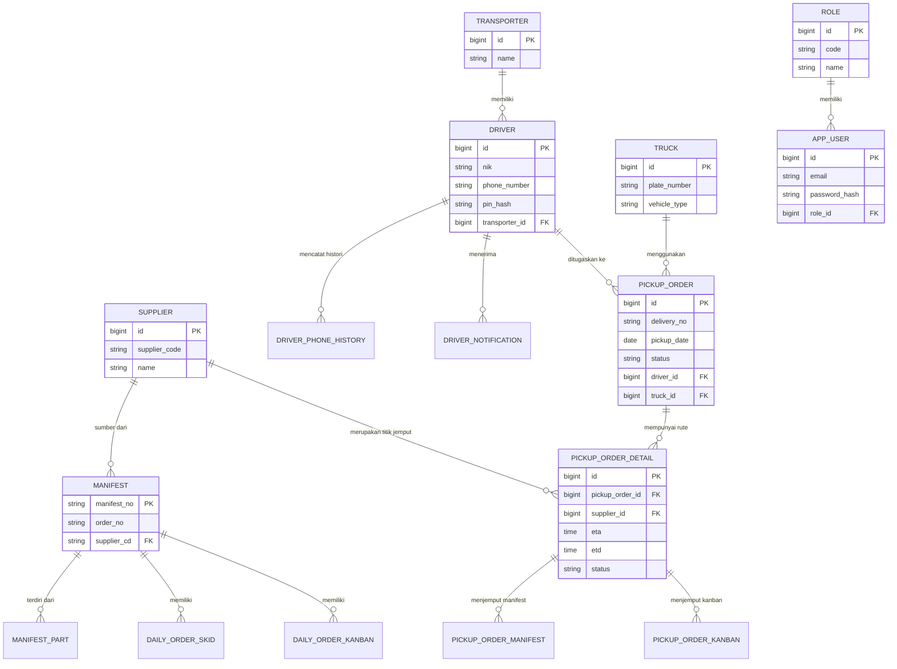

# Logical Data Model (EDCL Mini)

Dokumen ini mendeskripsikan model data logis dari aplikasi **EDCL Mini**. Model ini dikelompokkan ke dalam beberapa *domain* berdasarkan tanggung jawab bisnisnya.

## 1. Entity-Relationship Diagram (ERD) Inti

Diagram di bawah menggambarkan relasi antar entitas utama menggunakan standar *Crow's foot notation*.

---

## 2. Definisi Domain

Untuk mempermudah pemahaman arsitektur *Modular Monolith*, data dibagi ke dalam 4 pilar utama:

### A. Master Data Domain
Berisi entitas dasar yang jarang berubah dan sering menjadi rujukan tabel lain.
- **Transporter**: Perusahaan/Vendor penyedia logistik (misal: Hikari Logistics).
- **Truck**: Data armada fisik beserta plat nomornya (misal: Wingbox B 9607 PXT).
- **Supplier**: Entitas penyuplai barang atau pabrik tujuan.

### B. Auth & User Domain
Menyimpan kredensial dan entitas akses (Identity).
- **AppUser**: Pengguna portal *Web Backoffice* (biasanya Admin atau HRD). Login menggunakan *Email* dan *Password*.
- **Role**: Hak akses untuk `AppUser` (e.g., `ADMIN`, `USER`).
- **Driver**: Supir yang mengoperasikan *Mobile App*. Data ini unik karena mencampur profil (NIK, Nama) dan kredensial akses (No. HP, PIN Hash).
- **DriverPhoneHistory**: *Audit trail* otomatis (biasanya via SQL Trigger) ketika nomor HP Driver diganti.

### C. Ingestion Domain (Sinkronisasi Sistem Luar)
Tabel-tabel di domain ini biasanya tidak dimanipulasi oleh *user interface* aplikasi ini secara manual, melainkan diisi (sinkronisasi / *ingestion*) oleh *Background Jobs* dari sistem TMMIN / pusat.
- **Manifest**: Lembar pengiriman utama yang memuat `order_no`.
- **ManifestPart**: Rincian suku cadang di dalam sebuah Manifest (Part No, Pcs, Jenis Box).
- **DailyOrderSkid**: Data fisik wadah bongkar muat (Palet/Skid).
- **DailyOrderKanban**: Data spesifik satu kartu kanban individual yang akan divalidasi dengan alat *scan* barcode di lapangan.

### D. Transactional / Operational Domain
Ini adalah domain yang paling aktif, digunakan saat alur pengiriman berlangsung di lapangan.
- **PickupOrder**: Rencana kerja seorang Driver. Memetakan *Driver* A, menggunakan *Truck* B, pada *Tanggal* C, dengan status siklus keberangkatan (Rute + Cycle Code).
- **PickupOrderDetail**: Mewakili "Titik Singgah" (Stops) di dalam rute `PickupOrder`. Menyimpan estimasi tiba/berangkat (*ETA/ETD*) dan menghubungkan dengan *Supplier* mana yang harus didatangi.
- **PickupOrderManifest**: Ceklis manifest yang harus dipindai/diangkut di suatu *Titik Singgah*. Menyimpan status pencapaian (silang merah / centang hijau).
- **PickupOrderKanban**: Ceklis kanban individual dari manifest di atas. Ini adalah target utama yang dipindai (di-*scan*) oleh kamera *Mobile App* si Driver.

### E. Notification Domain
- **DriverNotification**: Berfungsi sebagai "Kotak Masuk" (*Inbox*) pesan untuk supir. Pesan seperti penugasan rute baru akan tersimpan di sini agar logo bel di aplikasi berubah menjadi merah jika belum dibaca (`is_read = 0`).

---

## 3. Best Practices yang Diterapkan di Database Ini
> [!TIP]
> 1. **Audit Columns**: Setiap tabel menyertakan kolom jejak rekam (`created_at`, `created_by`, `updated_at`, `deleted_at`) serta mengadopsi mekanisme *Soft-Delete* (`is_deleted` = 1).
> 2. **Global Query Filters**: Pada tingkat Entity Framework Core, data yang ter-*soft-delete* otomatis disembunyikan.
> 3. **Concurrency Control**: Terdapat kolom `row_version` untuk mencegah modifikasi data ganda secara bersamaan (Optimistic Concurrency).
> 4. **No Hard-Deletes for Auth**: Karena `Driver` berelasi kuat ke `PickupOrder`, jika Supir *resign*, statusnya cukup diubah menjadi `IsActive = 0`, sehingga data riwayat kerjanya di masa lalu tetap terjaga dengan utuh.
