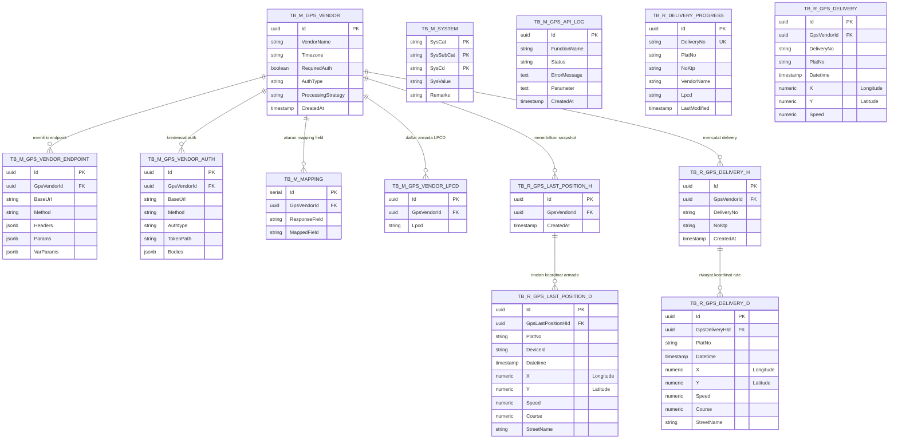
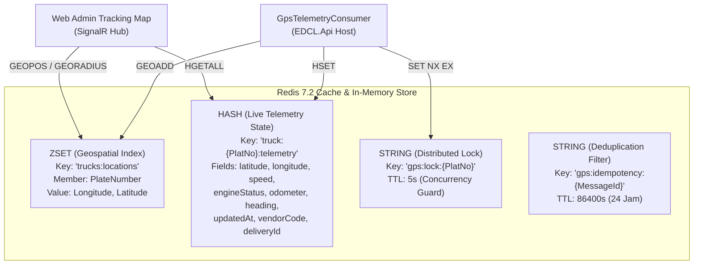

# Logical Data Model (EDCL Mini)

Model data logis **EDCL Mini** berbasis domain schema terisolasi pada **SQL Server 2022**.

---

## 1. Peta Domain & Database Schema

| Module | Schema DB | Deskripsi Tanggung Jawab |
|---|---|---|
| `Auth` | `[auth]` | Identitas Driver (Mobile) & AppUser (Web), token autentikasi & role. |
| `Driver` | `[driver]` | Master data: Logistic Partner, Truck, Supplier, Route, & Truck-Driver Assignments. |
| `Cargo` | `[ingestion]` | Ingestion Manifest, Part, Skid, & Kanban dari IDCS via Debezium CDC. |
| `Job` | `[job]` | Transaksi operasional: Pickup Order, Stops, Manifest Snapshots, & Scan Records. |
| `Notification` | `[notification]` | Kotak masuk notifikasi driver & log FCM alerts. |

---

## 2. Entity-Relationship Diagram (ERD)

```mermaid
erDiagram
    %% ======================================================
    %% [auth] SCHEMA — Auth Module
    %% ======================================================

    ROLE ||--o{ APP_USER : "dimiliki oleh"
    ROLE {
        bigint id PK
        string code UK
        string name
        string description
        boolean is_active
        datetime created_at
        string created_by
    }

    APP_USER {
        bigint id PK
        string name
        string email UK
        string password_hash
        bigint role_id FK
        boolean is_active
        datetime created_at
        string created_by
        datetime deleted_at
        boolean is_deleted
        bytes row_version
    }

    APP_USER ||--o{ APP_USER_REFRESH_TOKEN : "memiliki"
    APP_USER_REFRESH_TOKEN {
        bigint id PK
        bigint app_user_id FK
        string token
        string device_info
        datetime expires_at
        boolean is_revoked
        datetime revoked_at
        string replaced_by_token
    }

    DRIVER ||--o{ DRIVER_PHONE_HISTORY : "mencatat histori"
    DRIVER ||--o{ DRIVER_REFRESH_TOKEN : "memiliki"
    DRIVER {
        bigint id PK
        bigint logistic_partner_id "logical ref cross-domain"
        string name
        string nik UK
        string phone_number UK
        string pin_hash
        boolean must_change_pin
        string fcm_token
        string photo_url
        boolean is_active
        datetime created_at
        string created_by
        datetime deleted_at
        boolean is_deleted
        bytes row_version
        string trace_id
    }

    DRIVER_PHONE_HISTORY {
        bigint id PK
        bigint driver_id FK
        string old_phone_number
        string new_phone_number
        datetime changed_at
    }

    DRIVER_REFRESH_TOKEN {
        bigint id PK
        bigint driver_id FK
        string token
        string device_info
        datetime expires_at
        boolean is_revoked
        datetime revoked_at
        string replaced_by_token
    }

    %% ======================================================
    %% [driver] SCHEMA — Driver Module (Master Data)
    %% ======================================================

    LOGISTIC_PARTNER ||--o{ TRUCK : "memiliki"
    LOGISTIC_PARTNER {
        bigint id PK
        string code UK
        string name
        datetime created_at
        string created_by
        datetime deleted_at
        boolean is_deleted
        bytes row_version
    }

    TRUCK ||--o{ TRUCK_DRIVER_ASSIGNMENT : "riwayat penugasan"
    TRUCK {
        bigint id PK
        string plate_number UK
        string vehicle_type
        bigint logistic_partner_id FK
        boolean is_active
        datetime created_at
        string created_by
        datetime deleted_at
        boolean is_deleted
        bytes row_version
    }

    ROUTE {
        bigint id PK
        string route_code
        string cycle_code
        datetime created_at
        string created_by
        datetime deleted_at
        boolean is_deleted
        bytes row_version
    }

    ROUTE ||--o{ ROUTE_PRICE : "memiliki harga"
    LOGISTIC_PARTNER ||--o{ ROUTE_PRICE : "berlaku untuk"
    ROUTE_PRICE {
        bigint id PK
        bigint route_id FK
        bigint logistic_partner_id FK
        numeric price
        date valid_from
        date valid_to
        string price_type
        datetime created_at
        string created_by
        datetime deleted_at
        boolean is_deleted
        bytes row_version
    }

    TRUCK_DRIVER_ASSIGNMENT {
        bigint id PK
        bigint truck_id FK
        bigint driver_id "logical ref cross-domain"
        boolean is_active
        datetime assigned_at
        datetime unassigned_at
        datetime created_at
        string created_by
        bytes row_version
    }

    SUPPLIER {
        bigint id PK
        string supplier_code UK
        string name
        string address
        float latitude
        float longitude
        int geofence_radius_meters
        boolean is_active
        datetime created_at
        string created_by
        datetime deleted_at
        boolean is_deleted
        bytes row_version
    }

    %% ======================================================
    %% Cargo Domain — Ingestion via Debezium CDC
    %% ======================================================

    SUPPLIER ||--o{ MANIFEST : "asal manifest"
    MANIFEST ||--o{ MANIFEST_PART : "terdiri dari"
    MANIFEST ||--o{ MANIFEST_SKID : "memiliki skid"
    MANIFEST ||--o{ MANIFEST_KANBAN : "memiliki kanban"

    MANIFEST {
        bigint id PK
        string manifest_no UK
        string supplier_code FK
        string supplier_name
        int sequence
        string order_type
        string order_no
        string dock_code
        string p_lane_no
        datetime pick_date
        string cycle
        string status
        boolean is_assigned_to_route
    }

    MANIFEST_PART {
        bigint id PK
        bigint manifest_id FK
        string part_no
        string part_name
        int qty
        string kanban_no
        string uniq_no
        string box_type
        string status
    }

    MANIFEST_SKID {
        bigint id PK
        bigint manifest_id FK
        string skid_no
    }

    MANIFEST_KANBAN {
        bigint id PK
        bigint manifest_id FK
        string part_no
        string kanban_cd
    }

    INGESTION_ERROR {
        bigint id PK
        string event_type
        string payload
        string error_message
        string stack_trace
        datetime occurred_at
        boolean is_resolved
    }

    %% ======================================================
    %% [job] SCHEMA — Job Module (Transactional / Operational)
    %% ======================================================

    PICKUP_ORDER ||--o{ PICKUP_ORDER_DETAIL : "memiliki stop"
    PICKUP_ORDER ||--o{ PICKUP_ORDER_MANIFEST : "snapshot manifest"
    PICKUP_ORDER {
        bigint id PK
        bigint driver_id "logical ref cross-domain"
        bigint truck_id "logical ref cross-domain"
        string po_no UK
        date pickup_date
        string route_code
        string cycle_code
        time estimated_departure_time
        string status
        datetime started_at
        datetime completed_at
        string hangfire_job_id_h1
        string hangfire_job_id_h30
        datetime created_at
        string created_by
        bytes row_version
    }

    PICKUP_ORDER_DETAIL ||--o{ PICKUP_ORDER_MANIFEST : "mengambil manifest"
    PICKUP_ORDER_DETAIL {
        bigint id PK
        bigint pickup_order_id FK
        bigint supplier_id "logical ref cross-domain"
        int sequence
        string status
        datetime arrived_at
        datetime picked_up_at
        datetime created_at
        string created_by
    }

    PICKUP_ORDER_MANIFEST ||--o{ PICKUP_ORDER_KANBAN : "scan kanban"
    PICKUP_ORDER_MANIFEST {
        bigint id PK
        bigint pickup_order_detail_id FK
        string manifest_no
        string order_type
        int total_skid
        string dock_code
        int total_kanban
        int scanned_kanban
        string status
        datetime created_at
        string created_by
    }

    PICKUP_ORDER_KANBAN {
        bigint id PK
        bigint pickup_order_manifest_id FK
        string part_no
        string kanban_code
        datetime scanned_at
        string scanned_by
    }

    %% ======================================================
    %% [notification] SCHEMA — Notification Module
    %% ======================================================

    DRIVER_NOTIFICATION {
        bigint id PK
        bigint driver_id "logical ref cross-domain"
        string title
        string body
        boolean is_read
        datetime read_at
        string type
        bigint pickup_order_id "opsional, cross-domain ref"
        datetime created_at
        string created_by
        bytes row_version
    }
```

---

## 3. Komunikasi Antar-Modul (`Shared.Kernel`)

Komunikasi data lintas modul dilarang menggunakan direct SQL JOIN, melainkan melalui domain port interfaces:

- **`IDriverPort`**: Query driver aktif dan resolusi data partner logistik.
- **`ISupplierPort`**: Resolusi koordinat geofence dan data supplier.
- **`ITruckPort`**: Resolusi data kendaraan dan plat nomor.

---

## 4. Pola & Aturan Data Kunci

1. **Logical Foreign Keys**: Relasi antar-modul (`DriverId`, `TruckId`, `SupplierId`) bersifat referensial logis tanpa FK constraint fisik di SQL Server.
2. **Optimistic Concurrency**: Kolom `row_version` (`varbinary(8)`) pada seluruh entitas transaksi untuk mendeteksi konflik konkurensi.
3. **Event-Driven Duplication**: Snapshot atribut manifes (`order_type`, `dock_code`, `total_kanban`) disalin ke `PickupOrderManifest` saat pembuatan rute untuk menjamin otonomi modul `Job`.
4. **Soft Deletes & Audit Trail**: Entitas turunan `AuditableEntity` mencatat `CreatedAt`, `CreatedBy`, `UpdatedAt`, `UpdatedBy`, dan `IsDeleted`.

---

## 5. PostgreSQL GPS Tracking Schema (`edcl`) — Microservice `EDCLGPSAPI`

Pada implementasi pelacakan armada (**GPS Tracking**), sistem memisahkan beban *write-heavy* (koordinat GPS per detik, JSON payload vendor yang bervariasi, dan log panggilan API) dari SQL Server 2022 ke **PostgreSQL 16** (`AE031_EDCL_GPS_DB`, skema `edcl`).

### 5.1. Peta Tabel GPS Tracking (13 Relasi)

| Nama Tabel | Tipe | Deskripsi & Fungsi Operasional |
|---|---|---|
| `tb_m_gps_vendor` | Master | Profil vendor penyedia GPS (Hino Connect, Jitra GPS, EasyGo, dll.), strategi pemrosesan (`Individual` / `Batch`), dan tipe autentikasi. |
| `tb_m_gps_vendor_endpoint` | Master | Endpoint HTTP/REST vendor (URL, HTTP method, JSON headers/params, JSONB path extraction). |
| `tb_m_gps_vendor_auth` | Master | Konfigurasi kredensial OAuth2/Token auth untuk vendor yang mewajibkan pertukaran token berkala. |
| `tb_m_mapping` | Master | Kamus pemetaan field dinamis dari payload JSON vendor ke field standar EDCL (`X`, `Y`, `Speed`, `Course`). |
| `tb_m_gps_vendor_lpcd` | Master | Pemetaan unit kode armada vendor (*LPCD*) ke nomor polisi truk EDCL. |
| `tb_m_system` | Master | Konfigurasi sistem global (interval polling vendor, threshold geofence supplier/plant, nama exchange RabbitMQ). |
| `tb_m_gps_api_log` | Logging | Audit trail pemanggilan API eksternal pihak ketiga, mencatat latency, response status, error body, dan caller ID. |
| `tb_r_delivery_progress` | Transaksi | Status pelacakan rute pengiriman aktif per armada dan driver (geofence state machine). |
| `tb_r_gps_delivery_h` | Transaksi | Header sesi pengiriman delivery aktif untuk korelasi audit koordinat GPS. |
| `tb_r_gps_delivery_d` | Transaksi | Detail titik koordinat GPS riwayat (*breadcrumb history*) per armada untuk analisis replay rute. |
| `tb_r_gps_delivery` | Transaksi | Tabel histori konsolidasi koordinat GPS terpadu lintas vendor dan nomor delivery. |
| `tb_r_gps_last_position_h` | Transaksi | Header posisi terakhir vendor GPS saat polling periodik dieksekusi. |
| `tb_r_gps_last_position_d` | Transaksi | Posisi koordinat latitude (`Y`), longitude (`X`), kecepatan (`Speed`), dan arah (`Course`) teraktual per armada. |

### 5.2. GPS Tracking Entity-Relationship Diagram (Mermaid)

---

## 6. Redis Real-Time Geospatial & Telemetry State Machine

Untuk menyajikan peta armada *real-time* dengan latensi sub-milidetik pada Web Dashboard (`EDCL.Web`) tanpa membebani disk SQL Server maupun PostgreSQL, **Redis 7.2** digunakan sebagai layer data in-memory aktif:

### 6.1. Struktur Data Redis

1. **`trucks:locations` (Redis Geospatial / Sorted Set)**:
   - Perintah: `GEOADD trucks:locations <longitude> <latitude> "<plate_number>"`
   - Query: `GEOPOS trucks:locations "<plate_number>"` untuk posisi terkini, atau `GEORADIUSBYMEMBER` / `GEOSEARCH` untuk mencari armada di sekitar geofence supplier/plant.
2. **`truck:{PlatNo}:telemetry` (Redis Hash)**:
   - Menyimpan atribut telemetri lengkap:
     - `latitude`: Koordinat lintang desimal.
     - `longitude`: Koordinat bujur desimal.
     - `speed`: Kecepatan truk saat ini (km/jam).
     - `engineStatus`: Status mesin (`ON` / `OFF` / `IDLE`).
     - `heading`: Arah kompas derajat (0-360°).
     - `vendorCode`: Vendor GPS sumber (`HINO`, `JITRA`, `PUNINAR`).
     - `deliveryId`: ID penugasan pengiriman aktif.
     - `updatedAt`: Timestamp ISO-8601 koordinat terakhir.
3. **`gps:lock:{PlatNo}` (Distributed Lock / RedLock)**:
   - Menghindari *race condition* saat webhook vendor mengirimkan rentetan paket telemetri paralel secara out-of-order.
4. **`gps:idempotency:{MessageId}` (Deduplication Shield)**:
   - Filter idempotensi dengan TTL 24 jam untuk mencegah pemrosesan ganda koordinat yang sama dari RabbitMQ retry.

