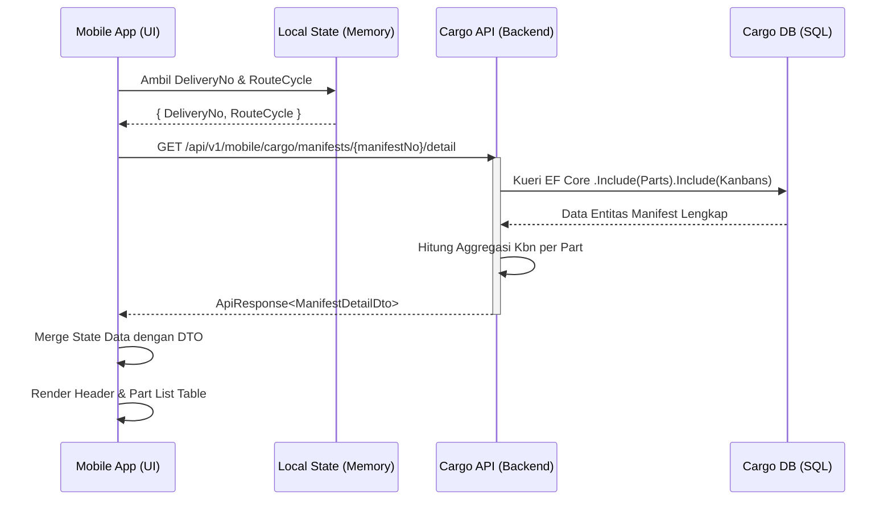

# Arsitektur Sistem: Manifest Detail

Spesifikasi teknis query detail part manifes dari modul `Cargo` menggunakan pola **Client-Side Composition**.

---

## 1. Spesifikasi Endpoint & DTO Contract

**Endpoint**: `GET /api/v1/mobile/cargo/manifests/{manifestNo}/detail`

```csharp
public sealed record ManifestDetailDto(
    string RouteCycle,
    string DeliveryNo,
    string ManifestNo,
    int TotalKanban,
    string OrderNo,
    string DockCode,
    string PLaneNo,
    List<ManifestPartDto> PartList
);

public sealed record ManifestPartDto(
    int No,
    string PartNo,
    string UniqNo,
    int PcsKbn,
    string BoxType,
    string NoOfKbn // Contoh: "2/2", "5/5"
);
```

---

## 2. Sequence Diagram (Client-Side Composition)



---

## 3. Keunggulan Arsitektur
- **Zero Cross-Module SQL JOIN**: Modul `Cargo` dan `Job` terisolasi secara mandiri.
- **Client-Side Composition**: Frontend mobile menggabungkan data status operasional rute (`Job`) dengan rincian master part (`Cargo`).
