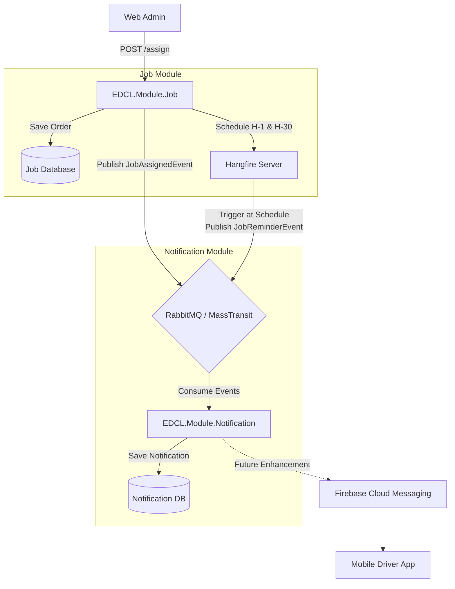

# Dokumen Teknis: Sistem Notifikasi Driver

Dokumen ini memuat spesifikasi teknis (best practice) tentang arsitektur dan implementasi fitur penugasan dan notifikasi terjadwal pada sistem EDCL Mini.

## 1. Arsitektur Komponen
Sistem notifikasi pada EDCL Mini menggunakan pola **Event-Driven Architecture (EDA)** yang dikombinasikan dengan **Background Job Scheduler** untuk pengingat (*reminder*).

Komponen utama yang terlibat:
- **EDCL.Module.Job**: Menangani logika bisnis *Pickup Order*. Mengelola data penugasan.
- **Hangfire**: Mengelola jadwal eksekusi tertunda (*delayed jobs*) dan menyimpannya secara persisten di *database*.
- **MassTransit (RabbitMQ)**: *Message broker* untuk menghubungkan komunikasi asinkron antarmodul.
- **EDCL.Module.Notification**: Mengonsumsi *events* dan bertanggung jawab mendaftarkan notifikasi ke *database* untuk ditayangkan di aplikasi klien, serta kelak menembak Firebase Cloud Messaging (FCM).

### 1.1 Visualisasi Arsitektur

Diagram di bawah ini menggambarkan aliran teknis bagaimana penugasan dikonversi menjadi *Event* dan *Scheduled Job*.

## 2. Alur Teknis (Sequence)

### 2.1 Penugasan Langsung (Direct Assignment)
1. **Client (Web)** memanggil `POST /api/v1/jobs/{id}/assign` dengan *body* berisi `DriverId`.
2. **AssignJobCommandHandler**:
   - Memvalidasi keberadaan `PickupOrder`.
   - Menghapus jadwal Hangfire lama (jika *order* ini sebelumnya sudah di-assign ke driver lain).
   - Memanggil `PickupOrder.Assign(DriverId)`.
   - Menginisiasi dua *delayed job* menggunakan `BackgroundJob.Schedule()`.
   - Mem-*publish* `JobAssignedIntegrationEvent` ke MassTransit.
3. **MassTransit**: Menyampaikan *event* ke antrean RabbitMQ.
4. **JobAssignedConsumer** (di Modul Notifikasi):
   - Menerima pesan.
   - Mengonstruksi entitas `DriverNotification` dengan *type* `ASSIGNMENT`.
   - Menyimpan *record* ke tabel `notification.driver_notifications`.

### 2.2 Notifikasi Terjadwal (Scheduled Reminders)
1. **Hangfire Server** secara konstan memantau *database* untuk *jobs* yang waktunya sudah jatuh tempo.
2. Saat waktu menunjukkan `PickupDate - 1 Jam` atau `PickupDate - 30 Menit`, Hangfire memicu eksekusi *method*:
   `IJobReminderService.PublishReminderAsync(pickupOrderId, reminderType)`
3. **JobReminderService**:
   - Mengecek kembali ke DB apakah `PickupOrder` tersebut masih valid (belum dicabut atau dibatalkan).
   - Mem-*publish* `JobReminderIntegrationEvent` ke MassTransit.
4. **JobReminderConsumer** (di Modul Notifikasi):
   - Menerima pesan dari RabbitMQ.
   - Mengonstruksi `DriverNotification` dengan *type* `REMINDER`.
   - Menyimpan notifikasi tersebut ke *database*.

## 3. Desain Database
Modifikasi dilakukan pada struktur tabel yang sudah ada:

### Tabel `[job].[pickup_orders]`
Tabel ini dimodifikasi dengan penambahan kolom untuk menyimpan *identifier* dari *Job* Hangfire, guna memfasilitasi pembatalan (*cancellation*).
- `HangfireJobIdH1` (VARCHAR 100, Nullable): Menyimpan ID antrean Hangfire untuk peringatan H-1 Jam.
- `HangfireJobIdH30` (VARCHAR 100, Nullable): Menyimpan ID antrean Hangfire untuk peringatan H-30 Menit.

### Tabel Hangfire Internal
Hangfire secara mandiri membuat beberapa tabel dengan skema `[HangFire].*` (seperti `Job`, `State`, `Set`) untuk mengelola *state* antrean. Data ini persisten sehingga jadwal tidak akan hilang bila *server* di-*restart*.

## 4. Best Practices yang Diterapkan

1. **Decoupling (Pemisahan Tanggung Jawab)**
   - Modul `Job` tidak tahu menahu soal cara menyimpan notifikasi atau menembak Firebase. Ia hanya "berteriak" (melempar *Integration Event*) bahwa tugas telah di-assign atau waktu pengingat telah tiba. Modul `Notification`-lah yang mendengarkan teriakan tersebut.
2. **Persistent Scheduling**
   - Tidak menggunakan `Task.Delay()` atau `Thread.Sleep()`. Penggunaan Hangfire memastikan jadwal tetap aman meskipun kontainer Docker mati/mati listrik.
3. **Idempotensi & Job Cancellation**
   - Menyimpan *Hangfire Job ID* ke entitas bisnis (`PickupOrder`). Jika Admin menekan tombol *Assign* berkali-kali untuk Rute yang sama (ganti-ganti Driver), aplikasi akan menghapus (*BackgroundJob.Delete*) jadwal keliru sebelumnya. Ini mencegah terjadinya lonjakan notifikasi palsu (*spam*).
4. **Out-of-Process Execution**
   - Beban eksekusi notifikasi (yang mungkin lambat jika API pihak ketiga seperti Firebase sedang *down*) dipindahkan ke MassTransit Consumer, sehingga respons HTTP untuk `POST /assign` akan kembali ke Web Admin dalam hitungan milidetik.
