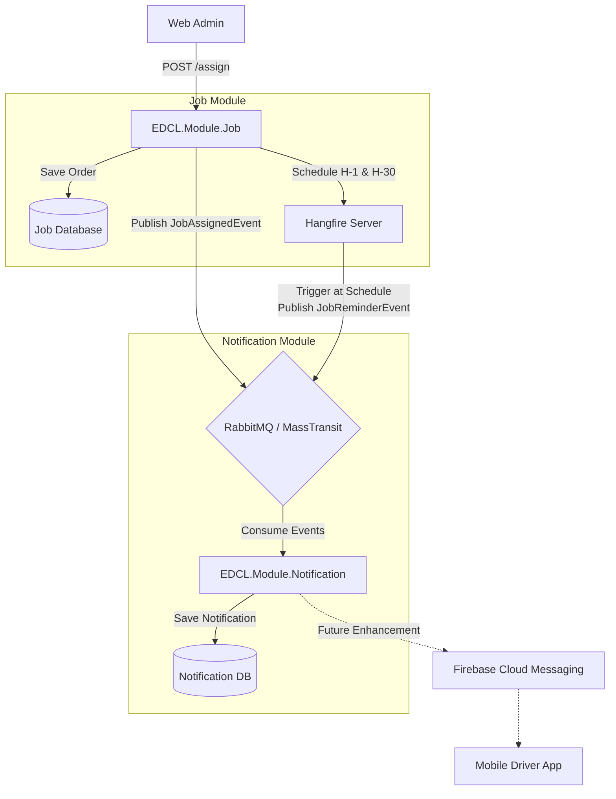

# Dokumen Teknis: Sistem Notifikasi Driver

Spesifikasi teknis arsitektur notifikasi penugasan dan pengingat terjadwal (*Scheduled Reminders*) untuk pengemudi.

---

## 1. Topologi Arsitektur Notifikasi

---

## 2. Alur Eksekusi

### A. Penugasan Langsung (*Direct Assignment*)
1. Web Admin mengeksekusi `POST /api/v1/jobs/{id}/assign` dengan payload `driverId`.
2. `AssignJobCommandHandler`:
   - Menghapus job scheduler Hangfire sebelumnya jika ada penugasan ulang.
   - Mengatur 2 scheduled reminder via Hangfire (`H-1 Jam` dan `H-30 Menit`).
   - Menerbitkan `JobAssignedIntegrationEvent` ke RabbitMQ via MassTransit.
3. `JobAssignedConsumer` pada modul `Notification` menyimpan notifikasi ke `[notification].[driver_notifications]` dan memicu push notification FCM.

### B. Pengingat Terjadwal (*Scheduled Reminders*)
1. Hangfire Server mengeksekusi `IJobReminderService.PublishReminderAsync()` pada waktu H-1 dan H-30 keberangkatan.
2. `JobReminderIntegrationEvent` diterbitkan ke RabbitMQ.
3. `JobReminderConsumer` mencatat pengingat ke database notifikasi driver.

---

## 3. Skema Data & Best Practices
- **Persistence Tracking**: Kolom `HangfireJobIdH1` dan `HangfireJobIdH30` pada tabel `[job].[pickup_orders]` memfasilitasi pembatalan jadwal lama jika terjadi pergantian pengemudi.
- **Domain Decoupling**: Modul `Job` tidak bergantung pada pustaka FCM pihak ketiga; delegasi dilakukan murni via integration events.
- **Non-blocking Execution**: Eksekusi push notification berjalan out-of-process melalui consumer asinkron.
