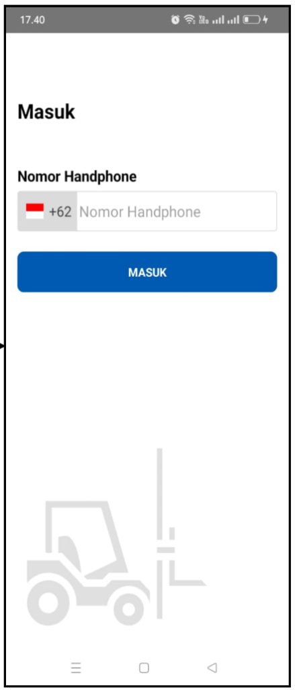

# UI to API Mapping (Functional Overview)

Dokumen ini memetakan tampilan antarmuka (UI) aplikasi klien (Mobile/Web) dengan Endpoint API yang sesuai di sisi Backend (EDCL Mini). Tujuannya adalah mempermudah tim Frontend untuk memahami endpoint mana yang harus dipanggil, parameter apa yang harus dikirim, dan struktur respons seperti apa yang akan diterima.

---

## 1. Driver Login

Tampilan awal aplikasi untuk Driver masuk ke dalam sistem. Saat ini UI hanya menampilkan input "Nomor Handphone", namun API secara aktual membutuhkan parameter tambahan berupa "PIN" atau "Password".



### API Endpoints Terkait

#### A. Eksekusi Login
Endpoint ini akan memverifikasi kredensial driver dan mengembalikan Access Token serta Refresh Token.

- **URL:** `POST /api/v1/auth/login`
- **Method:** `POST`
- **Auth:** *(None / Public)*

**Request Body:**
```json
{
  "phoneNumber": "08123456789",
  "pin": "123456" 
}
```
*(Catatan Frontend: Mengingat desain UI saat ini hanya memiliki input "Nomor Handphone", tim Frontend perlu memastikan dengan desainer apakah ada layar/step kedua untuk input PIN/OTP, atau jika ini versi *mockup*, pastikan parameter `pin` tetap dikirim).*

**Contoh Response (Success):**
```json
{
  "success": true,
  "traceId": "0HN...:00000003",
  "data": {
    "driverId": 1,
    "name": "LISTIONO",
    "nik": "DRV-001",
    "photoUrl": "https://...",
    "transporterName": "PT. BINTANG",
    "accessToken": "eyJhbGci...",
    "refreshToken": "d2FkYm...",
    "accessTokenExpiresAt": "2024-04-21T10:15:00Z",
    "refreshTokenExpiresAt": "2024-05-21T10:00:00Z"
  }
}
```
**Mapping ke UI:**
- Input `Nomor Handphone` ➡️ Dimasukkan ke *payload* `phoneNumber` pada request API.
- Tombol `MASUK` ➡️ Memicu request POST ke server.
- **Handling Token:** Parameter `accessToken` dan `refreshToken` dari respons wajib disimpan dengan aman di sisi klien (contoh: *Encrypted SharedPreferences* di Android atau *Keychain* di iOS) untuk dipanggil sebagai `Authorization: Bearer` pada layar berikutnya.

---

## 2. Notification: New Job / Job Details

Tampilan ini muncul ketika *Driver* mengetuk notifikasi "Kerjaan Baru", atau ketika mereka membuka detail rute dari dashboard. Layar ini menampilkan daftar *Supplier* beserta estimasi kedatangan (Arrival Plan).


### API Endpoints Terkait

#### A. Fetching Data Rute & Supplier (Read)
Endpoint ini digunakan untuk memuat keseluruhan teks pada card (Pickup Date, Route, Cycle, dan List Supplier).

- **URL:** `GET /api/v1/jobs/{PickupOrderId}/routes`
- **Method:** `GET`
- **Auth:** Bearer Token (Driver)

**Contoh Response:**
```json
{
  "success": true,
  "traceId": "0HN...:00000001",
  "data": {
    "routeCode": "RD23",
    "cycle": "01",
    "deliveryNo": "DLV-001",
    "date": "21 Apr 2024",
    "stops": [
      {
        "stopId": 1,
        "sequence": 1,
        "label": "Supplier",
        "status": "PENDING",
        "supplierName": "ADVICS INDONESIA",
        "supplierCode": "ADV",
        "eta": "03:16",
        "etd": "03:45",
        "original": { "scanned": 0, "total": 5 },
        "others": { "scanned": 0, "total": 0 },
        "eo": { "scanned": 0, "total": 0 }
      },
      {
        "stopId": 2,
        "sequence": 2,
        "label": "Supplier",
        "status": "PENDING",
        "supplierName": "PT. INDONESIA THAI SUMMIT PLAS",
        "supplierCode": "TSP",
        "eta": "04:05",
        "etd": "04:30",
        "original": { "scanned": 0, "total": 3 },
        "others": { "scanned": 0, "total": 0 },
        "eo": { "scanned": 0, "total": 0 }
      }
    ]
  }
}
```
**Mapping ke UI:**
- Teks `Pickup Date`: Diambil dari `data.date`.
- Teks `Route & Cycle`: Diambil dari penggabungan `data.routeCode` + " - " + `data.cycle`.
- List `Supplier` & `Arrival Plan`: Melakukan *looping* pada array `data.stops`, lalu menampilkan `supplierName` dan `eta`.

#### B. Tombol "Mulai Pekerjaan" (Write)
Endpoint ini dieksekusi ketika pengguna menekan tombol biru **Mulai Pekerjaan**.

- **URL:** `POST /api/v1/jobs/{PickupOrderId}/start`
- **Method:** `POST`
- **Auth:** Bearer Token (Driver)
- **Headers:** 
  - `X-Idempotency-Key`: UUID unik per *tap* tombol (mencegah *double klik*).

**Request Body:** *(Kosong)*
```json
{}
```

**Contoh Response (Success):**
```json
{
  "success": true,
  "traceId": "0HN...:00000002",
  "data": null
}
```
*Catatan:* Setelah menerima `success: true`, Frontend harus me-redirect driver ke layar navigasi (maps) menuju pemberhentian pertama.

---

*(Dokumen ini akan terus diperbarui secara bertahap setiap kali Anda mengunggah tangkapan layar UI berikutnya).*
