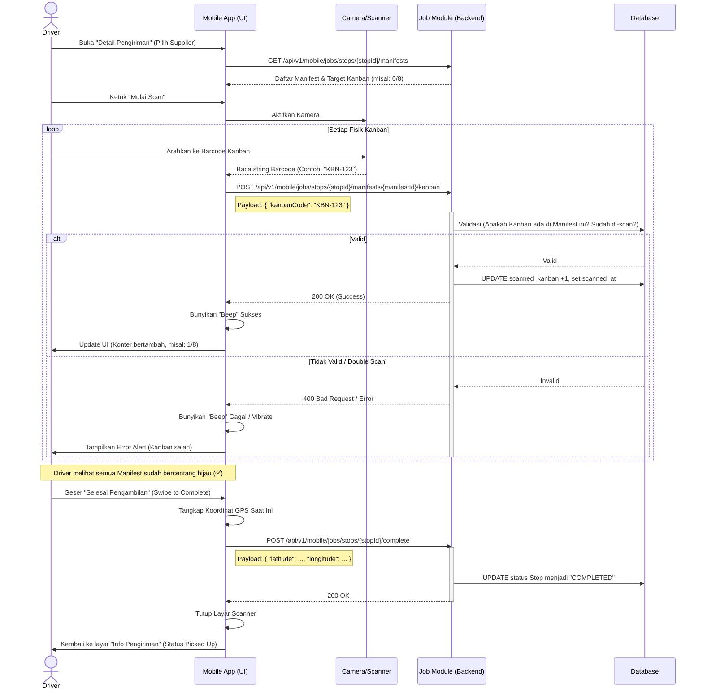

# Proses Bisnis: Detail Pengiriman (Kanban Scanning)

Dokumen ini menjelaskan alur kerja operasional bagi Driver saat berada di lokasi *Supplier* untuk melakukan serah terima barang (pemindaian fisik Kanban). Skenario ini berjalan di layar **Detail Pengiriman**.

## 1. Tujuan Bisnis
1. **Validasi Fisik**: Memastikan bahwa barang/Kanban fisik yang dinaikkan ke truk benar-benar sesuai dengan dokumen *Manifest* elektronik.
2. **Pencegahan Kesalahan (Poka-Yoke)**: Membantu Driver meminimalisasi risiko barang tertinggal atau salah angkut melalui indikator visual (merah/hijau).
3. **Akuntabilitas**: Mencatat waktu (*timestamp*) pastinya sebuah Kanban dipindai dan dimasukkan ke dalam truk.

## 2. Aktor yang Terlibat
- **Driver**: Pihak yang melakukan pemindaian menggunakan *smartphone*.
- **Admin/Checker Supplier (Opsional)**: Pihak pabrik yang menyiapkan barang di *Dock* sesuai Manifest.

## 3. Alur Operasional (Skenario Pemindaian)

### Fase A: Konfirmasi Daftar Manifest
1. Sesampainya di *Supplier*, Driver membuka layar **Detail Pengiriman**.
2. Aplikasi menampilkan ringkasan jumlah Kanban yang harus diambil (contoh: Original `0/8`).
3. Aplikasi juga menampilkan daftar *Manifest* elektronik. Setiap manifest memiliki target jumlah *Kanban* (misal: 8 buah) dan *Dock Code* (lokasi pintu pengambilan di pabrik).
4. Status awal di sebelah setiap Manifest adalah silang merah (❌), menandakan belum selesai.

### Fase B: Proses Pemindaian (Scanning)
1. Driver menuju *Dock Code* yang tertera pada Manifest pertama (misal: Dock 53).
2. Driver mengetuk tombol **Mulai Scan**. Aplikasi akan membuka antarmuka kamera (atau terhubung ke *Bluetooth Scanner*).
3. Driver mengarahkan kamera ke *Barcode* atau *QR Code* yang tertempel pada fisik kartu Kanban di kotak barang.
4. Setiap pemindaian yang valid akan dikirim ke sistem (*Backend*). Sistem memvalidasi apakah kode tersebut adalah milik *Manifest* yang bersangkutan.
5. Jika berhasil, *counter* di layar bertambah (contoh: dari 0/8 menjadi 1/8). Aplikasi dapat mengeluarkan bunyi (*beep*) sukses.
6. Apabila *barcode* tidak valid, aplikasi menampilkan *error alert* (contoh: "Kanban tidak sesuai manifest").

### Fase C: Penyelesaian per Manifest
1. Setelah seluruh Kanban dalam satu baris Manifest terpindai (misal mencapai 8/8), status di sebelah kanan Manifest tersebut berubah secara otomatis dari silang merah menjadi centang hijau (✅).
2. Driver mengulangi Fase B untuk Manifest berikutnya hingga seluruh baris Manifest bernilai hijau.

### Fase D: Penyelesaian Titik Supplier (Complete Stop)
1. Setelah seluruh *Manifest* berstatus hijau (jumlah Kanban terpenuhi 100%), Driver bersiap untuk meninggalkan *Supplier*.
2. Driver meletakkan jarinya di atas area **"Geser Selesai Pengambilan"** (*Swipe to Complete*), lalu menggesernya ke kanan.
3. Aplikasi menangkap koordinat GPS saat itu dan mengirim instruksi *Complete Stop* ke pusat.
4. Layar ini akan tertutup, mengembalikan Driver ke halaman "Info Pengiriman" dengan status Supplier tersebut kini bercentang **"Picked Up"**.
5. Driver melanjutkan perjalanan ke titik berikutnya.

---

## 4. Sequence Diagram: Alur Pemindaian Kanban

Berikut adalah visualisasi teknis dari interaksi antara Driver, Aplikasi Mobile, dan API Backend selama proses pemindaian berlangsung:

