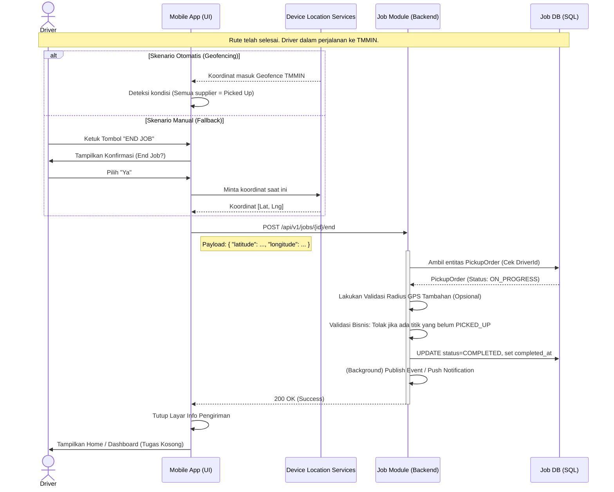

# Proses Bisnis: Penyelesaian Rute Pekerjaan (End Job)

Dokumen ini memuat alur operasional mengenai penyelesaian akhir keseluruhan rute perjalanan (*Pickup Order*) oleh Driver, baik secara otomatis maupun manual.

## 1. Tujuan Bisnis
- **Finalisasi Pekerjaan**: Menandakan bahwa seluruh aktivitas penjemputan barang (*Pickup*) di seluruh titik pemasok (*Supplier*) telah selesai dan barang telah atau akan segera diturunkan/diserahkan ke pabrik tujuan (TMMIN).
- **Akuntabilitas & Visibilitas**: Memberikan penanda waktu penyelesaian (*Completed At*) yang akurat bagi tim operasional/logistik di *Control Tower*.
- **Pelepasan Aset**: Melepaskan status keterikatan Driver dan Truk sehingga siap menerima pekerjaan (*Job*) pada siklus (*Cycle*) berikutnya.

## 2. Aktor / Pemicu
- **Aplikasi Mobile (Otomatis / *Geofencing*)**: Membaca koordinat lokasi Driver dan memicu End Job.
- **Driver (Manual)**: Menekan tombol "END JOB" secara manual sebagai langkah kedaruratan (*fallback*).

## 3. Alur Operasional (Skenario Utama)

Skenario penyelesaian rute bergantung pada lokasi akhir yang telah ditetapkan (TMMIN). Sistem menggunakan teknologi *Geofencing* untuk menyederhanakan tugas (*Seamless UX*) bagi Driver.

### Fase A: Persiapan (Semua Titik Selesai)
1. Driver telah menyelesaikan pemindaian Kanban dan *Complete Stop* di titik supllier terakhir.
2. Status seluruh titik di layar **Info Pengiriman** telah bercentang hijau (✅ *Picked Up*).
3. Driver memulai perjalanan menuju area penurunan (*Unloading*) di TMMIN.

### Fase B: Penyelesaian Otomatis (*Geofencing Trigger*)
1. Selama perjalanan, Aplikasi Klien di perangkat Driver melakukan pemantauan lokasi GPS di latar belakang secara berkala.
2. Ketika truk (Driver) memasuki **radius Geofence TMMIN** (misal: 1 kilometer dari titik koordinat pusat TMMIN):
   - Aplikasi menyadari bahwa pekerjaan *Pickup* (penjemputan) telah selesai dan lokasi tujuan akhir telah dicapai.
   - Aplikasi segera mengirimkan permintaan (*request*) penyelesaian tugas ke Backend secara senyap.
3. Setelah Backend memvalidasi dan memproses perubahan status, aplikasi mengembalikan Driver ke layar utama (**Home / Dashboard**).
4. Layar Dashboard akan kembali bersih (tidak ada tugas aktif) atau segera memunculkan rute siklus selanjutnya jika ada.
5. Notifikasi dapat dikirimkan kepada tim Logistik bahwa "Truk B 9607 PXT telah menyelesaikan rute RD23".

### Fase C: Skenario *Fallback* (Penyelesaian Manual)
Dalam kondisi di mana sinyal GPS buruk, akurasi (*drift*) menurun, atau aplikasi gagal mendeteksi radius *geofence* TMMIN:
1. Sesampainya di TMMIN, Driver menyadari bahwa rute di aplikasinya belum berstatus selesai.
2. Driver membuka layar **Info Pengiriman**.
3. Driver mengetuk **Tombol Lingkaran Merah "END JOB"** yang berada di sudut kanan atas antarmuka.
4. Aplikasi memunculkan dialog konfirmasi ("Apakah Anda yakin ingin mengakhiri rute ini?").
5. Setelah dikonfirmasi, aplikasi mencatat GPS terakhir dan mengirimkannya ke Backend.
6. Driver dialihkan ke layar utama (**Dashboard**).

---

## 4. Sequence Diagram: Alur Penyelesaian

