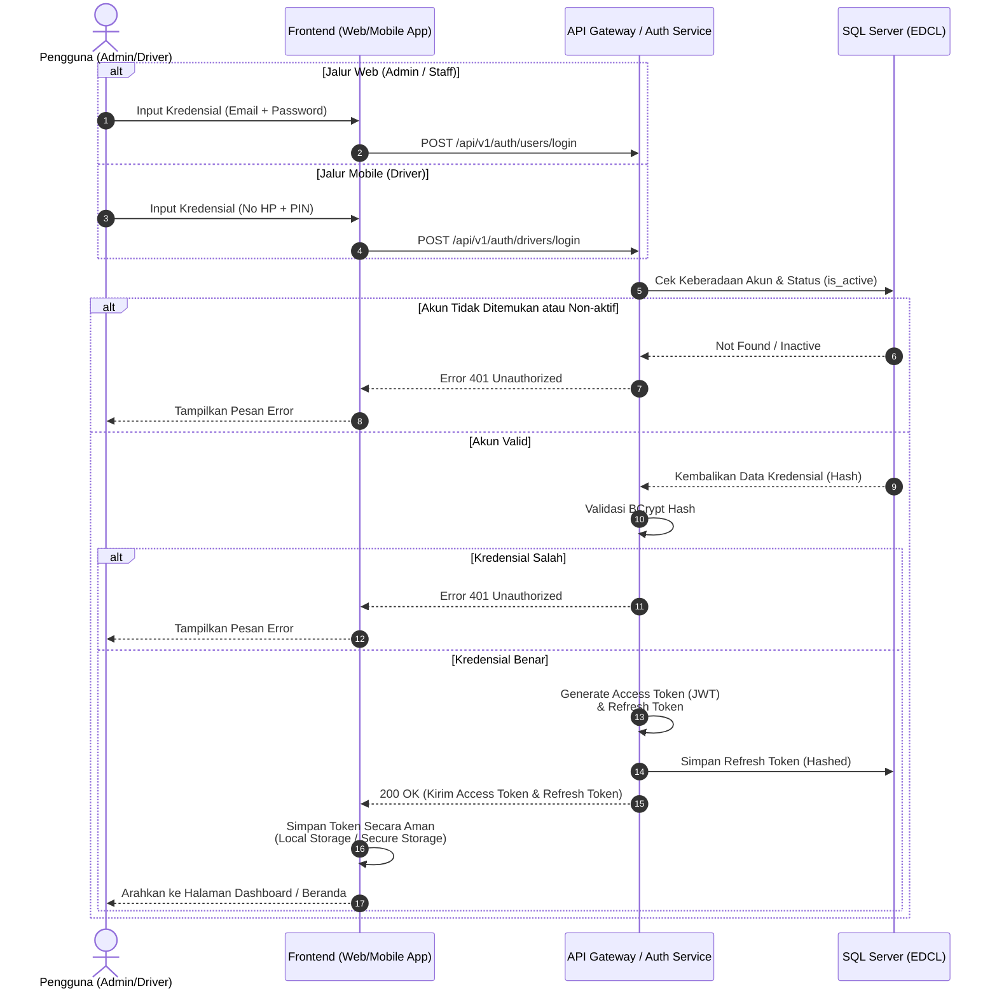
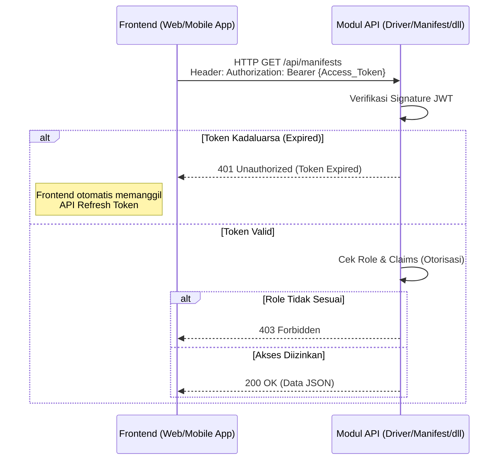

# Dokumen Proses Bisnis: Login & Autentikasi (Web & Mobile)

Dokumen ini menjelaskan alur proses bisnis saat pengguna (Admin Logistic Partner, Staff Pabrik, maupun Driver) melakukan *login* (masuk) ke dalam sistem EDCL, baik melalui platform Web maupun Aplikasi Mobile.

---

## 1. Konsep Utama
- **Token-Based Authentication (JWT):** Sistem EDCL tidak menggunakan *Session Cookies* tradisional, melainkan menggunakan *JSON Web Token* (JWT). Token ini menjamin komunikasi yang *stateless* dan aman antara *frontend* (Web/Mobile) dengan *backend* (API).
- **Pemisahan Kredensial:** 
  - **Admin / Staff Web:** Login menggunakan *Email* dan *Password*.
  - **Driver Mobile App:** Login menggunakan *Nomor Handphone* dan *PIN (6 digit)*.
- **Refresh Token:** Jika sesi JWT berakhir (misal: setelah 1 jam), sistem menggunakan *Refresh Token* terenkripsi untuk mendapatkan token baru secara otomatis di latar belakang tanpa mengganggu layar yang sedang dibuka pengguna.

---

## 2. Alur Operasional (Sequence Diagram)

Diagram berikut berlaku untuk semua jenis aplikasi klien yang terhubung ke EDCL API.

---

## 3. Skenario Akses Halaman Terlindungi (Protected Route)

Setelah berhasil login, setiap kali klien ingin mengambil data dari *backend*, inilah yang terjadi:

---

## 4. Kasus Khusus (Edge Cases)

1. **Pemblokiran Mendadak (Revocation)**
   Jika Admin memblokir akun Driver secara tiba-tiba (`is_active = false`), Access Token lama milik Driver mungkin masih berlaku selama beberapa menit. Namun, sistem kita memiliki mekanisme pengecekan status (Middleware Guard) yang akan langsung menolak aktivitas meskipun token masih aktif, dan aplikasi *mobile* akan langsung me-lempar (*force logout*) pengguna kembali ke halaman Login.

2. **Login di Perangkat Baru (Concurrent Sessions)**
   Secara *default*, *login* di HP baru akan menonaktifkan *refresh token* di HP lama untuk alasan keamanan (mencegah akun digunakan secara bersamaan oleh dua supir berbeda). Fitur ini menjaga integritas penugasan *Manifest*.

3. **Login Pertama Kali (Force Change PIN)**
   Khusus untuk Driver, jika sistem mendeteksi bahwa Driver masih menggunakan PIN bawaan atau status *MustChangePin* bernilai aktif, API **tidak akan menerbitkan Token**. Sebaliknya, API akan mengembalikan respons khusus (`HTTP 401 Unauthorized` dengan kode `Auth.ForceChangePin`).
   - **Dari Sisi UI Mobile:** Aplikasi akan mencegat perpindahan ke halaman Beranda dan sebaliknya menampilkan halaman Wajib Ganti PIN (*Mandatory Change PIN Screen*): **"Harap ganti PIN bawaan Anda (6-digit) demi keamanan."**.
   - Driver tidak akan bisa melanjutkan pekerjaan sebelum mengganti PIN melalui Endpoint `/change-pin`, memastikan tidak ada orang lain yang menyalahgunakan PIN *default* tersebut. *(Detail lebih lanjut dapat dilihat pada dokumen `registrasi-driver.md` dan `ui-api-mapping.md`)*.
