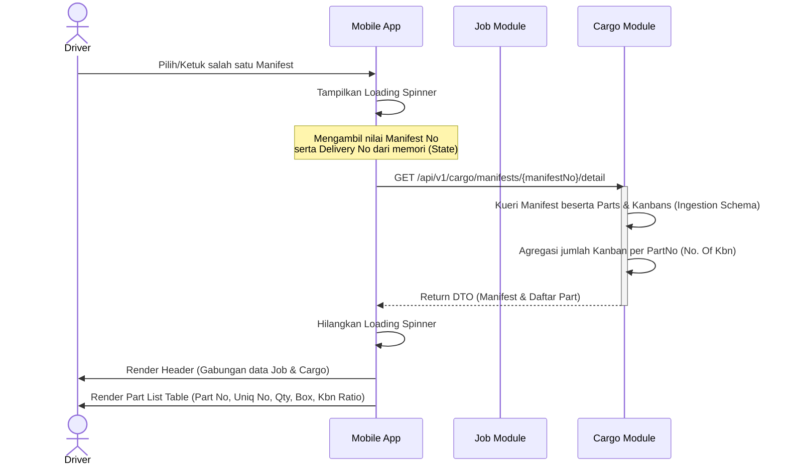

# Dokumen Arsitektur & Proses Bisnis: Manifest Detail

Dokumen ini menjelaskan alur kerja operasional dan arsitektur teknis untuk layar **Manifest Detail** pada aplikasi Mobile EDCL, berdasarkan pendekatan *Best Practice Microservices*.

## 1. Tujuan Bisnis
Layar Manifest Detail digunakan oleh **Driver** atau **Operator Gudang** (*Supplier*) untuk melihat rincian barang/suku cadang (*Parts*) yang terkandung di dalam sebuah dokumen *Manifest* secara spesifik. 
Tujuan utamanya adalah:
1. **Transparansi Barang**: Memastikan Driver mengetahui jenis suku cadang (`Part No`), tipe boks (`Box Type`), jumlah isi per kanban (`Pcs/Kbn`), dan total Kanban yang harus diangkut.
2. **Identifikasi Akurat**: Membantu Driver memverifikasi keunikan barang melalui *Unique No* (`Uniq No`) guna menghindari kesalahan angkut pada barang yang terlihat serupa.

## 2. Aktor yang Terlibat
- **Driver**: Membuka rincian manifest ketika ragu atau butuh detail lebih lanjut mengenai barang apa saja yang perlu diambil dari suatu *Dock Code*.

## 3. Alur Operasional (User Flow)
1. Driver berada di layar **Manifest List / Detail Pengiriman** (alur operasional dari Modul Job).
2. Driver mengetuk/memilih salah satu baris *Manifest* pada daftar.
3. Aplikasi melakukan navigasi ke layar **Manifest Detail** dan memunculkan _loading spinner_.
4. Aplikasi mengirimkan permintaan (*request*) API menggunakan `Manifest No` yang dipilih ke Modul **Cargo (Ingestion/Master Data)**.
5. Setelah data diterima, aplikasi menampilkan *header* yang berisi informasi statis (sebagian dibawa dari layar sebelumnya, sebagian dari API):
   - `Route & Cycle`
   - `Delivery No`
   - `Manifest No`
   - `Total Kanban`
   - `Order No`, `Dock Code`, `P-Lane No`
6. Di bawah *header*, aplikasi me-render daftar (*Part List Table*) yang memuat nomor urut, nomor komponen (*Part No.*), nomor unik (*Uniq No*), isi per kanban (*Pcs/Kbn*), tipe kotak (*Box Type*), dan rasio kanban (*No. Of Kbn*).
7. Driver membaca detail tersebut untuk mencocokkannya dengan kondisi fisik di lapangan.
8. Driver menekan tombol panah "Kembali" (*Back*) untuk merampungkan proses pemindaian (*Scanning*) di layar utama *Manifest List*.

### Sequence Diagram: Alur Buka Layar Detail

---

## 4. Arsitektur Teknis & Pola Microservices

Berdasarkan *best practice* arsitektur terdistribusi, layar **Manifest Detail** tidak dilayani oleh modul operasional (`Job`), melainkan oleh modul **Cargo (Ingestion)**.

### a. Alasan Desain (Trade-offs)
- **Bounded Context**: Modul `Job` hanya peduli pada status operasional (Kanban A sudah di-scan atau belum, dan pada koordinat GPS mana). `Job` tidak boleh menanggung beban merelasikan data statis *parts* seperti tipe kardus atau kode unik *supplier*.
- **Performa Database**: Jika modul `Job` harus melakukan JOIN ke tabel induk Master Data (atau melakukan pemanggilan HTTP internal antar-service), performa pembacaan akan menurun tajam saat beban pengiriman memuncak.
- **Client-Side Composition**: Aplikasi Mobile (Klien) memegang peran komposisi. Mobile memegang `DeliveryNo` dan `Route` dari rute operasional, lalu menggabungkannya dengan `PartList` dari rute *Master Data/Cargo*.

### b. Aliran Data (Data Flow)
1. **Request API**: `GET /api/v1/cargo/manifests/{manifestNo}/detail`
2. **Query Handler**: `GetManifestDetailQueryHandler` (di Modul Cargo).
3. **Database Layer**: Membaca dari `CargoDbContext` dengan *schema* `ingestion`.
4. **Relasi Entitas**: 
   - Kueri mengeksekusi `Manifest` beserta `.Include(x => x.Parts)` dan `.Include(x => x.Kanbans)`.
   - Menghitung jumlah per kanban: Mengelompokkan (`GroupBy`) `KanbanNo` atau `PartNo` langsung di memori karena skalanya terbatas per manifest.
5. **Response DTO**: 
   - Kueri mengembalikan objek DTO yang ringan dan sudah disesuaikan persis dengan kolom tabel di layar UI Mobile.

### c. Skema Tabel Pendukung (Ingestion)
Untuk memfasilitasi performa pembacaan *single-query* dari modul Cargo, skema tabel pada `CargoDbContext` telah dirancang inklusif:
- `ingestion.manifests` 
  - Menyimpan `manifest_no`, `order_no`, `dock_cd`, `p_lane_no`.
- `ingestion.manifest_parts`
  - Menyimpan `part_no`, `uniq_no`, `box_type`, `qty` (sebagai *Pcs/Kbn*).

---

> [!TIP]
> **Catatan Implementasi UI**
> Pengembang *Frontend* Mobile tidak perlu melakukan *data parsing* yang rumit. Kolom `No. Of Kbn` telah diformat dalam bentuk *string* (contoh: "2/2") langsung dari *Backend*, sehingga tugas UI murni hanya melakukan *rendering* tabel secara statis.
