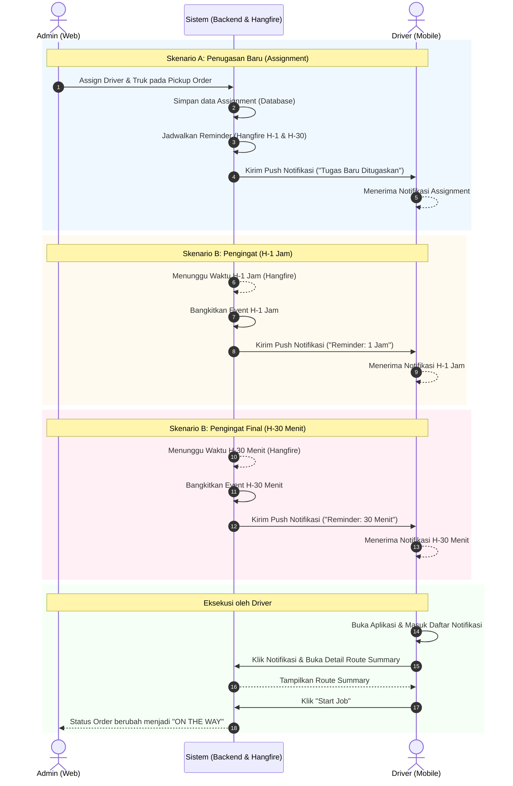

# Proses Bisnis: Notifikasi Driver

Dokumen ini menjelaskan alur proses bisnis terkait pengiriman dan penerimaan notifikasi oleh Driver di aplikasi EDCL Mini.

## 1. Tujuan Notifikasi
Notifikasi bertujuan untuk:
1. **Memberikan informasi** secara *real-time* kepada Driver jika mereka ditugaskan ke sebuah pekerjaan penjemputan (Pickup Order) oleh Admin.
2. **Mengingatkan Driver** (Reminder) agar tidak melupakan jadwal penjemputan yang sudah mendekat demi menjaga kelancaran operasional (SLA).
3. **Meningkatkan kepatuhan** dan kesiapsiagaan Driver dalam melaksanakan rute yang telah ditentukan.

## 2. Aktor yang Terlibat
- **Admin (Web User)**: Memiliki hak untuk menugaskan (Assign) pekerjaan kepada Driver.
- **Driver (Mobile User)**: Penerima tugas yang harus mengambil barang (Kanban) di *supplier*.
- **Sistem Backend (Hangfire & Message Broker)**: Mengotomatisasi dan menjadwalkan pengiriman notifikasi tanpa campur tangan manusia.

## 3. Skenario Pengiriman Notifikasi

### Skenario A: Penugasan Baru (New Job Assignment)
Skenario ini terjadi saat Admin menugaskan Driver secara langsung melalui Web Portal.

1. Admin Web membuka daftar *Pickup Order* (rute) yang masih belum memiliki Driver (status `PENDING`).
2. Admin memilih seorang Driver dan Truk, kemudian mengeklik tombol **Assign** / **Save**.
3. Sistem secara seketika:
   - Memperbarui data penugasan di *Database*.
   - Mengirimkan *Push Notification* ke ponsel Driver.
4. **Isi Notifikasi**:
   - **Judul**: "Tugas Baru Ditugaskan!"
   - **Pesan**: "Kamu telah ditugaskan untuk Route [ROUTE_CODE], Cycle [CYCLE] pada waktu [PICKUP_DATE]. Mohon bersiap."

### Skenario B: Pengingat Jadwal (Schedule Reminder)
Skenario ini berjalan secara otomatis di latar belakang untuk mengingatkan Driver tentang jadwal tugasnya yang semakin dekat.

1. Saat Admin menugaskan Driver di Skenario A, Sistem juga secara pintar menanamkan jadwal *Reminder* ke dalam sistem kalender internal (Hangfire).
2. Sistem akan memantau waktu secara terus-menerus.
3. **Pada H-1 Jam (60 Menit sebelum jam Pickup):**
   - Sistem membangkitkan notifikasi secara otomatis.
   - **Judul**: "Reminder: 1 Jam Menuju Penjemputan"
   - **Pesan**: "Route [ROUTE_CODE], Cycle [CYCLE] dijadwalkan pada [JAM_PICKUP]."
4. **Pada H-30 Menit (30 Menit sebelum jam Pickup):**
   - Sistem membangkitkan notifikasi final sebelum keberangkatan.
   - **Judul**: "Reminder: 30 Menit Menuju Penjemputan"
   - **Pesan**: "Route [ROUTE_CODE], Cycle [CYCLE] dijadwalkan pada [JAM_PICKUP]."
5. Driver menerima *Push Notification* di ponsel dan melihat daftarnya di menu Notifikasi aplikasi Mobile.

### Skenario C: Perubahan Jadwal / Pembatalan Penugasan
Skenario ini terjadi jika Admin membatalkan atau mengganti Driver untuk sebuah rute.

1. Admin mengganti Driver A menjadi Driver B, atau mencabut penugasan.
2. Sistem akan **menghapus jadwal reminder** yang sebelumnya dibuat untuk Driver A.
3. Driver A tidak akan menerima notifikasi H-1 Jam maupun H-30 Menit yang "nyasar" dari tugas lamanya.
4. (Opsional) Sistem mengirimkan notifikasi "Penugasan Dibatalkan" kepada Driver A, dan Skenario A akan terulang untuk Driver B.

## 4. Alur Interaksi Driver (UI Mobile)
1. **Notifikasi Masuk (Push):** Ketika ponsel terkunci atau aplikasi sedang ditutup, Driver menerima notifikasi *pop-up* (Firebase Cloud Messaging - kelak diimplementasikan).
2. **Membaca Notifikasi:** Ketika Driver mengetuk notifikasi tersebut, aplikasi Mobile terbuka dan mengarahkan Driver ke menu/halaman **Daftar Notifikasi** (Notification List).
3. **Status Baca:** Setelah Driver melihat halaman notifikasi, notifikasi yang belum dibaca (`is_read = false`) dapat di-klik untuk menandai bahwa instruksi telah dibaca dan dimengerti.
4. **Detail Route:** Dari notifikasi, Driver dapat mengeklik tombol/tautan untuk langsung melompat ke layar **Route Summary** guna memulai perjalanan (`Start Job`).

## 5. Alur Operasional (Swimlane)

Berikut adalah diagram Swimlane yang mengilustrasikan alur operasional pengiriman notifikasi dari Admin hingga dieksekusi oleh Driver.

