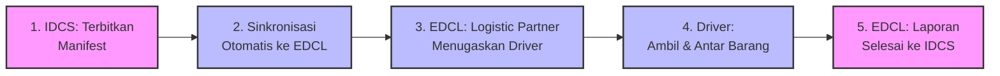
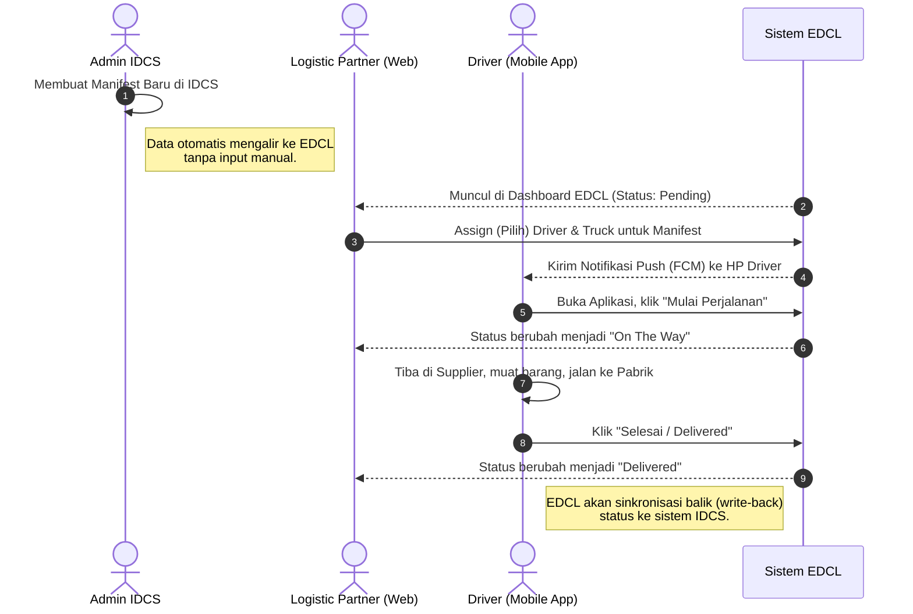
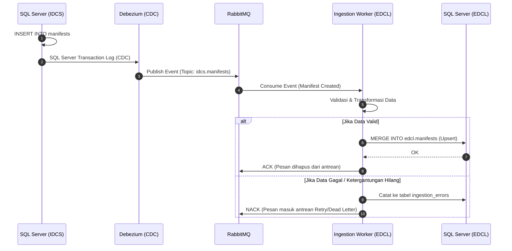

# Dokumen Proses Bisnis: Pengiriman Manifest (IDCS ke EDCL)

Dokumen ini menjelaskan alur proses bisnis end-to-end dari pembuatan Manifest di sistem IDCS hingga pengiriman selesai oleh Driver melalui sistem EDCL. Dokumen disusun dalam beberapa tingkatan (level) untuk memudahkan pemahaman bagi berbagai peran di dalam tim.

---

## 1. Glosarium (Kamus Istilah)
- **IDCS (Inventory & Delivery Control System):** Sistem legacy pusat tempat pesanan (manifest, part, kanban) diproduksi dan diterbitkan. Bertindak sebagai *Source of Truth* awal.
- **EDCL (Electronic Delivery Control Log):** Sistem logistik modern berbasis web dan mobile untuk pelacakan, penugasan, dan pengontrolan pengiriman secara elektronik.
- **Manifest:** Dokumen surat jalan yang berisi daftar muatan barang (part, kanban, skid) yang harus diambil dari *Supplier* dan diantar ke pabrik.
- **Logistic Partner:** Perusahaan vendor logistik pihak ketiga (contoh: Hikari Logistics) yang menyediakan armada truk dan supir.
- **CDC (Change Data Capture):** Mekanisme *real-time* di belakang layar yang memantau perubahan data di IDCS dan mengirimkannya ke EDCL tanpa mengganggu kinerja IDCS.

---

## 2. Level 1: Alur Bisnis Konseptual (High-Level)
*Diperuntukkan bagi Manajemen & Stakeholder.*

Alur logistik secara konseptual sangat sederhana: Sistem IDCS menerbitkan perintah ambil barang, EDCL menugaskan tim lapangan, dan tim lapangan mengeksekusinya.

---

## 3. Level 2: User Journey & Alur Operasional (Swimlane)
*Diperuntukkan bagi Tim Operasional, Vendor (Logistic Partner), dan UI/UX.*

Bagian ini memetakan interaksi manusia dengan layar aplikasi (UI) serta perpindahan tanggung jawab (*hand-off*) antar departemen.

---

## 4. Level 3: Urutan Teknis Integrasi (Technical Sequence)
*Diperuntukkan bagi Developer & Arsitek Sistem.*

Menjelaskan secara presisi bagaimana data mengalir (streaming) di bawah kap mesin (under the hood) menggunakan arsitektur Event-Driven.

---

## 5. Skenario Pengecualian Bisnis (Edge Cases)

Sistem telah dirancang untuk tahan banting (resilient) terhadap kondisi tidak ideal di lapangan:

1. **Bagaimana jika IDCS menerbitkan part barang sebelum surat Manifest-nya dibuat? (Out of Order Data)**
   - **Solusi Sistem:** EDCL Worker akan menangkap error ketidaklengkapan relasi. Pesan tersebut tidak dibuang, melainkan dimasukkan ke antrean *Retry* selama beberapa detik. Begitu induk Manifest tiba, sistem akan memproses ulang barang tersebut secara otomatis hingga sukses.

2. **Bagaimana jika Driver lupa kata sandi (PIN)?**
   - **Solusi Sistem:** Saat pendaftaran awal, Admin EDCL membuatkan PIN Default (123456). Jika supir lupa PIN barunya nanti, Admin dapat mereset *driver* ke kondisi PIN default kembali, dan Driver wajib menggantinya saat masuk berikutnya.

3. **Bagaimana jika aplikasi Mobile Driver kehilangan sinyal (Offline) saat "Delivered"?**
   - **Solusi Sistem:** (*Future Enhancement*) Aplikasi Mobile menyimpan status "Delivered" secara lokal (SQLite/Room). Begitu sinyal internet kembali (Online), aplikasi otomatis melakukan sinkronisasi dengan EDCL Backend.
