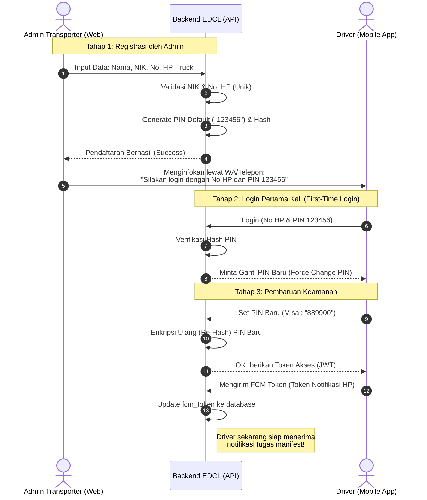

# Dokumen Proses Bisnis: Registrasi & Autentikasi Driver

Dokumen ini menjelaskan alur pendaftaran awal akun Driver oleh Admin Logistik (Transporter) hingga Driver tersebut dapat masuk (*login*) menggunakan aplikasi seluler (Mobile App) EDCL.

---

## 1. Konsep Dasar & Keamanan
- **No Self-Registration:** Untuk alasan keamanan dan validasi identitas, Driver tidak bisa mendaftar sendiri melalui aplikasi. Hanya Admin Transporter yang memiliki otorisasi untuk mendaftarkan Driver mereka.
- **PIN Default:** Karena Driver sedang berada di lapangan, mereka belum membuat kata sandi/PIN. Admin tidak meminta PIN, melainkan sistem secara otomatis memberikan PIN *default* (contoh: `123456`) agar Driver bisa masuk pertama kali.
- **Kerahasiaan Hash:** Meskipun PIN-nya standar, di *database*, PIN tersebut tetap disimpan menggunakan enkripsi ireversibel (BCrypt Hash).

---

## 2. Alur Operasional (Swimlane)

Alur ini membagi peran antara **Admin Transporter (Web)**, **Sistem Backend (EDCL)**, dan **Driver (Aplikasi Mobile)**.

---

## 3. Penjelasan Skenario Spesifik (Use Case)

### Skenario A: Driver Lupa PIN Setelah Ganti PIN
1. Driver menghubungi Admin Transporter.
2. Admin membuka Dashboard Web EDCL dan menekan tombol **"Reset PIN"** untuk Driver tersebut.
3. Backend akan menghapus PIN lama dan mengembalikannya ke PIN default (123456).
4. Driver bisa login lagi menggunakan PIN default, lalu diwajibkan (dipaksa) oleh aplikasi untuk segera mengubahnya.

### Skenario B: Driver Berhenti Bekerja
1. Admin menonaktifkan akun Driver dari Dashboard (`is_active = false`).
2. Jika Token Akses (JWT) Driver masih berlaku di HP-nya, Backend akan otomatis menolak semua aktivitas API karena mengecek status aktif. 
3. *Refresh token* akan dihanguskan (Revoke), sehingga Driver otomatis ter-logout (*force logout*) dari aplikasi *mobile*.

### Skenario C: Nomor HP Sudah Terdaftar
1. Saat pendaftaran, EDCL selalu mengecek tabel `drivers` untuk mencari NIK atau Nomor HP yang sama.
2. Jika ada, registrasi ditolak. Hal ini mencegah satu *Driver* didaftarkan ganda oleh vendor logistik yang berbeda tanpa sepengetahuan sistem pusat.
