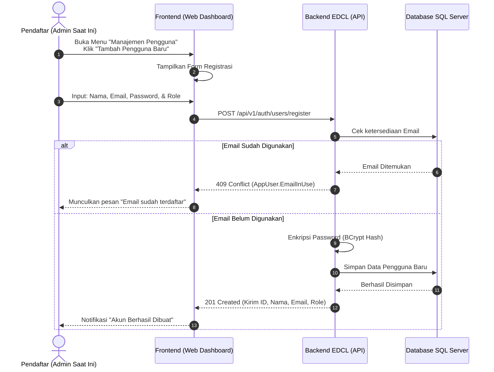

# Dokumen Proses Bisnis: Registrasi Web (Admin & Staff)

Dokumen ini menjelaskan alur pendaftaran akun pengguna Web, yaitu **Admin Transporter** dan **Staff Pabrik**, untuk dapat mengakses sistem *dashboard* EDCL.

---

## 1. Konsep Dasar & Keamanan
- **Role-Based Access:** Pendaftaran pengguna web membutuhkan penentuan peran (Role), misalnya `ADMIN` (Admin Logistik/Transporter) atau `STAFF` (Staff Operasional Pabrik).
- **Setup Awal (Bootstrap):** Secara *default*, sistem mengizinkan pendaftaran bebas (terbuka) di awal pemasangan agar *Super Admin* pertama bisa terbuat. Setelah itu, *endpoint* registrasi ini **harus dikunci** agar hanya Admin yang bisa mendaftarkan staf lainnya (menggunakan proteksi `[Authorize(Roles = "ADMIN")]`).
- **Kerahasiaan Hash:** Sama seperti Driver, kata sandi (Password) pengguna web disimpan secara aman menggunakan enkripsi BCrypt Hash.

---

## 2. Alur Operasional (Sequence Diagram)

Berikut adalah diagram yang menunjukkan bagaimana seorang pengguna web didaftarkan ke dalam sistem.

---

## 3. Penjelasan Skenario Spesifik (Use Case)

### Skenario A: Registrasi Berhasil
1. **Admin** mengisi formulir tambah pengguna dengan lengkap.
2. Saat menekan tombol **Simpan**, *frontend* memanggil *endpoint* `POST /api/v1/auth/users/register` dengan *payload* (Nama, Email, Password, RoleCode).
3. Backend memvalidasi bahwa email tersebut belum pernah terdaftar.
4. Data disimpan secara permanen di database. Status akun secara bawaan langsung menjadi **Aktif**.

### Skenario B: Duplikasi Email (Email In Use)
1. Jika Admin secara tidak sengaja mendaftarkan alamat email yang sudah pernah terdaftar (misal: `admin@edcl.com`).
2. Backend akan langsung menolak proses tersebut dan mengembalikan status `HTTP 409 Conflict`.
3. Pendaftar diminta memasukkan alamat email lain yang valid.

### Skenario C: Login Pengguna Baru
1. Setelah akun terbentuk, pengguna baru (misal staf baru) dapat membuka halaman *login* utama.
2. Mereka cukup memasukkan **Email** dan **Password** yang sudah dibuatkan (atau yang mereka buat sendiri pada saat *setup* awal) ke *endpoint* `POST /api/v1/auth/users/login`.
3. Backend akan memvalidasi *hash password* dan memberikan JWT Token untuk mereka mengakses *dashboard*.
