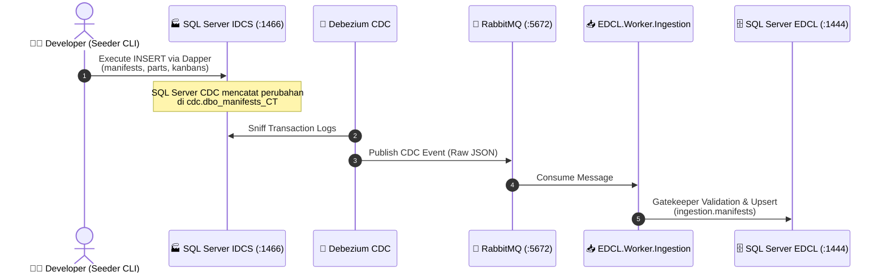

# 🏭 EDCL IDCS Seeder

**IDCS Seeder** adalah aplikasi konsol .NET 10 (*Console Application*) yang dirancang untuk mensimulasikan perilaku sistem **IDCS** (*legacy manifest database*) dengan melakukan manipulasi data (*Insert*, *Update*, *Delete*) secara langsung ke dalam tabel-tabel *database* IDCS.

Proyek ini menjadi tulang punggung (*backbone*) untuk **Pengujian End-to-End (E2E)** dari mekanisme **Change Data Capture (CDC)** menggunakan **Debezium**, antrean **RabbitMQ**, dan layanan konsumsi data **`EDCL.Worker.Ingestion`**.

---

## 🎯 Kapabilitas Utama

- **Inisialisasi Database IDCS & CDC:** Membuat *database* `IDCS` (port `1466`), seluruh tabel manifes, dan mengaktifkan SQL Server Change Data Capture (CDC) secara otomatis (`sys.sp_cdc_enable_db` & `sys.sp_cdc_enable_table`).
- **Simulasi Transaksi Real-Time:** Memasukkan data acak yang realistis (Manifest, Part, Kanban, Skid) yang mencerminkan struktur data logistik otomotif sesungguhnya.
- **Bulk Seeding (Data Massal):** Menghasilkan 200 Manifest sekaligus beserta Part, Kanban, dan Skid untuk pengujian beban tinggi (*stress testing*) dan evaluasi throughput CDC.
- **Single-Command E2E Demo (`seed-master-one`):** Menyiapkan 1 set data master lengkap (1 Logistic Partner, 1 Supplier DENSO, 1 Rute R01/C1, 1 Truk, 1 Supir, 1 Manifes, 1 Pickup Order, mock GPS fleet data) dan mempublikasikan event FCM untuk demo cepat aplikasi mobile & web.
- **4-Step Safe Reset (`reset-master-one`):** Mekanisme pembersihan data simulasi bertingkat yang aman dengan mengaktifkan *Worker Reset Mode* (120 detik) untuk mencegah *ghost CDC session*.
- **Pengujian Gatekeeper (CDC Anomalies & Rejection):** Mensimulasikan status pekerjaan di EDCL (`ON_PROGRESS` / `COMPLETED`), kemudian memicu *update/delete* CDC dari IDCS untuk memvalidasi aturan penolakan data dan pencatatan anomali ke tabel `ingestion.manifest_problems`.
- **Simulasi Kasus Ekstrem (Edge Cases):**
  - **Out-of-Order (Data Tidak Berurutan):** Menyuntikkan data anak (*Part*) sebelum data induknya (*Manifest*) ada, memicu mekanisme *5-stage retry exponential backoff* dan peringatan DLQ via Server-Sent Events (SSE).
  - **Race Conditions (Kondisi Balapan):** Menunda proses simpan data *Manifest* setelah data *Part* dibuat guna menguji toleransi konkurensi pada *Worker Ingestion*.

---

## 🛠 Prasyarat & Alokasi Port

Proyek ini menggunakan *container* SQL Server tersendiri yang terisolasi untuk simulasi IDCS (`docker-compose-idcs.yml`):

| Layanan | Port Host | Kredensial / Konfigurasi | Keterangan |
|---|:---:|---|---|
| **SQL Server IDCS (Simulasi)** | **`1466`** | `sa` / `IdcsPassword123!` | Database `IDCS` dengan SQL Server Agent & CDC aktif |
| **SQL Server EDCL (Utama)** | **`1444`** | `sa` / `EdclMini_123!` | Database `edcl` (Skema: `driver`, `auth`, `job`, `ingestion`, `notification`) |
| **RabbitMQ Message Broker** | **`5672`** / `15672` | `guest` / `guest` | Antrean CDC `edcl_ingestion`, retry queues, & DLX |

---

## 🚀 Panduan Penggunaan (Local Makefile)

Jalankan perintah di bawah ini dari dalam direktori `idcs-seeder` (atau melalui *root* `Makefile`):

### 1. 🐳 Perintah Infrastruktur Container
| Perintah | Deskripsi |
|---|---|
| `make idcs-up` | Menyalakan *container* SQL Server IDCS (`port 1466`) via `docker-compose-idcs.yml`. |
| `make idcs-down` | Menghentikan dan menghapus *container* SQL Server IDCS. |

---

### 2. ⚡ Inisialisasi & Rekomendasi E2E Testing
| Perintah | Deskripsi |
|---|---|
| `make seed-init` | Menginisialisasi database `IDCS`, tabel-tabel (`manifests`, `manifest_parts`, `manifest_kanbans`, `manifest_skids`, `suppliers`, `edcl_delivery_status`), dan mengaktifkan CDC. **Wajib dijalankan pertama kali.** |
| `make seed-master-one` | **[RECOMMENDED]** Men-seed 1 set data master lengkap (Hikari Logistics, Denso, Rute R01/C1, Truk B 9607 PXT, Supir LISTIONO), 1 manifes, 1 Pickup Order, data GPS live tracking, dan pemicu notifikasi FCM. |
| `make reset-master-one` | **[RECOMMENDED]** Membersihkan seluruh data simulasi secara aman (4-step safe reset) tanpa meninggalkan *ghost session*. |

---

### 3. 📦 Master Data Seeding & Reset
| Perintah | Deskripsi |
|---|---|
| `make seed-master` | Membuat seluruh data master inti EDCL (Ekspedisi/Logistic Partners, Pemasok, Rute, Sopir, dan Truk). |
| `make reset-master` | Mereset seluruh Data Master dari database EDCL. |
| `make seed-supplier` / `make reset-supplier` | Seed / Reset data master Supplier (`edcl.driver.suppliers` & IDCS `suppliers`). |
| `make seed-driver` / `make reset-driver` | Seed / Reset data master Supir (`edcl.auth.drivers`). |
| `make seed-truck` / `make reset-truck` | Seed / Reset data master Truk & Assignment (`edcl.driver.trucks`). |
| `make seed-route` / `make reset-route` | Seed / Reset data master Rute & Siklus (`edcl.driver.routes`). |
| `make seed-logistic-partner` / `make reset-logistic-partner` | Seed / Reset data master Partner Ekspedisi & Vendor GPS. |

---

### 4. 📋 Transactional Data Seeding
| Perintah | Deskripsi |
|---|---|
| `make seed-transaction` | Menyuntikkan 1 alur transaksi lengkap (1 Manifest, 1 Skid, 1 Part, 1 Kanban) dan membuat Pickup Order live tracking di EDCL. |
| `make seed-manifest` | Menyuntikkan 1 data Manifest acak ke IDCS. |
| `make seed-part` | Menyuntikkan 1 Part ke Manifest terakhir di IDCS. |
| `make seed-kanban` | Menyuntikkan 1 Kanban ke Part terakhir di IDCS. |
| `make seed-skid` | Menyuntikkan 1 Skid ke Manifest terakhir di IDCS. |
| `make seed-bulk` | Menyuntikkan 200 Manifest massal (lengkap dengan Part, Kanban, dan Skid) untuk *load testing* CDC. |
| `make reset-transaction` | Menghapus (truncate) seluruh data transaksional Manifest di database IDCS maupun EDCL. |
| `make reset-pickup` | Membersihkan tabel `job.pickup_orders` dan anakannya di EDCL serta mereset status penugasan manifes. |

---

### 5. 🔬 Simulasi Kasus Ekstrem & Gatekeeper Testing
| Perintah | Deskripsi |
|---|---|
| `make trigger-reject` | **Pengujian Gatekeeper:** Membuat order dengan status `ON_PROGRESS` dan `COMPLETED` di EDCL, lalu memicu *update/delete* CDC dari IDCS untuk menguji penolakan data dan pencatatan ke `manifest_problems`. |
| `make seed-out-of-order` | Menyuntikkan data *Part* dengan ID *Manifest* fiktif (`999999`) untuk menguji *Delayed Retry Queue* dan *Dead Letter Queue* (DLQ). |
| `make seed-race-condition` | Menunda proses simpan *Manifest* 3 detik setelah data *Part* masuk untuk memvalidasi pemulihan otomatis via *Retry Queue*. |
| `make seed-k6-clean` | Membersihkan data transaksi khusus untuk persiapan *benchmark* beban k6. |

---

## 🏗 Cara Kerja Sistem (Under the Hood)

### 🛡️ Arsitektur 4-Step Safe Reset
Untuk mencegah masalah *ghost session* pada monitoring CDC akibat penundaan penangkapan *delete events* oleh Debezium, seeder menerapkan mekanisme pembersihan 4 tahap:
1. **Step 1**: Menghapus tabel `edcl.ingestion.sync_sessions` terlebih dahulu $\to$ Worker Ingestion mendeteksi hilangnya sesi aktif dan masuk ke **Reset Mode (120 detik)**.
2. **Step 2**: Menghapus seluruh tabel manifes di database IDCS (event *delete* CDC yang ditangkap Debezium diabaikan oleh Worker karena sedang dalam Reset Mode).
3. **Step 3**: Melakukan pembersihan antrean (*Queue Purge*) pada seluruh antrean RabbitMQ (`edcl_ingestion`, `edcl_ingestion_faults`, dan 5 *retry queues*).
4. **Step 4**: Menghapus sisa data tabel ingestion di EDCL dan mempublikasikan event **`SimulationResetIntegrationEvent`** untuk menyinkronkan seluruh subsistem.
